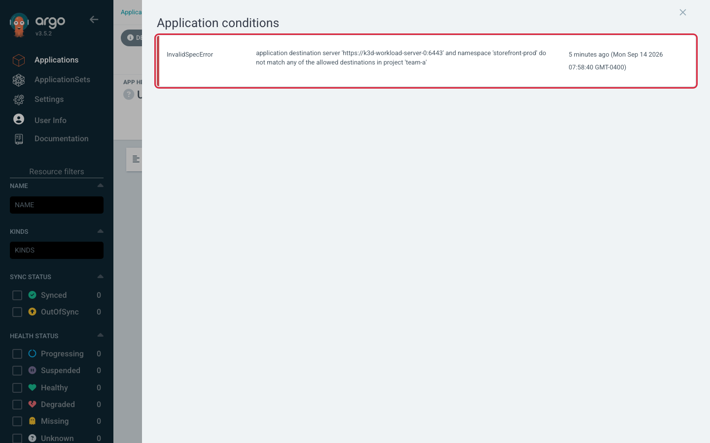
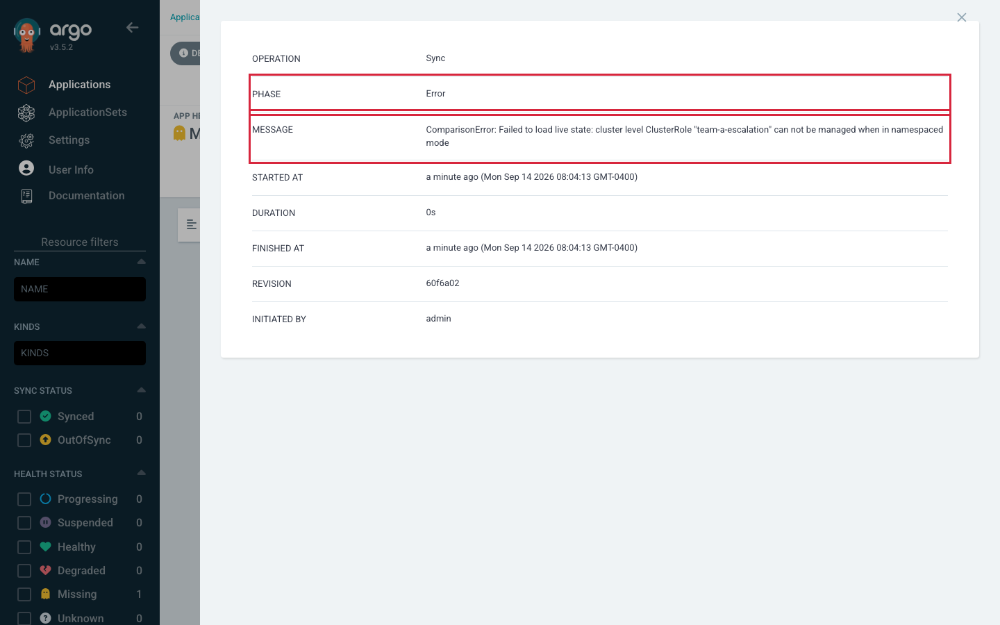
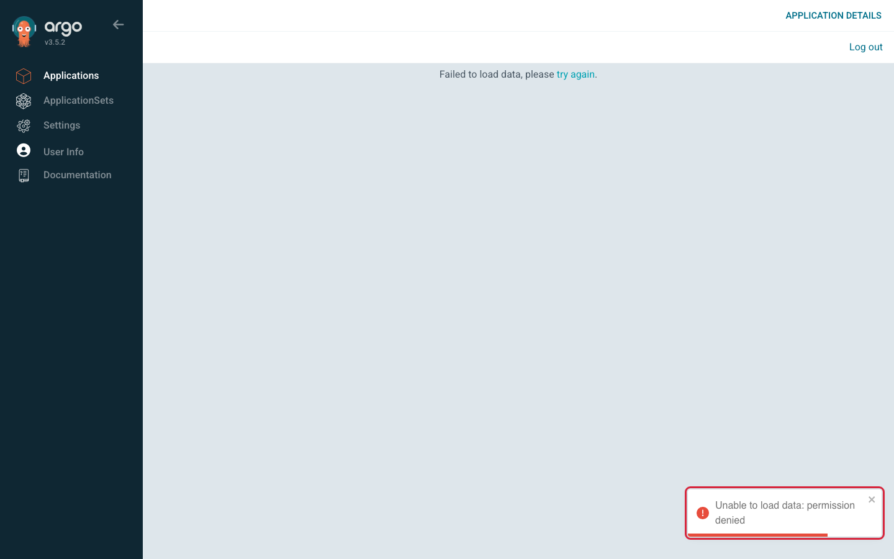
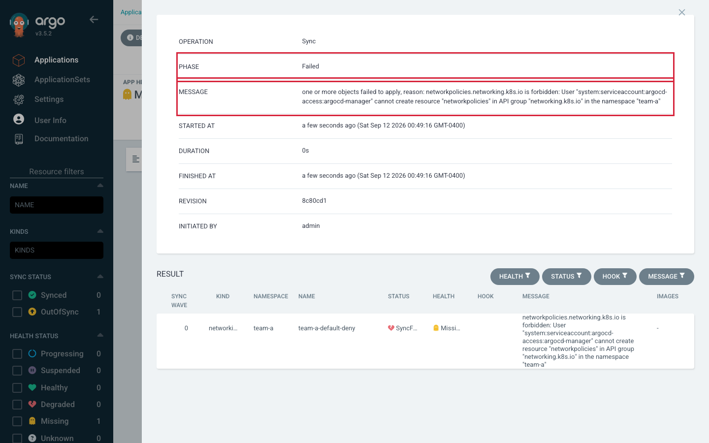

# Lab 5 · Module 3 — Bypass Attempts

> **Day 2 · Lab 5 · Module 3 of 4 · ~18 minutes**
> **Goal:** trigger four refusals from four different guards, predict each, and prove *which* one spoke from the message alone (**E3, E4**).

Each attempt follows the **Guardrail-Bypass-Attempt** shape: *predict which guard refuses, try it, confirm which layer said no, and why.*

---

## Exercise 3 — A wrong destination and a cluster-scoped kind (6 min · diagnosis)

**Part A — an unauthorized destination.** **▶ Predict first:** an Application in project `team-a` whose destination namespace is `storefront-prod` (not permitted) — which guard refuses, and does anything reach the cluster?

Create a throwaway (same `team-a` project, destination `storefront-prod`), apply, read the condition:

```bash
kubectl --context k3d-mgmt apply -f /tmp/team-a-wrong-dest.yaml
argocd app get team-a-wrong-dest
```

**Expected** — `Sync Status: Unknown`, `Health: Unknown`, one condition:

```text
CONDITION         MESSAGE
InvalidSpecError  application destination server 'https://k3d-workload-server-0:6443' and namespace 'storefront-prod'
                  do not match any of the allowed destinations in project 'team-a'
```

**🔍 Note the exact shape:** condition type **`InvalidSpecError`**, phrase **`do not match any of the allowed destinations in project 'team-a'`**, **single** quotes. No sync needed. If you *do* press Sync, an operation records and ends immediately with `Phase: Error`, `Duration: 0s`, **empty sync result**, nothing changed. This is **fence 2** (the AppProject).



<!-- CAPTURE-SPEC: SS-L5-03 — conditions, destination rejected. State: E3A. Highlight: InvalidSpecError row. Argo CD v3.5.2. -->

**Part B — a cluster-scoped resource, and a race between two guards.** The `team-a-apps` repo ships `attempts/cluster-scoped/clusterrole.yaml` — a **`ClusterRole`**. **▶ Predict harder:** *two* guards could refuse — **fence 2** (empty `clusterResourceWhitelist`) and **fence 2b** (cluster registration with `clusterResources: "false"`). Which speaks **first**, and what evidence proves it?

Point a throwaway (project `team-a`, destination `team-a`) at `path: attempts/cluster-scoped`, apply, sync:

```bash
kubectl --context k3d-mgmt apply -f /tmp/team-a-clusterrole.yaml
argocd app sync team-a-clusterrole ; argocd app get team-a-clusterrole
```

**Expected** — the operation ends instantly:

```text
Phase:    Error
Duration: 0s
Message:  ComparisonError: Failed to load live state: cluster level ClusterRole "team-a-escalation"
          can not be managed when in namespaced mode
```

Nothing created (`kubectl --context k3d-workload get clusterrole team-a-escalation` → `NotFound`).

**🔍 Read the message for the layer, not the outcome.** `can not be managed when in namespaced mode` is about the **cluster connection** — the words "project"/"team-a" do not appear. That is **fence 2b**. Argo CD refused while *loading live state* for the comparison, which happens before it checks the project's resource allow-lists. The order Argo CD reaches its checks:

1. Is the spec valid for this project? (Part A → `InvalidSpecError`)
2. Can I read live state for these kinds on that cluster? (Part B → `ComparisonError`, fence 2b)
3. Is every kind in the sync permitted by the project? (only reached when 1 & 2 pass)

So your empty `clusterResourceWhitelist` *is* real — it simply never gets asked, because a narrower guard stands in front. **Defense in depth means the outer guard usually gets the microphone.**



**🔍 Notice:** `PHASE: Error`, `DURATION: 0s`, message names the *cluster registration* not the project, and the panel has **no RESULT section** — Argo CD never applied anything. (In the CLI the tree shows a `ClusterRole` row with `STATUS: Unknown` and empty MESSAGE; `kubectl … get application team-a-clusterrole -o jsonpath='{.status.operationState.syncResult.resources}'` prints nothing.)

<!-- CAPTURE-SPEC: SS-L5-04 — sync result, cluster-scoped refused by namespaced-mode scope. State: E3B. Highlight: Phase Error, ComparisonError. Argo CD v3.5.2. -->

**Hints:**
- *Hint 1:* Copy your E2 `team-a-guestbook.yaml` twice; change **`metadata.name`** and the one field each part needs (destination namespace in A, `path` in B). No `syncPolicy:` block.
- *Hint 2:* Read the *condition*/*sync result*, not the badge.
- *Hint 3:* Leave the throwaways in place; clean up at the end of E4.

---

## Exercise 4 — Argo CD denial vs Kubernetes denial (12 min · the centerpiece)

**Goal.** Trigger **two denials from two systems**, minutes apart, and complete a comparison table. This is the outline's explicit bullet.

**Part A — an Argo CD RBAC denial (fence 1).** *Switch identity — CLI:*

```bash
argocd login localhost:8443 --username team-a-dev --insecure
```
*(Password from `~/course/credentials/team-a-dev.txt`. Do not echo credentials.)*

**▶ Predict first:** `team-a-dev` has `get`/`sync` on `team-a/*` only. What happens when it tries to sync a *storefront* app? Which fence, does a sync start, and how much will the message tell you?

```bash
argocd app sync storefront-prod-workload
```

**Expected** — a fatal, strikingly unhelpful message:

```text
{"level":"fatal","msg":"rpc error: code = PermissionDenied desc = permission denied","time":"..."}
```

That is the whole message — no resource, action, object, or subject. Argo CD is deliberately terse: **you asked about an object you are not allowed to see**, so it cannot describe it without leaking its existence. (E5 shows the *detailed* form for an object you *are* allowed to see.)

**Where is it logged?** On the server. *Switch to `admin`* and read it:

```bash
argocd login localhost:8443 --username admin \
  --password "$(cat ~/course/credentials/argocd-admin.txt)" --insecure
kubectl --context k3d-mgmt -n argocd logs deploy/argocd-server | grep "permission denied"
```

**Expected** (two lines per denial; timestamps differ):

```text
... level=warning msg="user tried to get application which they do not have access to: rpc error: ... permission denied: applications, get, storefront/storefront-prod-workload, sub: team-a-dev, iat: ..." ... security=2 user=team-a-dev
... msg="finished call" grpc.code=PermissionDenied grpc.method=Get ...
```

**🔍** The first line names `applications, **get**, storefront/storefront-prod-workload` — not `sync`. The CLI's first move is to fetch the app; that `get` is refused, so `sync` is never evaluated. `security=2` is Argo CD's severity marker for a SIEM. The second line (`grpc.method=Get`) independently confirms the blocked call was the `get`.



**🔍** *Switch browser to `team-a-dev`* and open `storefront-prod-workload`: there is **no Sync button** — the page cannot load the app at all (`Unable to load data: permission denied`). The nav still works and `team-a-dev` can open its *own* app — least privilege, not "no access."

<!-- CAPTURE-SPEC: SS-L5-05 — app page as team-a-dev, refused. State: E4A. Highlight: "Failed to load data"/permission-denied toast. Argo CD v3.5.2. Auth: team-a-dev. -->

**Part B — a Kubernetes RBAC denial (fence 3).** Back to `admin`. `team-a-apps` ships `attempts/network-policy/netpol.yaml` — a **NetworkPolicy** in `team-a`. The AppProject **allows** it, the cluster registration allows it (namespaced, permitted namespace), and Argo CD RBAC allows `admin` to sync. **Every Argo CD guard passes — and the sync will still fail**, because the workload cluster's team-a Role (`argocd-deployer-team`) was never granted verbs on NetworkPolicies.

**▶ Ask fence 3 directly first:**

```bash
kubectl --context k3d-workload auth can-i create networkpolicies.networking.k8s.io -n team-a \
  --as=system:serviceaccount:argocd-access:argocd-manager
```

**Expected:** `no`. **▶ Predict:** given that `no`, will the sync refuse up front (like E3) or start and then fail? Which name appears in the message?

Make a throwaway (project `team-a`, dest `team-a`, `path: attempts/network-policy`, name `team-a-netpol`, no `syncPolicy`) and sync as `admin`:

```bash
kubectl --context k3d-mgmt apply -f /tmp/team-a-netpol.yaml
argocd app sync team-a-netpol ; argocd app get team-a-netpol
```

**Expected** — `Phase: Failed` (not `Error`), and a verbatim Kubernetes rejection:

```text
one or more objects failed to apply, reason: networkpolicies.networking.k8s.io is forbidden:
User "system:serviceaccount:argocd-access:argocd-manager" cannot create resource "networkpolicies"
in API group "networking.k8s.io" in the namespace "team-a"
```

There is also a **sync-result row** for the NetworkPolicy with `status: SyncFailed` — the structural tell that Argo CD got far enough to *try*. (In the UI it is a row in the **RESULT** section; in the CLI tree the row reads `OutOfSync` and the tell is its **MESSAGE column** carrying the rejection. `kubectl … get application team-a-netpol -o jsonpath='{.status.operationState.syncResult.resources}'` prints a list with `"status":"SyncFailed"` — where E3B printed nothing.)



**🔍 Notice:** the sync **started** and produced per-resource results (a RESULT section with a `SyncFailed` row, where E3B had none); the word is `forbidden`; the subject is a **ServiceAccount**, not a person; and the message names an API group, resource, and namespace — the vocabulary of a Kubernetes `Role`. Nothing mentions Argo CD, because Argo CD is only the messenger.

<!-- CAPTURE-SPEC: SS-L5-06 — sync result, Kubernetes forbidden. State: E4B. Highlight: Phase Failed, forbidden, SyncFailed row. Argo CD v3.5.2. -->

**▶ Complete the comparison** from your own run:

| Attempt | Who denied it? | Where logged? | Which config fixes it? | Who owns that config? |
|---|---|---|---|---|
| A: `team-a-dev` syncs `storefront-prod-workload` | ? | ? | ? | ? |
| B: NetworkPolicy in `team-a` | ? | ? | ? | ? |

And the question that makes it stick: **for each denial, which team do you page?**

**Clean up** — remove all three throwaways, leaving alone the resources they never created:

```bash
argocd app delete team-a-wrong-dest --cascade=false
argocd app delete team-a-clusterrole --cascade=false
argocd app delete team-a-netpol      --cascade=false
```

*(At v3.5.2 these do not confirm — check the name twice, and never point this at `team-a-guestbook`.)*

**Hints:**
- *Hint 1:* The one-question test: **did the sync do anything?** A never reaches the cluster (Argo CD refused *you*); B reaches it and is rejected there (Kubernetes refused the *ServiceAccount*).
- *Hint 2:* "Where logged" differs: A is in the `argocd-server` log; B is in the Application's sync result and the workload cluster's audit trail. Only one is visible to the person who pressed the button.
- *Hint 3:* "Which config fixes it" differs: A is `policy.csv` (platform team); B is a Kubernetes `Role`/`RoleBinding` on the workload cluster (whoever administers it) — *different people*, the answer to "who do you page."
- *Hint 4:* If B does **not** fail, the team-a Role was widened — re-run the `auth can-i … --as` check (should print `no`).

**→ Next:** [04 — Deletion protection and wrap-up](04-deletion-protection-and-wrap-up.md)
