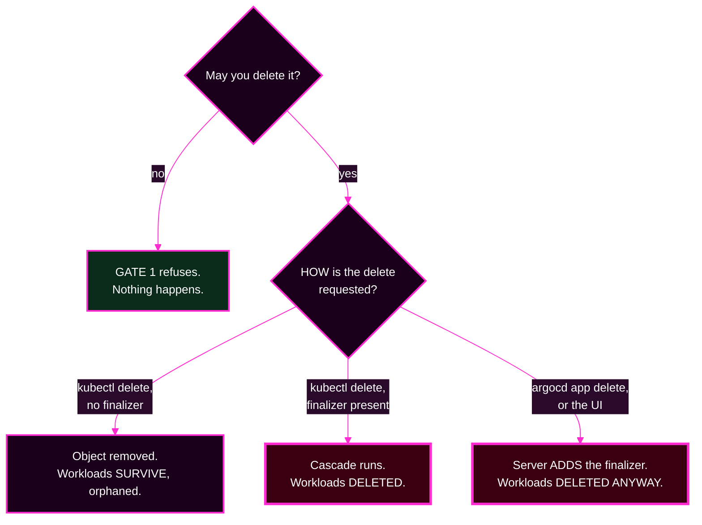
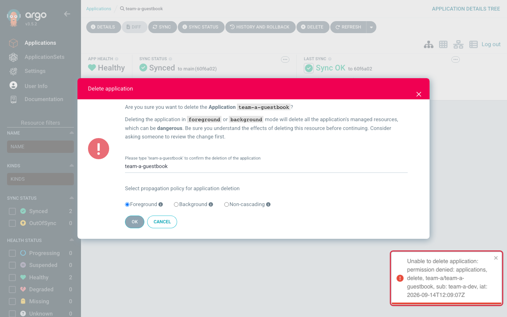

# Lab 5 · Module 4 — Deletion, Finalizers, and Wrap-Up

> **Day 2 · Lab 5 · Module 4 of 4 · 10 minutes**
> **Run every command in your VM terminal**, after `source ~/argo-lab-env.sh`.
> **← Back to:** [Day 2 map](../README.md) · [Lab 5](README.md)

---

## Module TL;DR

- **What this is.** You prove the tenant role cannot delete an Application, then find out where the deletion danger actually lives.
- **Why it matters.** It is not where most people look. It is not a field on the object.
- **What to remember.** *The deletion danger lives in the delete path, not in the object.*
- **The most common mistake.** Concluding that an Application with no finalizer is safe from a cascading delete. It is not.

---

# Exercise 5 — Deletion and finalizers · 6 min

## Why

Deleting an Application is governed by gate 1, like any other verb. But **what a delete destroys** is decided somewhere else entirely — and getting that wrong is how a "small cleanup" removes production.

## Starting state

E1 and E2 are live. The throwaways from E3 and E4 are gone. `team-a-guestbook` is `Synced`/`Healthy`. `team-a-dev` has `get` and `sync` only.

**Identity:** `admin` to begin with.

## Mental model

**Two separate questions, and people conflate them.**

*May you delete this?* is a permission question, answered by gate 1.
*What disappears when you do?* is a mechanics question, answered by the **delete path**.



*Read the three outcomes on the right. **The object's fields are the same in all three.** Only the request differs.*


---

## Part A — attempt the delete for real

**▶ First, confirm the safety interlock.** As `admin`:

```bash
argocd admin settings rbac can team-a-dev delete applications 'team-a/team-a-guestbook' --namespace argocd
```

> **⚠️ Do not continue until this prints `No`.** This is a real interlock, not a formality. `argocd app delete` at v3.5.2 **does not ask for confirmation** — verified. If your E1 grant were over-broad, the next command would actually delete a working Application.
>
> If it prints `Yes`, go back and fix E1 first.

**▶ Predict:** you already saw gate 1's *terse* form in E4 Part A. This time `team-a-dev` **can** see the object it is asking about. **Will the message be terse or detailed?**

**Switch identity and try it:**

```bash
argocd login localhost:8443 --username team-a-dev --insecure
argocd app delete team-a-guestbook
```

## Observe

**Expected** — verified on the course environment:

```text
{"level":"fatal","msg":"rpc error: code = PermissionDenied desc = permission denied:
applications, delete, team-a/team-a-guestbook, sub: team-a-dev, iat: ..."}
```

**🔍 Compare that with E4 Part A's bare `permission denied`:**

| | E4 Part A | E5 Part A |
|---|---|---|
| Could the subject `get` the object? | **no** | **yes** |
| What the message says | `permission denied` | the **full rule**: resource, action, object, subject, issued-at |
| Which gate | gate 1 | gate 1 |

> **The rule: when the subject may `get` the object, Argo CD names the rule. When it may not, the answer is stripped to two words** — because describing the denial would confirm that an object they cannot see exists.
>
> **Same gate. The difference is what you are allowed to know.**

---

## Part B — where the danger actually lives

**Switch back to `admin`:**

```bash
argocd login localhost:8443 --username admin \
  --password "$(cat ~/course/credentials/argocd-admin.txt)" --insecure
```

**▶ Predict before you run this:** which of your Applications carry the `resources-finalizer.argocd.argoproj.io` finalizer — the marker that makes a deletion cascade to the workloads?

```bash
kubectl --context k3d-mgmt -n argocd get applications \
  -o custom-columns='NAME:.metadata.name,FINALIZERS:.metadata.finalizers'
```

**Expected** — verified on the course environment:

```text
NAME                          FINALIZERS
platform-agent                <none>
platform-netpol               <none>
platform-quotas               <none>
platform-root                 <none>
storefront-dev-workload       <none>
storefront-prod-workload      <none>
storefront-staging-workload   <none>
team-a-guestbook              <none>
```

**Not a single Application carries the finalizer.**

- The `storefront-*` apps **cannot**, because Lab 4's `preserveResourcesOnDeletion: true` is precisely an instruction not to add it.
- The hand-written ones do not, because nobody wrote one.

**▶ Now look at the delete dialog in the user interface.** Open `team-a-guestbook` and press **DELETE**. Read the dialog *before* confirming, then cancel.



*Figure SS-L5-07 — The dialog warns that **Foreground** and **Background** deletion "will delete all the application's managed resources." **Non-cascading** removes only the Application object and orphans the workloads. Confirmation requires typing the name — friction by design.*

<!-- CAPTURE-SPEC: SS-L5-07 — delete dialog + denial as team-a-dev. State: E5B. Argo CD v3.5.2. -->

## Diagnose — the contradiction

**Two things are both true, and together they give you the real rule:**

1. **No Application here carries the finalizer.**
2. **The dialog still offers to delete all managed resources.**

**▶ How can both be true? Write your answer before opening this.**

<details>
<summary>Show the answer</summary>

**Because the finalizer is not the only way a cascade happens.**

| How the delete is requested | Finalizer present? | What happens to the workloads |
|---|---|---|
| `kubectl delete application <name>` | yes | **deleted** — the finalizer runs the cascade |
| `kubectl delete application <name>` | no | **survive**, orphaned |
| `argocd app delete <name>` (default), or the UI's Foreground/Background | no | **deleted anyway** — the Argo CD server adds the finalizer for you as it deletes |

**The object's fields did not decide the outcome. The client did.**
</details>

## Explain why

> **Say the rule out loud: the deletion danger does not live in the object — it lives in the delete *path*.**
>
> Whether the workloads die is decided by **how the delete is requested** — the propagation policy the client asks for, or a finalizer running the cascade — **not by any field on the Application**.
>
> **An Application showing `<none>` for finalizers is not safe.** It is one `argocd app delete` away from taking its workloads down with it.

### How far does a cascade reach? One layer.

A cascade deletes the Application's **own** managed resources.

- For `team-a-guestbook`, that is its Deployment and its Service.
- For `platform-root`, that is the three **child Application objects** — and because those children carry no finalizer either, **their** workloads keep running, orphaned.

**That is the Lab 4 Module 3 observation arriving as a consequence.** A cascade stops at the first layer whose objects lack a finalizer.

**▶ Write two or three sentences:** *why is "there is no finalizer on it" a dangerous thing to rely on?* Connect the delete **path** to the outcome, not the object's fields.

**This is exactly the reasoning the capstone expects when an Application and its workloads disappear together.**

### Staged hints

<details>
<summary><b>Hint 1 — what to inspect</b></summary>

You checked a field on the object. But the outcome of a delete is not determined only by the object.

What else participates in a deletion?
</details>

<details>
<summary><b>Hint 2 — which command or object to examine</b></summary>

Compare the two clients. `kubectl delete` sends a plain deletion request. `argocd app delete` goes through the **Argo CD API server**, which can modify the object on its way.

Read the UI dialog's three propagation options again. Each one is a different *request*, not a different object.
</details>

<details>
<summary><b>Hint 3 — how to interpret what you get back</b></summary>

If the finalizer were the only mechanism, the UI could not honestly offer to delete managed resources for an Application that has none.

It offers it because the server **adds** the finalizer as part of performing the delete.
</details>

<details>
<summary><b>Final hint — the direction</b></summary>

The protection that actually holds is **not** the absence of a finalizer. It is **gate 1**: do not grant `delete` to a role that only needs `sync`.

That is what you built in E1, and what Part A just proved.
</details>

## Verify

```bash
argocd app get team-a-guestbook
argocd app list -o name | grep team-a
```

**Expected:** `team-a-guestbook` still `Synced`/`Healthy`, and it is the only `team-a` Application. **The denial held in both the CLI and the user interface**, because both go through the same API server.

## Cleanup

**Nothing to clean up.** Make sure you are logged back in as `admin`:

```bash
argocd account get-user-info
```

**Expected:** `Logged In: true`, `Username: admin`.

## ✅ Key Takeaways — E5

- **How much a denial tells you depends on what you may see.** Gate 1 names the rule when you can `get` the object, and says two words when you cannot.
- **No Application in this course carries the cascade finalizer** — and they are still not safe from a cascading delete.
- **The deletion danger lives in the delete path, not the object.**
- **A cascade reaches one layer.** Children without finalizers leave their own workloads orphaned.
- **Least privilege on `delete` is the boundary that actually holds.**

---

## Lab 5 checkpoint

**The checkpoint is not "did anything turn green."** It is: **did each refusal come from the gate I predicted, with a message that named the rule?**

| Attempt | Predicted gate | Message contains | Sync result rows? | Match? |
|---|---|---|---|---|
| E3 wrong destination | 2 · AppProject | `InvalidSpecError` … `do not match any of the allowed destinations in project 'team-a'` | none | |
| E4-A `team-a-dev` syncs storefront | 1 · Argo CD RBAC | `permission denied` (terse); the log adds `applications, get, storefront/…, sub: team-a-dev` | none | |
| E4-B NetworkPolicy in `team-a` | 4 · Kubernetes RBAC | `forbidden` … `system:serviceaccount:argocd-access:argocd-manager` | **one, `SyncFailed`** | |
| E5 delete own app | 1 · Argo CD RBAC | `permission denied: applications, delete, team-a/team-a-guestbook, sub: team-a-dev` | n/a | |
| *(optional)* ClusterRole | 3 · Cluster scope | `ComparisonError` … `can not be managed when in namespaced mode` | none | |

**Score the result-rows column with:**

```bash
kubectl --context k3d-mgmt -n argocd get application <name> \
  -o jsonpath='{.status.operationState.syncResult.resources}' ; echo
```

**Empty = "none". A list containing `"status":"SyncFailed"` = "one".**

### You pass when all four are true

**1 — The happy path works and the throwaways are gone.**

```bash
argocd app list -o name | grep team-a
```

**Expected:** `argocd/team-a-guestbook` and nothing else, `Synced`/`Healthy`.

**2 — Every attempt was refused, and you can name the gate from its message** — or say which gate spoke instead of the one you predicted, and why it got there first.

**3 — The grant is least privilege.**

```bash
argocd admin settings rbac can team-a-dev sync   applications 'team-a/team-a-guestbook' --namespace argocd
argocd admin settings rbac can team-a-dev delete applications 'team-a/team-a-guestbook' --namespace argocd
```

**Expected:** `Yes`, then `No`.

**4 — The fence is committed.**

```bash
git -C ~/platform-config log --oneline -1
git -C ~/platform-config status --short
```

**Expected:** your commit containing `projects/team-a.yaml` and the `values.yaml` edit, with a clean working tree.

> **If any check fails**, `reset-lab.sh CP-capstone --local` restores the state the capstone expects, including a correct team-a fence.

---

## Design debrief — a guardrail is only as good as the message it fails with

**▶ Rank the four denials** by how easily a developer who hit them cold — with no access to your `argocd-server` logs — could diagnose their own problem.

**The terse `permission denied` from E4 Part A almost certainly ranks last.**

**Now write a better message for it.** What would it need to say to be self-serviceable *without* leaking the existence of an object the caller may not see?

> **There may be no fully satisfying answer. Noticing that tension is the lesson.** A guardrail nobody can interpret is not prevention — it is a support ticket. This rehearses the capstone's closing step, where you propose the guardrail or monitoring change that would have caught each fault sooner.

---

## Troubleshooting reference for the whole lab

| Symptom | Cause | Fix |
|---|---|---|
| `invalid session: account password has changed since token issued` | an apply re-stamped passwords — uncommon; check the apply's output | log in again ([Module 1 §4](01-environment-and-mechanisms.md#4-how-a-values-change-becomes-live-argo-cd-configuration)); refresh the browser |
| `apply-argocd-config.sh` succeeds but the policy is unchanged | it applies what is **committed and pushed** to `main`, plus any values file you pass | pass the path, or commit and push first. Verify with `kubectl --context k3d-mgmt -n argocd get cm argocd-rbac-cm -o jsonpath='{.data.policy\.csv}'` |
| `please provide exactly one of --policy-file or --namespace` | the command has no default source | add one flag — never both |
| `team-a-dev` logs in but sees nothing and every action fails | the E1 grant was not applied, or `policy.csv` is still empty | confirm `rbac can team-a-dev get applications 'team-a/*' --namespace argocd` prints `Yes` |
| Unexpected `InvalidSpecError … do not match any of the allowed destinations` | gate 2 — the source or destination is outside team-a's allow-lists; nothing applied | read the named value; fix the app, or widen the project deliberately and commit it |
| `Phase: Error`, `0s`, `can not be managed when in namespaced mode` | gate 3 — the cluster registration forbids cluster-scoped kinds, and is reached before the project's allow-lists | intended in the optional deepening. Outside the lab, fix the cluster Secret |
| Sync **starts**, a `SyncFailed` row appears, message says `forbidden` | gate 4 — Kubernetes RBAC, **not** the AppProject | fixed on the **workload** cluster with a `Role`/`RoleBinding`; confirm with `auth can-i … --as` |
| `another operation is already in progress` | a previous sync is still running | `argocd app terminate-op <app>`, remove any `syncPolicy:` block, re-apply |
| `rbac can` says `'sync' is not a valid resource name`, or answers `No` unexpectedly | the argument order is `can <subject> <action> <resource> <object>` — resource and action swap versus a policy line | re-run with the correct order; the object is `<project>/<app>` |
| `argocd app sync` on a refused app never returns | the CLI is waiting for a desired state the app will never reach | Ctrl+C, then re-run with `--timeout 30` |

---

## ✅ Key Takeaways from the whole of Lab 5

- **A guardrail you have never tried to break is one you do not have.** The proof it works is a refused attempt; the proof it is *good* is a refusal that names the rule.
- **Four gates, three systems, four error signatures.** Three live in Argo CD; one lives on the workload cluster.
- **Several gates can refuse one request, and only the first one speaks.** Name the gate from the message's **vocabulary**, not from your prediction.
- **Read the sync result, and know where it lives.** An Argo CD-side refusal leaves it empty; a Kubernetes-side failure fills it with `SyncFailed` rows. That tells you which team to page.
- **How much a denial tells you depends on what you may see.** The full detail is always in the `argocd-server` log, tagged `security=2`.
- **`rbac can --policy-file` is a unit test for your permission model**; `--namespace argocd` is the production check.
- **Deletion danger lives in the delete path, not the object.** Least privilege on `delete` is the boundary that holds.

---

## Optional stretch challenges — outside the timebox

**1 — Prove deny precedence.** In Argo CD RBAC a `deny` always beats an `allow`, regardless of order. Add `p, role:team-a, applications, delete, team-a/*, deny` alongside a deliberately broad `allow` in a scratch file, and prove offline that the answer is still `No`. Then decide whether you would ship it: is an explicit `deny` clearer to a reviewer than an absent line, or is it noise?

**2 — Lock the ApplicationSet controller.** In `~/platform-config/argocd/values.yaml`, add `applicationsetcontroller.policy: create-update` under `configs.params`, then apply with the path as in E1. Confirm it landed:

```bash
kubectl --context k3d-mgmt -n argocd get cm argocd-cmd-params-cm \
  -o jsonpath='{.data.applicationsetcontroller\.policy}' ; echo
```

**Predict:** can a single ApplicationSet still opt into `create-delete`? Test with a scratch ApplicationSet that deploys nothing, then delete it. **Revert without losing your E1 work:** `git -C ~/platform-config checkout -- argocd/values.yaml`, then run `apply-argocd-config.sh` with no argument, which re-applies `main` — including your committed E1 grant.

**3 — Project roles and scoped tokens, and sync windows.** Both are covered with working commands in [the Session 6 optional reference](../session-06/90-reference-sso-secrets-and-governance.md#3-governance-controls-that-ride-on-the-gates). **If you try a sync window, remove it before the capstone.** A forgotten deny window looks exactly like a mysterious refusal, and you will waste incident time on scaffolding you created yourself.

---

## Final module TL;DR

- **What this is.** A refused delete, and the real location of deletion danger.
- **Why it matters.** The capstone expects you to reason about a delete path, not a field.
- **What to remember.** *The deletion danger lives in the delete path, not the object.*
- **The most common mistake.** Reading `<none>` in the finalizers column and concluding you are safe.

---

## Transition — from gates to failures

You have built and *felt* every boundary a platform team owns, and you can read an authorization denial down to the exact gate that produced it — including when the gate you expected never got to speak.

That reading skill becomes the core of the course's finale. **[Session 7](../session-07/README.md)** formalises the troubleshooting method you have been building since Lab 1, and names the discipline you used here: **evidence comes before change**.

Then the **capstone** hands you a platform with *several* connected failures at once — one of them an authorization denial like these, except nobody tells you which gate it is. The habits you built today are how you will find it: *did anything actually get applied?* and *whose vocabulary is this message written in?*

**→ Next:** [Session 7 — Reliability and Troubleshooting](../session-07/README.md)
