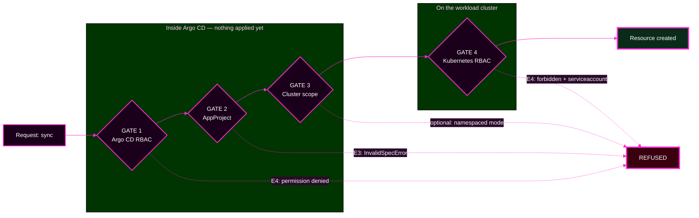

# Lab 5 — Enforce Platform Guardrails

> **Day 2 · Lab 5 · Hands-on · 45 minutes**
> **Argo CD version this course targets: `v3.5.2`** (Helm chart `10.8.4`, Kubernetes `v1.35`; repo-server renders with **Helm v4.2.1**).
> **Starting checkpoint: `CP-lab-05`.**
> **Before this:** [Session 6](../session-06/README.md) and all earlier labs.
> **← Back to:** [Day 2 map](../README.md)

---

## Lab TL;DR

- **What this is.** You build a real fence around a new tenant, prove it lets the right thing through, then try to walk through it twice — once refused by Argo CD, once refused by Kubernetes.
- **Why it matters.** The capstone contains an authorization fault and does not tell you which gate it is.
- **What to remember.** *"Permission denied" is not a diagnosis. "Which permission system denied it" is.*
- **The most common mistake.** Naming the gate from what you predicted, instead of from the message's vocabulary.

---

## Why this lab exists

**A guardrail you have never tried to break is not a guardrail — it is a hope.**

When you add a restriction, nothing lights up green. The only evidence that a fence exists is **an attempt that was refused**. And the only evidence that it is a *good* fence is that the refusal **said something useful**: it named the rule and the offending value, so that whoever hit it can fix their own mistake without paging you.

So you will fence in a brand-new tenant — **team-a** — and then genuinely try to walk through the fence. Each attempt is refused by a **different system**, with **different error text**, logged in a **different place**, and fixed by a **different team**.

---

## The four gates, as Session 6 named them

| Gate | The question | Where it is configured | Refuses |
|---|---|---|---|
| **1 · Argo CD RBAC** | Can this **user** request the action? | `argocd-rbac-cm` (`policy.csv`) | before anything is applied |
| **2 · AppProject** | Is this **source or destination** allowed? | the `AppProject` | before anything is applied |
| **3 · Cluster registration scope** | May Argo CD **manage this scope**? | the cluster registration Secret | before anything is applied |
| **4 · Kubernetes RBAC** | Can the **ServiceAccount** do it? | `Role`/`RoleBinding` on the workload cluster | **during** the apply |



**Carry three things into every exercise:**

1. **Gates 1, 2, and 3 refuse without touching the workload cluster.** Gate 4 refuses *after* Argo CD has begun applying.
2. **The reliable tell is "did anything get applied?"**, not "did the sync start." An Argo CD-side refusal records `Phase: Error`, `Duration: 0s`, and an **empty sync result**. A gate-4 failure fills the sync result with a `SyncFailed` row.
3. **Several gates can refuse the same request, and only the first one speaks.**

---

## What you will do

| # | Exercise | You will | Module |
|---|---|---|---|
| **E1** | Build the fence | create team-a's restricted AppProject and a least-privilege RBAC grant | 2 |
| **E2** | Prove the happy path | deploy an app that lands inside every gate and reaches `Synced`/`Healthy` | 2 |
| **E3** | An AppProject denial | point an app somewhere its project forbids, and read the refusal | 3 |
| **E4** | A Kubernetes RBAC denial | sync something the cluster refuses, and compare the two denials | 3 |
| **E5** | Deletion and finalizers | prove the team role cannot delete, and find where the real danger lives | 4 |

---

## Before you start: where you are running

Every command runs in your **VM terminal**, after:

```bash
source ~/argo-lab-env.sh
```

**You will switch identity several times in this lab.** That is a real source of confusion, so each step says which account to be. Check at any time with:

```bash
argocd account get-user-info
```

**Two Kubernetes contexts, as always:**

| Context | Holds | In this lab |
|---|---|---|
| `k3d-mgmt` | Argo CD | Applications, AppProjects, the RBAC ConfigMap, the server log |
| `k3d-workload` | the workloads | the `team-a` namespace, and the `Role` that gate 4 enforces |

**Credentials** live in `~/course/credentials/`. **Never print, paste, or commit them.**

---

## The four modules

| Module | You will | Exercises | Time |
|---|---|---|---|
| [01 — Starting state and the two mechanisms](01-environment-and-mechanisms.md) | confirm the start state; learn how a fence and a policy are written, applied, and read | — | 5 min |
| [02 — Build the fence, prove the happy path](02-build-fence-and-happy-path.md) | create the AppProject and the RBAC grant; deploy inside every gate | **E1, E2** | 12 min |
| [03 — Two denials, two systems](03-bypass-attempts.md) | trigger an Argo CD refusal and a Kubernetes refusal, and compare them | **E3, E4** | 18 min |
| [04 — Deletion, finalizers, and wrap-up](04-deletion-protection-and-wrap-up.md) | prove delete is denied; find where deletion danger really lives | **E5** | 10 min |

**Each module page is the authoritative version of its content.** This page is a map.

---

## How hints work in this lab

Every exercise has **staged hints**. Open them one at a time and try the suggestion before opening the next.

| Hint | Tells you |
|---|---|
| **Hint 1** | what to inspect |
| **Hint 2** | which command or object to examine |
| **Hint 3** | how to read what you got back |
| **Final hint** | the likely direction of the fix |

---

## Recovering from anything

| Situation | What to do |
|---|---|
| `invalid session: account password has changed since token issued` | log in again — see [Module 1 §4](01-environment-and-mechanisms.md#4-how-a-values-change-becomes-live-argo-cd-configuration) |
| You granted too much in E1 | fix `policy.csv`, re-apply, and re-run the offline check before continuing |
| A throwaway Application is stuck | `argocd app terminate-op <name>`, then delete it with `--cascade=false` |
| The lab is tangled | `reset-lab.sh CP-lab-05 --local` and start the module again |

> **One safety rule for this lab: never point a delete command at `team-a-guestbook`.** Check the name twice. `argocd app delete` at v3.5.2 **does not ask for confirmation** — verified.

---

## Final TL;DR

- **Build a fence, prove it works, then break it twice** — 45 minutes, five exercises.
- **Four gates, four owners, four message signatures.**
- **The routing question is "did anything on the cluster actually get touched?"**
- **The most common mistake** is trusting your prediction over the message's vocabulary.

**→ Start:** [01 — Starting state and the two mechanisms](01-environment-and-mechanisms.md)
