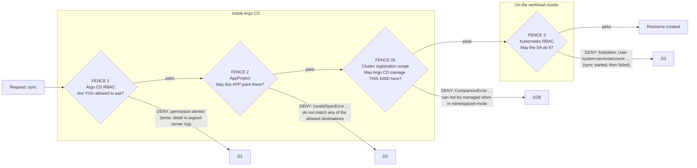

# Lab 5 — Enforce Platform Guardrails (modular arc)

> **Day 2 · Lab 5 · Hands-on · ~50 minutes · Scaffolding G2 (reduced)**
> **Argo CD version this course targets: `v3.5.2`** (Helm chart `10.8.4`, Kubernetes `v1.35`; repo-server renders with **Helm v4.2.1**).
> **Before this:** [Session 6](../session-06/README.md) and all earlier labs. Every *new* idea is explained before you use it; Day-1/Lab-4 mechanics are not re-explained — you will often write a manifest or policy line yourself first.
> **Open:** the Argo CD UI (`https://localhost:8443`, `admin`), a terminal with `argocd`/`kubectl` (`source ~/argo-lab-env.sh`), and your clone of `platform-config` (at `~/platform-config`).

---

## Why this matters

A guardrail you have never tried to break is not a guardrail — it is a hope. When you add a restriction, nothing lights up green; the only evidence a fence exists is **an attempt that was refused**, and the only evidence it is a *good* fence is that the refusal **said something useful** — it named the rule and the offending value, so whoever hit it can fix their own mistake without paging you.

So you will fence in a brand-new tenant — **team-a** — then genuinely try to walk through the fence four ways. Each attempt is refused by a *different* guard, with *different* error text, logged in a *different* place, fixed by a *different* team. One of the four is refused by a guard you may not predict — and that is the most useful thing in the lab: real platforms are defended in depth, several guards can refuse the same request, and only one gets to speak first.

That skill is what the Capstone grades hardest: "permission denied" is not a diagnosis. "*Which* permission system denied it" is.

---

## Learning objectives

1. Create a restricted AppProject for team-a from a specification, and write the Argo CD RBAC policy that lets a team account use it with least privilege (**L5.1**).
2. Permit an approved source, namespace, and cluster by creating an Application that reaches `Synced`/`Healthy` *because* it lands inside every fence (**L5.2**).
3. Block an unauthorized destination and a cluster-scoped resource, predicting and observing exactly which guard refuses each — including when two guards could and only one did (**L5.3**).
4. Compare an Argo CD authorization failure with a Kubernetes authorization failure — who denied it, where logged, which config fixes it, who owns it (**L5.4**).
5. Protect Applications from unintended deletion at the governance layer (**L5.5**).

Maps to outcomes **O6, O7**.

---

## Mental model recap (short — Session 6 taught this)

A single request — "sync this Application" — walks past a line of guards, each a *different* system with a *different* error signature. Session 6 taught three fences; this lab adds one you built in Lab 2 but have not seen speak: the **cluster registration scope** (fence 2b).

Carry four things: (1) fences 1, 2, 2b live inside Argo CD and refuse without touching the workload cluster; (2) fence 3 refuses *after* the sync begins applying, with a `forbidden` message naming a ServiceAccount; (3) the fast question is "did the sync start?" but the **reliable tell is "did anything get applied?"** — an Argo CD-side refusal records `Phase: Error`, `Duration: 0s`, **empty sync result**, while a fence-3 failure fills the sync result with a `SyncFailed` row; (4) several guards can refuse the same request, and only the first one speaks.

> **Where the result rows are:** in the **UI**, the sync-result panel's **RESULT** section (a `SyncFailed` row for fence 3; no RESULT section for fence 2/2b). In the **CLI**, `argocd app get` prints the *resource tree* in both cases — so the tell there is the **MESSAGE column** (empty for Argo CD-side, the cluster's rejection text for Kubernetes-side). The mechanical settler: `kubectl --context k3d-mgmt -n argocd get application <name> -o jsonpath='{.status.operationState.syncResult.resources}'` — nothing after a fence-2/2b refusal, a list with `"status":"SyncFailed"` after fence 3.

---

## The four modules

| Module | You will... | Exercises | ~Time |
|---|---|---|---|
| [01 — Environment and the two mechanisms](01-environment-and-mechanisms.md) | Confirm the start state; learn how a fence and a policy are written, applied, and read | — | ~5 min |
| [02 — Build the fence and prove the happy path](02-build-fence-and-happy-path.md) | Create team-a's AppProject + RBAC grant; deploy its app inside every fence | **E1, E2** | ~13 min |
| [03 — Bypass attempts](03-bypass-attempts.md) | Trigger and diagnose four refusals from four guards | **E3, E4** | ~18 min |
| [04 — Deletion protection and wrap-up](04-deletion-protection-and-wrap-up.md) | Prove delete is denied; the deletion-path danger; checkpoint and stretch | **E5** | ~10 min |

**→ Start:** [01 — Environment and the two mechanisms](01-environment-and-mechanisms.md)
