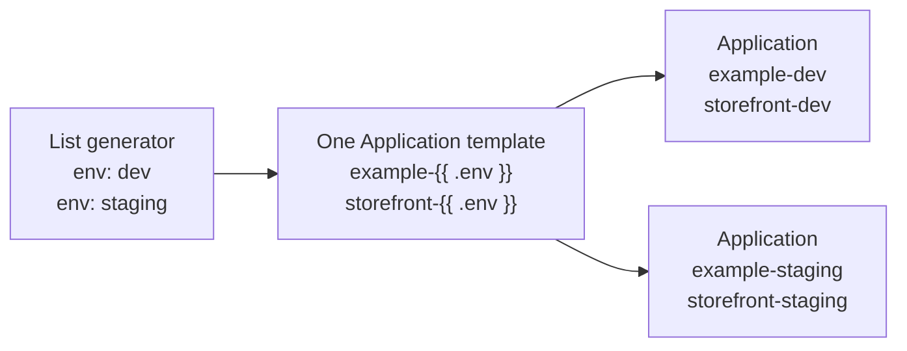
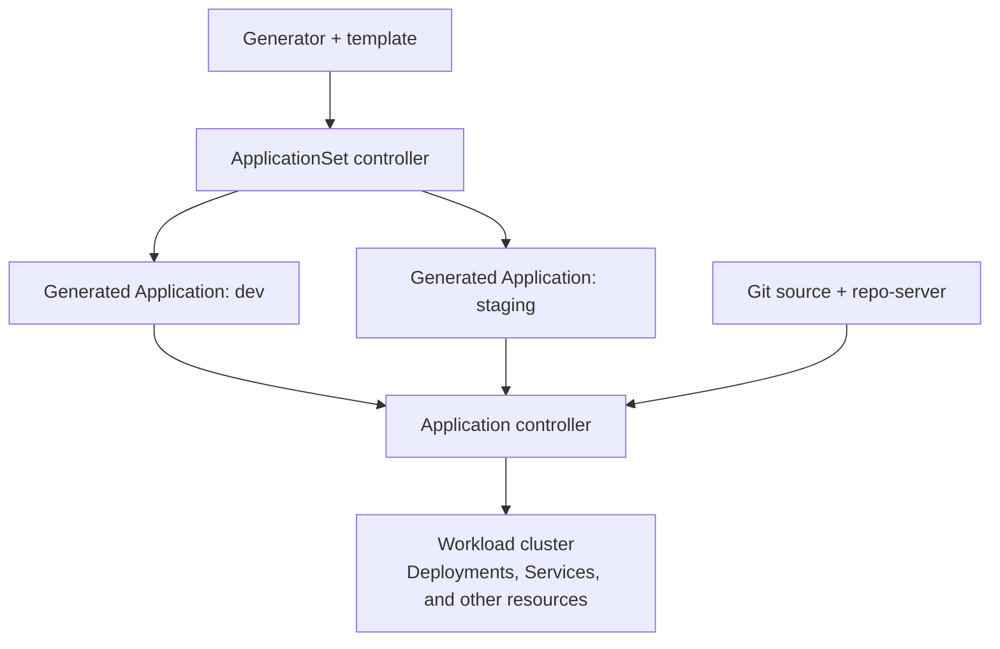

# Session 5 · Module 1 — ApplicationSets: One Template, Many Applications

> **Day 2 · Session 5 · Module 1 of 3 · ~22 minutes · concept + hands-on**
> **Goal:** predict which Applications one ApplicationSet will produce, then prove your prediction with a preview that creates nothing.

**By the end, you should be able to:**

- Explain why a team would use an ApplicationSet instead of copying Application YAML files.
- Point to the **generator**, the **template**, and the resulting **Applications**.
- Preview two Applications and check their names, destinations, and environment values files.
- Explain why one shared edit can affect many Applications, and why that does not necessarily mean an immediate rollout.

> **Where this fits:** Day 1 taught you how one Application connects Git to a cluster. This session lets you rehearse how to produce many Applications consistently. **Lab 4** is where you build the storefront factory, apply it, and troubleshoot it.

---

## 1. The problem: “Can we add another environment?”

You already have an Application for `storefront` in development. Now the team wants staging too.

You could copy the Application YAML and change its name, namespace, and values file. That works for two environments. But with ten environments, a shared change means finding and updating ten similar files. It becomes easy to miss one or leave the wrong destination in a copy.

**An ApplicationSet describes the shared parts once and supplies the differences as data.** Its controller uses that description to create and maintain ordinary Argo CD Applications.

Think of a mail merge: one letter template plus two recipient records produces two personalized letters. Here, one Application template plus two environment records produces two Applications.

**Today's concrete task:** read the existing example, predict the Applications for `dev` and `staging`, and preview them. Success is being able to explain the output—not deploying another storefront yet.

---

## 2. Read the factory: inputs, template, output



*Read each output back to its input: `env: dev` supplies the `dev` in the Application name, namespace, and values-file path.*

An **ApplicationSet** is a Kubernetes custom resource installed with Argo CD. Like an Application, it is a YAML-described object stored in the Kubernetes API. In this course, both live in the management cluster's `argocd` namespace.

There are two main parts inside its `spec`:

| Part | Plain-language meaning | In today's example |
|---|---|---|
| `generators` | Produce records of values to use in the template | Two records: `env: dev` and `env: staging` |
| `template` | Describe one Application, with placeholders for what varies | `example-{{ .env }}`, `storefront-{{ .env }}`, and an environment values-file path |

A **placeholder** marks where a value will be inserted. With Go templating enabled, `{{ .env }}` means “use the `env` value from this record.”

Here are the relevant parts of the course example. **This is an excerpt to read, not a complete manifest to apply.**

```yaml
spec:
  goTemplate: true
  goTemplateOptions: ["missingkey=error"]
  generators:
    - list:
        elements:
          - env: dev
          - env: staging
  template:
    metadata:
      name: "example-{{ .env }}"
    spec:
      project: storefront
      source:
        # Shared repository, revision, and chart path omitted here.
        helm:
          valueFiles:
            - "../../envs/{{ .env }}/values.yaml"
      destination:
        server: https://k3d-workload-server-0:6443
        namespace: "storefront-{{ .env }}"
```

`missingkey=error` makes a missing template value an error; Module 2 explores why that matters.

**Pause and predict:** which fields change between the two generated Applications? Which destination field stays the same?

Both target the **same workload cluster**. An environment does not have to mean a separate cluster; this example separates environments by namespace and values file.

### Can each generated Application use its own Git repository?

**Yes.** The repository URL is part of the Application template, so every generated Application can point to a different repository when the generator supplies a `repoURL` value. A Git generator could produce one record for `payments.git` and another for `catalog.git`, while the template uses `{{ .repoURL }}`.

Most ApplicationSet examples use one repository because the Applications share a chart or deployment structure. Separate repositories make sense when teams own services independently, access must be isolated, or release lifecycles differ. The ApplicationSet still creates the Application objects; each Application then reads its own declared repository.

---

## 3. Who actually deploys the workload?



*There are two responsibilities: maintain the list of Applications, then reconcile each Application's workload.*

The **ApplicationSet controller** creates, updates, and—subject to its configured policy—deletes **Application objects**. The **application controller** reconciles each generated Application against its Git source and destination, using the repo-server to obtain rendered manifests.

A generated Application works like the ones you used on Day 1. It still has a source, destination, project, sync status, and health status.

**Creating an Application and syncing its workload are separate actions.** A manual-sync Application waits for a sync request. An Application with automated sync enabled can sync automatically, subject to its controls. Today's example does not enable automated sync, and our preview does not create the Applications in the first place.

Use that distinction when diagnosing a problem:

| What you observe | Start by inspecting |
|---|---|
| An expected Application is missing, has the wrong name, or points to the wrong namespace | The ApplicationSet's generator, template, and generation errors |
| The Application has the intended spec, but rendering, sync, or workload health fails | That Application's source, events, conditions, and workload resources—the Day 1 troubleshooting path |

`OutOfSync` means the desired resources and live resources differ. It does not, by itself, tell you whether the workload is healthy.

---

## 4. Guided practice: predict → preview → explain

### A. Open the existing example

Use your course terminal with the Argo CD command-line interface (CLI) logged in. Open your **existing `platform-config` clone**, then run:

```bash
source ~/argo-lab-env.sh
pwd
ls examples/appset-list.yaml
cat examples/appset-list.yaml
```

**Expected:** `pwd` ends in your `platform-config` directory, and the file contains the two elements `dev` and `staging`. If the file is not found, check that you are in the clone's top-level directory.

The `storefront` AppProject from Lab 2 must already exist. If your instructor has moved the environment to the Day 2 checkpoint, it is also present there. This preview does not require resetting your environment.

**Before running the preview, write down:**

1. The number of Applications you expect.
2. Their names and destination namespaces.
3. The values file each will use.

### B. Preview the generated Applications

```bash
argocd appset generate examples/appset-list.yaml -o yaml
```

This sends the definition to Argo CD to generate and validate the Application output. **It prints the result; it does not save an ApplicationSet or create Applications.** It needs a reachable Argo CD server and a valid CLI login.

Locate these fields in the output:

| Input record | Application name | Destination namespace | Helm values file |
|---|---|---|---|
| `env: dev` | `example-dev` | `storefront-dev` | `../../envs/dev/values.yaml` |
| `env: staging` | `example-staging` | `storefront-staging` | `../../envs/staging/values.yaml` |

Both should use project `storefront`, chart path `charts/storefront`, and server `https://k3d-workload-server-0:6443`.

**What you proved:** two input records filled the same template twice. You did not write two separate Application manifests.

### C. Check that the preview did not create them

```bash
kubectl --context k3d-mgmt -n argocd get applications \
  example-dev example-staging --ignore-not-found -o name
```

**Expected in the untouched course example:** no output. The command succeeded but found neither Application. If a name appears, that Application already exists from another action; `generate` does not create it.

If preview reports that project `storefront` does not exist, check your course environment with the instructor. If it reports a connection or authentication error, restore your CLI connection before continuing. Neither error tells you that the generator needs changing.

> **Stop here for this practice.** There is nothing to apply or clean up. Preview confirms the generated definitions; it does not prove that the chart will render or that a workload will deploy successfully. Lab 4 adds those checks.

---

## 5. Why preview matters more as the list grows

The number of generated Applications is called the **fan-out**. The number that a change could affect is its **blast radius**.

For today's List generator, two records produce two Applications. For a Matrix generator combining two independent lists of **2 clusters × 3 environments**, the preview would contain **6 Applications**, assuming unique names and valid inputs. That is a scaling example; today's course preview still produces two.

| Change to today's definition | Expected effect when a live ApplicationSet reconciles |
|---|---|
| Add another environment record | Generate one additional Application, if the input is valid |
| Change a shared field such as `template.spec.source.targetRevision` | Update that field in both generated Applications, if updates are permitted |
| Change the template's namespace expression | Potentially change both Applications' destinations |

A shared edit can reach many Applications. **It does not guarantee that they all roll out immediately or simultaneously.** Workload rollout depends on each Application's sync configuration and applicable controls.

Before accepting a factory change, ask: **“How many Applications will this produce, what will they be called, and where will they point?”** Module 2 turns that question into a repeatable safety check.

---

## 6. Five generators to recognize

A **generator** supplies template values. The difference between generator types is where those values come from, or how they are combined.

| Generator | YAML key | Question it answers | Example |
|---|---|---|---|
| List | `list` | “Which records did I explicitly list?” | `dev` and `staging` in today's file |
| Cluster | `clusters` | “Which registered clusters match my selector?” | Clusters labelled `cluster-role: workload` |
| Git | `git` | “Which files or directories match in this repository?” | One record per matching environment configuration file |
| Matrix | `matrix` | “What combinations do two generators produce?” | Each environment on each selected cluster |
| Merge | `merge` | “Which records match by key, and what values should override them?” | A base cluster list with selected per-cluster overrides |

**Notice the spelling:** the Cluster generator's YAML key is `clusters`, plural.

In the course environment, `cluster-role: workload` selects the workload cluster and excludes the management cluster **because of their current labels**. A selector depends on correct labels; it is not a permanent guarantee against targeting the wrong cluster.

Argo CD also offers SCM Provider, Pull Request, Cluster Decision Resource, and Plugin generators. You do not need them for this exercise.

---

## 7. Where does App-of-Apps fit?

**App-of-Apps** uses a parent Application whose Git source contains child Application manifests. **ApplicationSet** generates Applications from a template and records.

| Your need | Pattern to consider |
|---|---|
| Many Applications with the same structure and different values | ApplicationSet |
| A parent that manages an explicitly defined collection of child Applications | App-of-Apps |

An ApplicationSet can use a hand-written List generator, so the choice is not simply “automatic list versus manual list.” Ask whether a shared template fits the Applications you need.

App-of-Apps also does **not automatically guarantee deployment order or readiness across children**; that needs deliberate configuration. Module 3 covers the pattern, ownership, and deletion boundaries.

---

## 8. Check that the idea has landed

Without running another command, explain:

- Where did the `staging` in `example-staging` come from?
- If you changed a shared source revision, how many generated Applications could change?
- Which controller handles workload sync after an Application exists?
- Why did no new Applications appear after today's command?

> **Takeaway:** an ApplicationSet keeps many Application definitions consistent by combining a generator with one template. Preview makes the result visible before you create or change those Applications.

**→ Next:** [02 — Safety: failing loud and bounding the blast radius](02-safety-and-controls.md)

**Reference:** [ApplicationSet controller responsibilities](https://argo-cd.readthedocs.io/en/stable/operator-manual/applicationset/Argo-CD-Integration/), [generator types](https://argo-cd.readthedocs.io/en/stable/operator-manual/applicationset/Generators/), and [Argo CD 3.5 preview command](https://argo-cd.readthedocs.io/en/release-3.5/user-guide/commands/argocd_appset_generate/).
