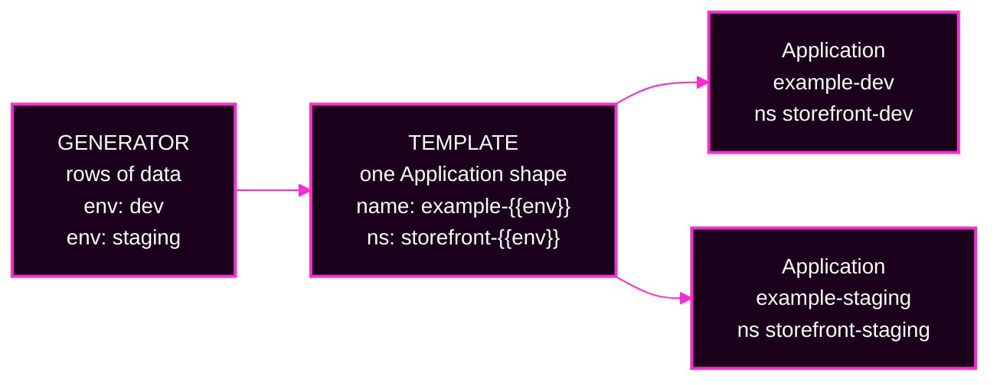
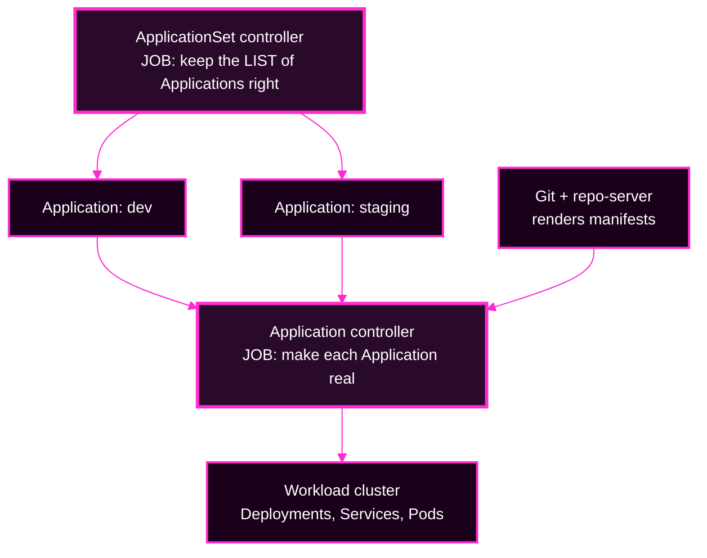

# Session 5 · Module 1 — ApplicationSets: One Template, Many Applications

> **Day 2 · Session 5 · Module 1 of 3 · ~20 minutes · concept + hands-on**
> **Run every command in your VM terminal**, after `source ~/argo-lab-env.sh`.
> **← Back to:** [Day 2 map](../README.md) · [Session 5](README.md)

---

## Page TL;DR

- **What this is.** An **ApplicationSet** is a factory: you write one Application shape, feed it rows of data, and it stamps out one real Application per row.
- **Why it matters.** Copying Application YAML ten times means ten places to make a typo, and ten places to forget a fix.
- **What to remember.** *An ApplicationSet is a factory that creates Applications.* It does not deploy anything itself.
- **The most common mistake.** Thinking the ApplicationSet deploys your workload. It does not. It creates Applications; the same Day-1 controller then deploys each one.

---

## 1. The problem: "can we add another environment?"

You already have an Application for `storefront` in development. The team now wants staging as well, and mentions production is coming.

You could copy the Application YAML and change its name, its namespace, and its values file. That is fine for two environments.

Now picture ten. A shared change — a new Helm value, a different repository branch, an added label — means finding and editing ten near-identical files. Each edit is a chance to miss one file or leave a stale destination in a copy.

**An ApplicationSet lets you write the shared parts once and supply the differences as data.**

> **The metaphor to keep for the rest of the course: a mail merge.** One letter template plus two recipient records produces two personalised letters. One Application template plus two environment records produces two Applications. Change the letter and every copy changes. Change the list and copies appear or disappear.

**Today's concrete task:** read the course's example, predict which Applications it will produce, and prove your prediction with a command that creates nothing.

### Mini TL;DR — section 1

- The problem ApplicationSets solve is **duplication**, not deployment.
- One template plus rows of data replaces many hand-copied files.
- A mail merge is the model: **template + list = finished copies**.

---

## 2. Read the factory: inputs, template, output



*Read each output back to its input. The word `dev` in the row supplied the `dev` in the Application's name, its namespace, and its values-file path.*

An **ApplicationSet** is a Kubernetes custom resource that Argo CD installs. Like an Application, it is a YAML object stored in the Kubernetes API. In this course both live in the management cluster's `argocd` namespace.

Two parts inside its `spec` do all the work.

| Part | Plain-language meaning | In today's example |
|---|---|---|
| `generators` | produce the **rows** of values | two rows: `env: dev` and `env: staging` |
| `template` | describe **one** Application, with blanks | `example-{{ .env }}` in namespace `storefront-{{ .env }}` |

A **placeholder** marks where a value gets inserted. With Go templating turned on, `{{ .env }}` means "use the `env` value from this row."

Here are the parts that matter from the course example. **This is an excerpt to read, not a manifest to apply.**

```yaml
spec:
  goTemplate: true
  goTemplateOptions: ["missingkey=error"]
  generators:
    - list:
        elements:
          - env: dev
          - env: staging
  template:
    metadata:
      name: "example-{{ .env }}"
    spec:
      project: storefront
      source:
        helm:
          valueFiles:
            - "../../envs/{{ .env }}/values.yaml"
      destination:
        server: https://k3d-workload-server-0:6443
        namespace: "storefront-{{ .env }}"
```

`missingkey=error` is a safety setting. Module 2 explains exactly what it prevents.

> **▶ Predict before you read on.** Which fields differ between the two generated Applications? Which field is identical in both?

<details>
<summary>Show the answer</summary>

**Different:** the Application name, the destination namespace, and the values-file path — all three are built from `{{ .env }}`.

**Identical:** the `project`, and the destination `server`. Both generated Applications target the **same workload cluster**.

That last point surprises people. An "environment" does not have to mean a separate cluster. This example separates environments by **namespace and values file** on one cluster.
</details>

### Can each generated Application use a different Git repository?

Yes. The repository URL sits inside the template, so it can be a blank like anything else. A generator that supplies a `repoURL` per row lets one ApplicationSet produce Applications pointing at `payments.git` and `catalog.git`.

Most examples use one repository because the Applications share a chart. Separate repositories make sense when teams own services independently or their release cycles differ.

### Mini TL;DR — section 2

- `generators` make the rows; `template` is the shape with blanks.
- A blank can be any field, including the repository URL.
- Rows and template together decide **how many** Applications exist and **what each one points at**.

---

## 3. Who actually deploys the workload?

This is the single most important idea in the module, and the one people get wrong.



**There are two separate jobs, done by two separate controllers.**

The **ApplicationSet controller** creates, updates, and — only if its policy allows — deletes **Application objects**. That is its entire job. It never touches a Deployment.

The **application controller** is the one you met on Day 1. It reconciles each Application against its Git source and its destination, using the repo-server to get rendered manifests. It is the only thing here that writes to a workload cluster.

**A generated Application is an ordinary Application.** It has a source, a destination, a project, a sync status, and a health status, exactly like the ones you wrote by hand yesterday.

**Creating an Application and syncing its workload are two different events.** Today's example does not enable automated sync, and the preview you are about to run does not create the Applications at all.

Use that split when something goes wrong:

| What you observe | Start by inspecting |
|---|---|
| An Application is **missing**, **misnamed**, or points at the **wrong namespace** | the ApplicationSet: its generator, its template, its error conditions |
| The Application looks right, but **rendering, sync, or health** fails | that Application's own source, conditions, and workload — the Day 1 path |

> **Say it once, out loud:** *the factory decides which Applications exist; the controller decides whether each one is healthy.* Almost every ApplicationSet incident is really a question about which of those two sentences is failing.

### Mini TL;DR — section 3

- **ApplicationSet controller** maintains the *list*. **Application controller** does the *deploying*.
- A generated Application behaves exactly like a hand-written one.
- Diagnosis forks immediately: is the **wrong Application** there, or is the **right Application unhealthy**?

---

## ✅ Key Takeaways — the factory model

- **An ApplicationSet is a factory that creates Applications.** It is not a new deployment mechanism.
- **Rows × template = Applications.** The row count is the Application count.
- **Two controllers, two jobs.** Generation and reconciliation fail in different places and are fixed in different files.
- **The fields that vary come from the data; the fields that must not vary are written out literally.**

---

## 4. Guided practice: predict, then preview

This practice creates nothing and cleans up nothing. It is safe to run at any point in Day 2.

### A. Open the course example

```bash
source ~/argo-lab-env.sh
cd ~/platform-config
cat examples/appset-list.yaml
```

**Expected:** the file exists and contains two elements, `env: dev` and `env: staging`.

If `cd` fails, your clone is somewhere else. Find it with `ls -d ~/platform-config` and, if it is genuinely absent, you are not at the `CP-lab-04` checkpoint — see [the Day 2 map](../README.md#resetting-and-recovering).

**▶ Before running anything, write down three things:**

1. How many Applications do you expect?
2. What exactly are they named?
3. Which values file will each one use?

### B. Preview the generated Applications

```bash
argocd appset generate examples/appset-list.yaml -o yaml
```

This sends the definition to Argo CD, which generates and validates the Application output and prints it. **It does not save an ApplicationSet and it does not create Applications.** It needs a reachable Argo CD server and a valid CLI login.

Find these fields in the output:

| Input row | Application name | Destination namespace | Helm values file |
|---|---|---|---|
| `env: dev` | `example-dev` | `storefront-dev` | `../../envs/dev/values.yaml` |
| `env: staging` | `example-staging` | `storefront-staging` | `../../envs/staging/values.yaml` |

Both use project `storefront`, chart path `charts/storefront`, and server `https://k3d-workload-server-0:6443`.

### C. Prove the preview created nothing

```bash
kubectl --context k3d-mgmt -n argocd get applications \
  example-dev example-staging --ignore-not-found -o name
```

**Expected: no output at all.** The command succeeded and found neither Application. Silence is the result you want here.

If a name *does* appear, that Application exists from some other action. `generate` did not create it.

### If the preview fails instead

| Message contains | What it means | What to do |
|---|---|---|
| `project storefront does not exist` | you are at a pre-Lab-2 checkpoint | verify your checkpoint; this is not a template bug |
| `connection refused` / `authentication required` | your CLI is not logged in to Argo CD | log in again, then retry |
| `no such file or directory` | you are not in the `platform-config` clone | `cd ~/platform-config` |

Notice that **none of those three errors means your generator is wrong.** Reading *which* thing failed is the skill.

### Mini TL;DR — the practice

- `argocd appset generate` shows you the finished Applications and creates nothing.
- Two rows produced two Applications, and every difference between them traces back to one word in the data.
- A preview proves the *definitions*. It does not prove the chart renders or the workload is healthy — Lab 4 adds those checks.

---

## 5. Why preview matters more as the list grows

Two words to keep:

- **Fan-out** is how many Applications the generator produces.
- **Blast radius** is how many Applications one change could affect.

For today's list generator, two rows give two Applications. A **matrix** generator that combines 2 clusters with 3 environments gives **6**, because a matrix is a times table.

| Change to the definition | What happens when a live ApplicationSet reconciles |
|---|---|
| Add another environment row | one more Application appears, if the row is valid |
| Change a shared field in the template, such as the target revision | that field changes in **every** generated Application |
| Change the template's namespace expression | **every** generated Application's destination could move |

A shared edit reaches many Applications at once. That does **not** guarantee they all roll out immediately: whether a workload actually changes depends on each Application's sync configuration.

> **The question to ask before accepting any factory change:** *how many Applications will this produce, what will they be called, and where will they point?* Module 2 turns that question into a repeatable three-step habit.

### Mini TL;DR — section 5

- **Fan-out** is the count; **blast radius** is what one edit can reach.
- A matrix multiplies, so small selector edits cause large changes.
- Counting the preview is the cheapest safety check that exists.

---

## 6. The four generators you actually need

A **generator** supplies the rows. The types differ only in *where the rows come from*.

These four cover everything in this course, Lab 4, and the capstone.

| Generator | YAML key | The question it answers | Where you meet it |
|---|---|---|---|
| **List** | `list` | "which rows did I type out by hand?" | today's example |
| **Cluster** | `clusters` | "which registered clusters match my label selector?" | Lab 4, and the capstone's blast-radius fault |
| **Git files** | `git` | "which files match this glob in the repository?" | Lab 4's environments |
| **Matrix** | `matrix` | "what combinations do two generators produce?" | Lab 4's real storefront factory |

> **Watch the spelling.** The Cluster generator's key is **`clusters`**, plural. Singular `cluster` is silently not a generator.

In this course, the selector `cluster-role: workload` matches the workload cluster and excludes the management cluster — **because of the labels those clusters currently carry**. A selector is only as good as its labels. It is not a permanent guarantee that you cannot target the wrong cluster.

Argo CD ships several more generators. **You do not need them today.** If you are curious, they are catalogued in [the optional generator reference](90-reference-generators-and-progressive-syncs.md), which is designed to be read after the capstone.

### Mini TL;DR — section 6

- Four generators carry the whole course: **List, Cluster, Git files, Matrix**.
- A matrix is a times table, which is why it is the one that surprises people.
- A cluster selector depends on labels being correct, so it is a control, not a guarantee.

---

## 7. Where App-of-Apps fits

You will meet the second pattern in Module 3. One sentence now, so the comparison has somewhere to land:

**An ApplicationSet generates Applications from data. An App-of-Apps is a parent Application whose Git folder contains child Application files that a person wrote by hand.**

| Your need | Pattern to reach for |
|---|---|
| Many Applications with the same shape and different values | ApplicationSet |
| A specific, named set of components you want to read top to bottom | App-of-Apps |

The choice is **not** "automatic versus manual" — a List generator is hand-typed too. Module 3 gives you the question that actually decides it.

---

## 8. Check that the idea landed

Answer these without running anything.

1. Where did the word `staging` in `example-staging` come from?
2. If you changed one shared source revision in the template, how many generated Applications could change?
3. Which controller deploys the workload after an Application exists?
4. Why did no new Applications appear after the command you ran?

<details>
<summary>Show the answers</summary>

1. From the generator row `env: staging`. The same word filled the name, the namespace, and the values path.
2. **All of them.** A template field is shared by every row, which is exactly what blast radius means.
3. The **application controller** — the same one from Day 1. The ApplicationSet controller only writes Application objects.
4. Because `argocd appset generate` **previews**. It renders and prints the result without saving an ApplicationSet or creating Applications.
</details>

---

## Final page TL;DR

- **What this is.** The factory model: one template plus rows of data equals many ordinary Applications.
- **Why it matters.** It removes duplication, and in exchange it concentrates risk — one edit now reaches many Applications.
- **What to remember.** *ApplicationSet is a factory that creates Applications.* Two controllers, two jobs.
- **The most common mistake.** Diagnosing a generated Application without first asking whether the **factory** or the **Application** is the broken thing.

**→ Next:** [02 — Keeping the factory safe](02-safety-and-controls.md)

**Reference:** [ApplicationSet controller](https://argo-cd.readthedocs.io/en/stable/operator-manual/applicationset/Argo-CD-Integration/) · [generator types](https://argo-cd.readthedocs.io/en/stable/operator-manual/applicationset/Generators/)
