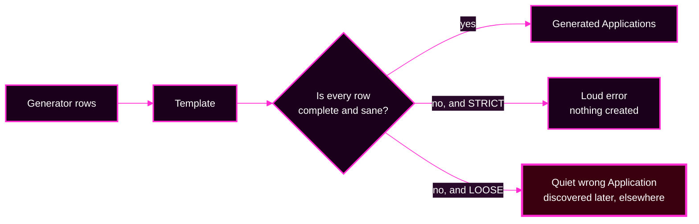
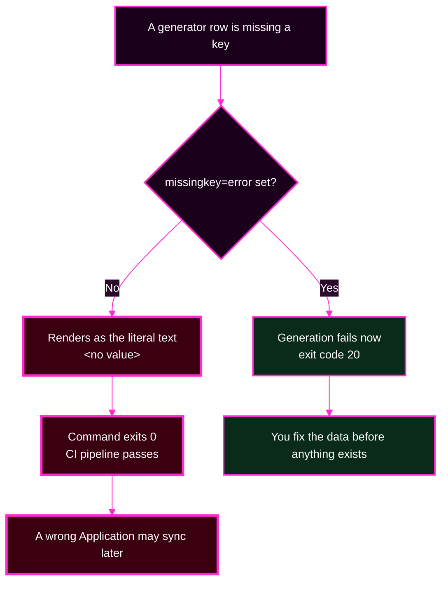
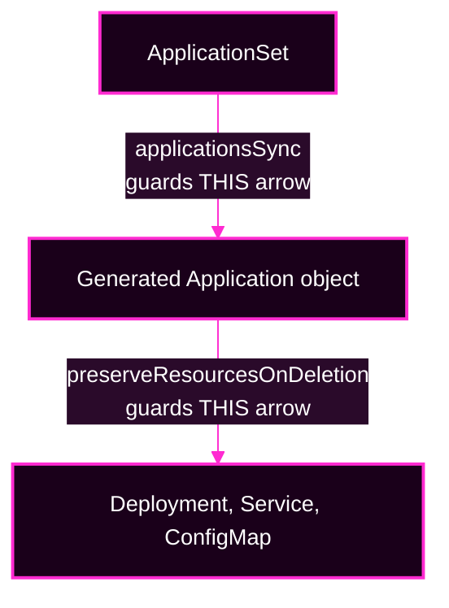
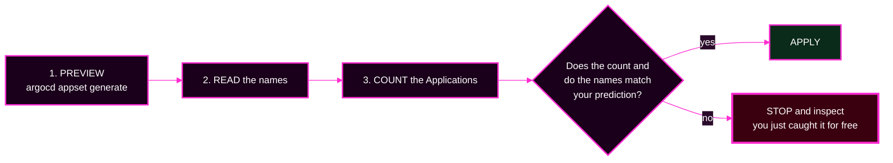

# Session 5 · Module 2 — Keeping the Factory Safe

> **Day 2 · Session 5 · Module 2 of 3 · ~20 minutes · concept + hands-on**
> **Run every command in your VM terminal**, after `source ~/argo-lab-env.sh`.
> **← Back to:** [Day 2 map](../README.md) · [Session 5](README.md)

---

## Page TL;DR

- **What this is.** Three settings and one habit that stop a factory from confidently producing the wrong thing.
- **Why it matters.** A factory multiplies whatever you give it, including mistakes. The same edit costs one Application or forty.
- **What to remember.** *Preview, count, apply.* And: **a failure during generation is cheap; a successful render of the wrong thing is expensive.**
- **The most common mistake.** Assuming a command that exits `0` did what you wanted. A non-strict template can produce a perfectly valid, perfectly wrong Application.

---

## The idea in one picture



**The safest factory is not the one that never errors. It is the one that errors *before* it creates something wrong.**

---

## 1. Keep `project` literal — it is a security boundary

Every generated Application has a `spec.project` field. That field names the **AppProject** that controls which repositories it may use, which clusters and namespaces it may target, and which resource kinds it may create.

Treat `spec.project` as a security boundary, not as ordinary application data.

**Safe — the project is written out:**

```yaml
spec:
  project: storefront        # literal, deliberately not a blank
  source:
    repoURL: "{{ .repoURL }}"
```

**Unsafe — the data chooses the boundary:**

```yaml
spec:
  project: "{{ .project }}"  # generator data now selects the security boundary
```

> **▶ Predict:** why is the second form dangerous even if the data is currently correct?

<details>
<summary>Show the answer</summary>

Because whoever can edit the **generator data** can now move a generated Application into a **more powerful AppProject**. The data file is usually reviewed less carefully than the security configuration, so this is a **privilege-escalation path**: a change that looks like a config tweak silently grants wider permissions.

Fill in names, destinations, revisions, and value files from data. Write the project out by hand.
</details>

### Mini TL;DR — section 1

- `spec.project` selects the tenant's fence. Never template it.
- Templating it lets a data edit widen permissions.
- Names, namespaces, revisions, and values files are fine to template.

---

## 2. Strict templates: fail early instead of rendering emptiness

Suppose a generator row is missing `namespace`, but the template says:

```yaml
destination:
  namespace: "{{ .namespace }}"
```

By default, Go templating renders the missing value as text. The Application is still generated — with a nonsense destination. The problem surfaces much later, somewhere else, in disguise.

**Turn on strict checking:**

```yaml
spec:
  goTemplate: true
  goTemplateOptions:
    - missingkey=error
```

Now a missing key is a **template error**. The bad row produces no Application, and the valid rows are untouched.



**You will watch this happen for real in Lab 4.** With strict templating on, the generation fails loudly. With it off, the same broken data produces an Application whose namespace is the literal text `<no value>` — and the command **exits `0`**, so a pipeline that only checks "did the command fail?" waves it through.

> **The sentence to keep:** *a failure during generation is cheap and local; a successful render of the wrong thing is expensive and remote.*

This setting is opt-in. Do not assume an ApplicationSet you inherit has it. Every example in this course sets it explicitly.

### Mini TL;DR — section 2

- `missingkey=error` converts a silent empty value into a loud, local failure.
- Without it, the command **succeeds** and the mistake travels.
- Safer configuration means *more* failures, *sooner*, on purpose.

---

## 3. Two protections, two different layers

There are two separate things you might want to protect, and they use different settings. Confusing them is the classic mistake.



**Layer 1 — what may happen to the generated Application objects.**

`spec.syncPolicy.applicationsSync` decides what the ApplicationSet controller is allowed to do.

| Setting | Create | Update | Delete | Meaning |
|---|:---:|:---:|:---:|---|
| `create-only` | yes | no | no | maximum protection; template edits never propagate |
| `create-update` | yes | yes | no | the common safer default; removed rows leave **orphans** |
| `create-delete` | yes | no | yes | rare |

The usual production choice:

```yaml
spec:
  syncPolicy:
    applicationsSync: create-update
```

This lets template edits update existing Applications, but removing a generator row does **not** automatically delete its Application.

An Application that still exists but is no longer generated is called an **orphan**. Somebody must decide what to do with it, deliberately.

**Layer 2 — what happens to the workload if an Application *is* deleted.**

```yaml
spec:
  syncPolicy:
    preserveResourcesOnDeletion: true
```

This one means: if a generated Application is deleted, leave its workloads running.

> **Verified behaviour, worth knowing before Lab 4.** By default the ApplicationSet controller adds the `resources-finalizer.argocd.argoproj.io` finalizer to each Application it generates, which is what makes a deletion cascade to the workload. Setting `preserveResourcesOnDeletion: true` causes the controller to leave that finalizer **off**. You can see the difference directly:
>
> ```bash
> kubectl --context k3d-mgmt -n argocd get applications \
>   -o custom-columns='NAME:.metadata.name,FINALIZERS:.metadata.finalizers'
> ```
>
> Before the setting, the generated apps show `[resources-finalizer.argocd.argoproj.io]`. After it, they show `<none>`.

In short:

- **`applicationsSync` protects the Application objects.**
- **`preserveResourcesOnDeletion` protects the workloads underneath them.**

"Safe" here means deletion becomes a **human decision**, not that cleanup happens for you.

### Mini TL;DR — section 3

- Two settings, two arrows on the ownership diagram. Do not mix them up.
- `create-update` prevents auto-deletion and therefore *creates orphans* — that is the trade, not a bug.
- You can verify which protection is live by reading the finalizers.

---

## ✅ Key Takeaways — safety settings

- **`project` is literal.** Data must never be able to choose a security boundary.
- **`missingkey=error` makes missing data fail during generation**, where it is cheap.
- **`applicationsSync` guards Application objects; `preserveResourcesOnDeletion` guards workloads.**
- **`create-update` trades auto-deletion for orphans**, on purpose.

---

## 4. The habit: preview → count → apply

Before changing any generator or template, answer two questions: **what will be produced**, and **how many**.



### Preview

```bash
cd ~/platform-config
argocd appset generate examples/appset-matrix.yaml -o yaml
```

Add `-o wide` instead for a one-line-per-Application table, which is easier to count by eye.

### Count

**▶ Do this now.** The course example combines the workload cluster with three environment files:

```bash
argocd appset generate examples/appset-matrix.yaml -o yaml | grep -c 'kind: Application'
```

**Expected output:**

```text
3
```

That is `1 workload cluster × 3 environment files = 3`. If a second matching workload cluster existed, the same command would print `6`.

> **▶ Predict:** if someone widened the cluster selector so it matched *both* registered clusters, what would this command print? You will do exactly that in Lab 4 and see the answer.

### Apply — only if the count and the names matched

If you expected three Applications and the preview shows thirty, you have caught a blast-radius mistake before it touched the cluster, for the price of one command.

### When the preview itself fails

`argocd appset generate` prints a **large single-line JSON blob to standard error** and exits with code **20** when generation fails. The useful sentence is at the very front, buried in a wall of Go internals.

**Cut it down to the first line — this works identically on Ubuntu and macOS:**

```bash
argocd appset generate applicationsets/storefront.yaml -o wide 2>&1 | sed 's/\\n.*//'
```

**Typical result:**

```text
{"level":"fatal","msg":"rpc error: code = Unknown desc = unable to generate Applications of
ApplicationSet: error generating applications: failed to execute go template {{ .namespace }}:
... map has no entry for key \"namespace\""
```

**The phrase that matters is `map has no entry for key`** followed by the key name. That is `missingkey=error` doing its job: the template asked for a value the generator did not supply.

> **If you see `project storefront does not exist`,** you are at a checkpoint from before Lab 2. The `storefront` AppProject is created in Lab 2. That is an environment problem, not a template problem.

### Mini TL;DR — the habit

- **Preview → count → apply**, every time, before any factory change.
- The count catches "too many"; the **names** catch template bugs.
- A failed generate exits **20** and buries its message; `sed 's/\\n.*//'` makes it readable.

---

## 5. Quick checks

**S5-QC1 — What happens when a key is missing?**
A Git-files generator reads `envs/*/config.yaml`. One of those files has no `namespace:` line, and the template contains `namespace: "{{ .namespace }}"`. Predict both outcomes.

<details>
<summary>Show the answer</summary>

**Without `missingkey=error`:** the value renders as the literal text `<no value>`. A real, broken Application is generated, and the command exits **0**.

**With `missingkey=error`:** generation reports a template error and exits **20**. That one row produces no Application. The other rows are unaffected.

Both behaviours are verified in Lab 4, Module 2.
</details>

**S5-QC2 — Does `create-update` handle deletion for me?**

<details>
<summary>Show the answer</summary>

**No — that is the whole point.** `create-update` *prevents* automatic deletion. When a generator row disappears, the Application it produced becomes an **orphan**: still running, no longer generated. A person must review it and delete it on purpose.
</details>

**S5-QC3 — Which setting protects which layer?**

<details>
<summary>Show the answer</summary>

| Question | Setting |
|---|---|
| May the ApplicationSet create, update, or delete generated Applications? | `applicationsSync` |
| Should the workloads survive if an Application is deleted? | `preserveResourcesOnDeletion` |
</details>

---

## 6. Not required today

**Progressive Syncs** stage the rollout of generated Applications instead of updating them all at once. They are Beta, off by default, version-dependent, and **not used anywhere in this course or the capstone**. They also have two sharp edges worth knowing exist before you reach for them in production.

If you want them, they are covered in [the optional reference module](90-reference-generators-and-progressive-syncs.md#3-progressive-syncs), designed to be read after the capstone.

---

## Final page TL;DR

- **What this is.** The controls that make a factory fail safely, plus the habit that catches the rest.
- **Why it matters.** Leverage without a brake is just a faster way to be wrong everywhere at once.
- **What to remember.** *Preview, count, apply.* `project` literal, `missingkey=error` on, `applicationsSync: create-update`.
- **The most common mistake.** Trusting exit code `0`. A loose template succeeds while producing something you never intended.

**→ Next:** [03 — App-of-Apps, and choosing between the patterns](03-app-of-apps-and-choosing.md)
