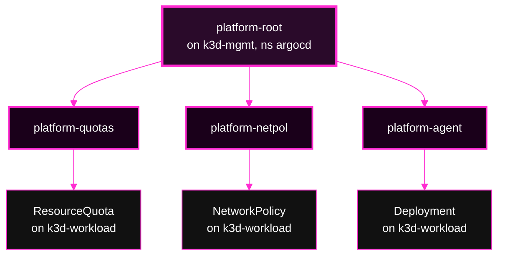
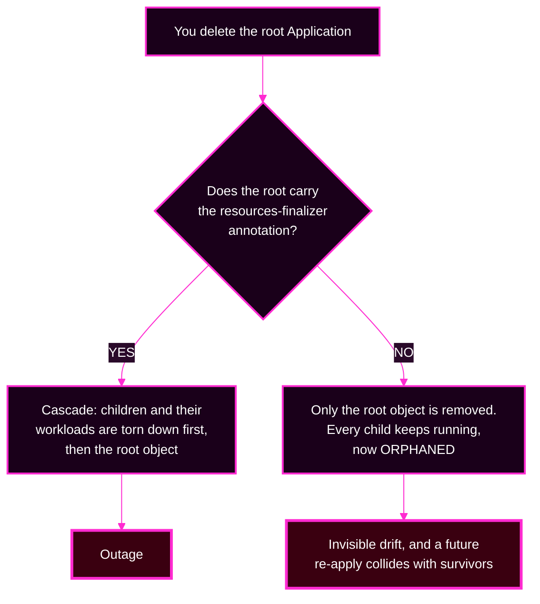
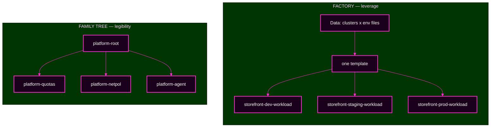
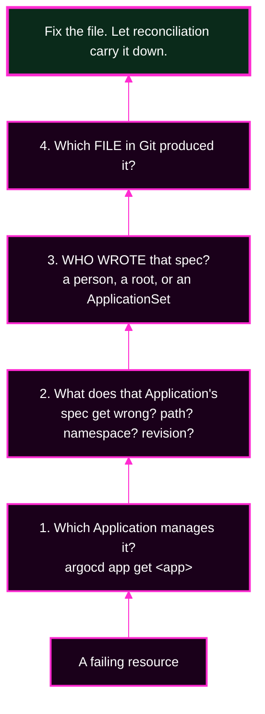

# Session 5 · Module 3 — App-of-Apps, and Choosing Between the Patterns

> **Day 2 · Session 5 · Module 3 of 3 · ~20 minutes · concept + hands-on**
> **Run every command in your VM terminal**, after `source ~/argo-lab-env.sh`.
> **← Back to:** [Day 2 map](../README.md) · [Session 5](README.md)

---

## Page TL;DR

- **What this is.** The second pattern. An **App-of-Apps** is a parent Application whose Git folder holds child Application files that a person wrote by name.
- **Why it matters.** It is how platforms bootstrap a known set of components, and it introduces two failure modes you will meet in the capstone: **misread ownership** and **cascading deletion**.
- **What to remember.** *App-of-Apps is a family tree.* And: **ApplicationSet gives you leverage; App-of-Apps gives you legibility.**
- **The most common mistake.** Believing a green root means the children are fine. It does not.

---

## 1. App-of-Apps: a deliberate family tree

There is no special resource type here. An App-of-Apps is **an ordinary Application whose rendered content happens to be other Application manifests**.

Here is the course's real root, `platform-config/root/platform-root.yaml`:

```yaml
kind: Application
metadata:
  name: platform-root
spec:
  project: platform                        # hard-coded, like every project field
  source:
    repoURL: http://lab-gitea:3000/course/platform-config.git
    path: apps                             # this folder holds child Application files
  destination:
    server: https://kubernetes.default.svc # the MANAGEMENT cluster's argocd namespace
    namespace: argocd
  syncPolicy:
    automated: { prune: true, selfHeal: true }
```

Its `path: apps` points at a folder of child Application manifests. Syncing the root creates **three child Applications** on the management cluster, and each child deploys real workloads onto the **workload** cluster.

| Child Application | Its source path | It deploys to |
|---|---|---|
| `platform-quotas` | `platform-components/quotas` | `storefront-dev` (workload cluster) |
| `platform-netpol` | `platform-components/network-policies` | `storefront-dev` (workload cluster) |
| `platform-agent` | `platform-components/agent` | `platform-system` (workload cluster) |



**Nobody derived that list of three. A person decided it, wrote each child by name, and can read it back.** That readability is the entire point of the pattern.

Ordering between children — namespaces before the things that live in them — is controlled by **sync waves**, exactly as in Session 4. App-of-Apps does **not** give you ordering or readiness for free.

**▶ Do this now — read the family tree from Git.** In your `platform-config` clone:

```bash
cd ~/platform-config
ls apps/
grep -E 'name:|path:|project:' root/platform-root.yaml
```

**🔍 Notice:** the `apps/` folder lists the children by filename, and the root's `path: apps` is what makes syncing the root create them. You can read the whole intended tree top to bottom.

### Mini TL;DR — section 1

- An App-of-Apps is a normal Application pointed at a folder of Application files.
- The root creates **children**; each child deploys the real workload.
- The child list is **decided by a person**, which is what makes it legible.

---

## 2. Deleting a root: everything, or nothing

This is the App-of-Apps counterpart to Module 2's protection settings, and it is the misconception most worth breaking.



**Both outcomes are disasters, in opposite directions, and they are one quiet annotation apart.**

> **A finalizer** is a marker that tells Kubernetes "before you remove this object, let Argo CD clean up what it manages first." With it, deletion propagates down the ownership edges. Without it, only the object disappears and everything it managed is left running with no owner.

The lesson is not "always add the finalizer" or "never add it." It is: **decide, on purpose, where the finalizer lives — and never discover it during an incident.**


*Figure SS-S5-03 — The `platform-root` tree: the root is `Healthy` and `Synced`, above `platform-agent`, `platform-netpol`, and `platform-quotas`. Look carefully: the root node shows a health indicator, and each child node shows **only** a sync check. That difference is section 3.*

<!-- CAPTURE-SPEC: SS-S5-03 — platform-root App-of-Apps tree. State: CP-lab-05. Highlight: root node (health + sync) and three child Application nodes (sync only). Argo CD v3.5.2. -->

### Mini TL;DR — section 2

- Deleting a root removes **everything** or **only the root object**.
- The `resources-finalizer` annotation decides which, quietly.
- Ownership and deletion boundaries must be a decision, written down in advance.

---

## 3. A healthy parent does not mean healthy children

**By default, Argo CD does not judge the health of an `Application` that sits inside another Application.** A root can report `Healthy` while a child beneath it is completely broken.

This is not a bug. The root's job was to *apply the child Application object*, and it did that successfully.

> **The plain-words version.** The root is a manager who reports "I handed out every task sheet." That is true. It says nothing about whether the worker could do the task. To learn that, you ask the worker.

**Carry this sentence into the capstone: a healthy parent does not necessarily mean every child workload is healthy.**

You will reproduce this in Lab 4: a child pointing at a folder that does not exist shows a `ComparisonError`, while the root stays `Synced` and `Healthy`, and the root's own tree view still shows that child with a green sync check.

### Mini TL;DR — section 3

- Root health answers *"did I apply the child object?"*, not *"is the child working?"*
- Always open the **child** to judge the child.
- This is the trap the capstone uses deliberately.

---

## 4. Two roots over one resource: the ownership rule

Suppose two roots each create a child that manages the **same** namespace or the same resource.

Now two owners each believe they are responsible. Each enforces its own view. The resource **flaps** back and forth — and, the nasty part, **both roots can report `Synced` and `Healthy` the whole time.**

The rule that prevents it: **ownership must be a partition, not an overlap.** Every resource has exactly one owner in the tree.

> **This is a capstone fault.** One of the seven injected faults is a second root creating a duplicate child that points at the same source as an existing child. Recognising the shape now is why this section exists.

### Mini TL;DR — section 4

- Two owners of one resource produce flapping and **two green badges**.
- Green does not mean uncontested.
- Ownership must partition the resources, never overlap.

---

## ✅ Key Takeaways — the family tree

- **App-of-Apps is a family tree** — a root whose content is child Application files, decided by a person.
- **Deleting a root does everything or nothing**, decided by one annotation.
- **A healthy parent does not necessarily mean every child workload is healthy.**
- **Ownership must be a partition.** Duplicate ownership hides behind green badges.

---

## 5. Choosing between the patterns

Here is the whole decision, in one table.

| | **ApplicationSet** | **App-of-Apps** |
|---|---|---|
| **One-word summary** | **Leverage** | **Legibility** |
| **The metaphor** | a factory | a family tree |
| **Who decides the list** | data does — it is **derived** | a person does — it is **decided** |
| **To add an app, you** | add a row of data, or a matching folder | write a new child file by name |
| **Can you preview it?** | yes — `argocd appset generate` | no equivalent; you read the files |
| **What one typo costs** | multiplied across every generated app | limited to the one child you typed |
| **Deletion is controlled by** | `applicationsSync` + `preserveResourcesOnDeletion` | the root's `prune`, plus finalizers |
| **Best for** | many similar apps across clusters or environments | a known, ordered set of platform components |

> **The one question that decides it: is this list *derived* or *decided*?**
> Derived from data — clusters, folders, files — reach for the **factory**.
> Decided by a person as a specific set — reach for the **family tree**.

**Combining both is allowed, but only with explicit ownership and deletion boundaries.** That is a condition, not a recommendation.

### Ownership at a glance



*Left: one writer, many outputs, listed by data. Right: one writer, three outputs, listed by hand. In both cases everything below the top box is an ordinary Application.*

### Mini TL;DR — section 5

- **ApplicationSet gives you leverage; App-of-Apps gives you legibility.**
- The deciding question is **derived or decided**.
- Combining them is fine only when ownership and deletion are explicit.

---

## 6. Tracing a failure to the layer that owns it

Because both patterns *write Applications*, a wrong Application is never fixed by editing that Application. You fix **the thing that wrote it**.



### How to answer step 3 with a command

"Who wrote this?" is not guesswork. Each pattern records it, in a **different place** — verified on this course environment:

| Written by | Where ownership is recorded | Command |
|---|---|---|
| an **ApplicationSet** | `metadata.ownerReferences` | `kubectl --context k3d-mgmt -n argocd get application <name> -o jsonpath='{.metadata.ownerReferences}'` |
| an **App-of-Apps root** | the `argocd.argoproj.io/tracking-id` annotation | `kubectl --context k3d-mgmt -n argocd get application <name> -o jsonpath='{.metadata.annotations.argocd\.argoproj\.io/tracking-id}'` |

**An App-of-Apps child carries no `ownerReferences` at all.** So an empty result from the first command does not mean "nobody wrote it" — it means "not an ApplicationSet." Check the annotation next. Its value begins with the name of the Application that wrote it, for example `platform-root:argoproj.io/Application:argocd/platform-quotas`.

**The tell that you fixed the wrong layer: your edit reverts.**

If you hand-edit a generated child and something above it puts the old value back, congratulations — you have just identified the owner. Now go and fix it there, in Git.

### Mini TL;DR — section 6

- Fix the **writer**, not the written.
- Walk up: resource → Application → writer → file.
- **If your fix reverted, you fixed the wrong layer.**

---

## 7. Quick checks

**S5-QC4 — Apply the decision.** For each, choose a pattern and justify it as *derived* or *decided*.

1. Deploy the same agent to **every** workload cluster, now and as new ones are added.
2. Bootstrap a new cluster with a **known, ordered** set of platform components.
3. Let teams add an environment by **adding a folder** to a repository.

<details>
<summary>Show the answer</summary>

1. **ApplicationSet**, cluster generator. The list is **derived** from the fleet, and it must keep up as the fleet changes.
2. **App-of-Apps**. The list is **decided** — a specific, ordered hierarchy that a person should be able to read.
3. **ApplicationSet**, Git-files generator. The list is **derived** from the repository; adding a folder adds an app with no change to the ApplicationSet itself.
</details>

**S5-QC5 — Delete a root with cascade.** `platform-root` carries the finalizer and owns three children. You delete it with cascade. What is removed? What would have happened **without** the finalizer?

<details>
<summary>Show the answer</summary>

**With the finalizer:** the deletion propagates down the ownership edges — the three child Application objects, and the workloads they manage, are torn down before the root object itself is removed.

**Without it:** only the root object disappears. All three children and their workloads keep running, **orphaned**, with nothing reconciling them. A later re-apply then collides with the survivors.

"Delete the root" is never a small action, and the outcome flips on one annotation.
</details>

---

## 8. Common misconceptions

| Misconception | The reality |
|---|---|
| "A root reporting `Healthy` means its children are healthy." | Root health does not roll up child Application health by default. A `Healthy` root can sit above a `Degraded` child. |
| "`create-update` protects my App-of-Apps tree too." | Different mechanisms, different objects. `applicationsSync` guards Applications an **ApplicationSet** generated. A root's cascade is decided by the **finalizer**. |
| "ApplicationSets are advanced; App-of-Apps is for beginners." | Neither. They answer different questions: **derived** list versus **decided** list. |
| "An App-of-Apps guarantees my components come up in order." | It does not. Ordering comes from **sync waves**, the same as any other sync. |

---

## Final page TL;DR

- **What this is.** The family-tree pattern, its deletion behaviour, and the rule for choosing between the two patterns.
- **Why it matters.** Three of the capstone's seven faults live in this material: ownership, blast radius, and a green badge over a broken thing.
- **What to remember.** *ApplicationSet gives you leverage; App-of-Apps gives you legibility.* And: *a healthy parent does not necessarily mean every child workload is healthy.*
- **The most common mistake.** Fixing the Application you can see instead of the file that wrote it. If your fix reverts, you fixed the wrong layer.

---

## Transition — to Lab 4

You have both mental models and the vocabulary. **[Lab 4](../lab-04/README.md)** turns them into muscle memory.

You will build the real storefront ApplicationSet and run preview → count → apply. You will widen a selector and watch the blast radius double, without applying it. You will break the factory with a missing key and watch strict templating refuse loudly. You will apply the App-of-Apps root, break one child, and watch the root stay green above it. Then you will run a short incident that rehearses the capstone.

Bring two questions: **derived or decided?** and **who wrote this?**

**→ Next:** [Lab 4 — Build and Troubleshoot the Patterns](../lab-04/README.md)
