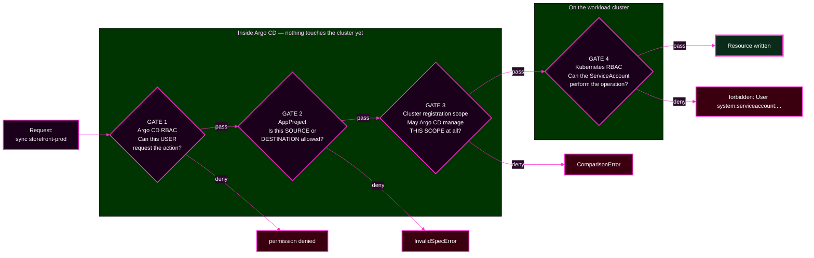

# Session 6 · Module 1 — The Four Authorization Gates

> **Day 2 · Session 6 · Module 1 of 3 · ~15 minutes · concept**
> **Run every command in your VM terminal**, after `source ~/argo-lab-env.sh`.
> **← Back to:** [Day 2 map](../README.md) · [Session 6](README.md)

---

## Page TL;DR

- **What this is.** Four independent permission systems that a single request must satisfy before anything changes on a cluster.
- **Why it matters.** All four produce a red badge. Only the **message** tells you which one refused, and each one is fixed by a different team in a different file.
- **What to remember.** *"Permission denied" is not a diagnosis. "Which permission system denied it" is.*
- **The most common mistake.** Reading the badge instead of the message, then editing the wrong configuration.

---

## 1. Why this matters: the deleted production app

A developer's CI pipeline was given an Argo CD API token months ago. It has worked fine. Nobody has looked at it since.

On a Tuesday, a cleanup step meant to remove a stale *test* Application hits a typo that turns the target into `storefront-prod`. The pipeline calls Argo CD. Argo CD checks the token, finds that it **is allowed to delete Applications**, and deletes the production Application. The deletion cascades, and production comes off the cluster.

Nothing malfunctioned. Every component did exactly what it was told.

The failure was **governance**, and it has a precise anatomy:

- The token was granted **more than it needed** — it could delete, when it only ever needed to sync.
- Nobody could easily answer **"what can this token actually do?"**
- **No gate** stopped a `storefront` credential from touching production.

Every one of those is a control this session teaches.

### Mini TL;DR — section 1

- Governance failures happen with every component working correctly.
- Over-granted credentials are the usual root cause.
- The fix is a gate, decided in advance, not a better incident response.

---

## 2. Four gates, four questions

Picture one request — *"sync `storefront-prod`"* — walking toward the cluster. It must pass **four separate gates**. Each is a **different system**, answering a **different question**, owned by a **different team**.



**Three gates live inside Argo CD. One lives on the workload cluster.**

That split is the single most useful fact in this session, because it gives you a question you can answer in one step.

> **The routing question: did anything on the cluster actually get touched?**
> **Nothing touched** → gates 1, 2, or 3. The refusal happened inside Argo CD.
> **Something was attempted and rejected** → gate 4. Kubernetes pushed back.

### Mini TL;DR — section 2

- Four gates, four systems, four owners.
- Gates 1–3 are Argo CD; gate 4 is Kubernetes.
- One question routes you: **did anything get applied?**

---

## 3. The four gates, one at a time

Each gate below gives you the same five things: what it is, a tiny configuration example, one denial symptom, who owns the fix, and how to prove your conclusion.

---

### Gate 1 — Argo CD RBAC: *can this user request the action?*

**In plain words.** Argo CD's own permission layer. Before anything else happens, it asks *who is asking* and *what verb do they want*. If the answer is no, **no sync ever starts**.

Think of the receptionist checking your badge before you are allowed to press any button.

**Tiny configuration example** — this lives in the `argocd-rbac-cm` ConfigMap:

```csv
p, role:team-a, applications, get,  team-a/*, allow
p, role:team-a, applications, sync, team-a/*, allow
g, team-a-dev, role:team-a
```

A `p` line is a **permission**: `p, subject, resource, action, object, effect`. A `g` line is a **grant**: this account holds that role. Notice there is **no `delete` line** — absence is how you deny.

**One denial symptom.** The caller gets almost nothing:

```text
{"level":"fatal","msg":"rpc error: code = PermissionDenied desc = permission denied"}
```

The detail is in the `argocd-server` log, not in your terminal:

```text
level=warning msg="user tried to get application which they do not have access to: ...
permission denied: applications, get, storefront/storefront-prod-workload,
sub: team-a-dev, iat: ..." security=2 user=team-a-dev
```

**Who owns the failure.** The **platform team**, in `policy.csv`.

**How to prove it.** Ask the policy directly, before or after the fact:

```bash
argocd admin settings rbac can team-a-dev sync applications 'team-a/team-a-guestbook' --namespace argocd
```

It answers `Yes` or `No` against the live policy. Nothing is changed by asking.

> **The tell:** the message names a **subject** (`sub:`) and a **verb**. It is about a *person or account*.

---

### Gate 2 — AppProject: *is this source, destination, namespace, or resource allowed?*

**In plain words.** A boundary attached to the **Application**, not to the person. It restricts which repositories an app may deploy from, which cluster and namespace it may target, and which resource kinds it may create.

Even a full administrator's request is refused here if the app points somewhere its project forbids. This is the fence around *which building the app may enter*.

**Tiny configuration example:**

```yaml
kind: AppProject
metadata:
  name: team-a
spec:
  sourceRepos:
    - http://lab-gitea:3000/course/team-a-apps.git   # only this repo
  destinations:
    - server: https://k3d-workload-server-0:6443
      namespace: team-a                              # only this namespace
  clusterResourceWhitelist: []                       # no cluster-scoped kinds at all
  namespaceResourceWhitelist:
    - { group: "", kind: ConfigMap }
    - { group: apps, kind: Deployment }
```

**An AppProject is a *positive* list.** It permits exactly what it names and refuses everything else. An **empty** list means **deny everything**, not "unset and permissive."

**One denial symptom.** A condition on the Application, with no sync operation at all:

```text
CONDITION         MESSAGE
InvalidSpecError  application destination server 'https://k3d-workload-server-0:6443' and
                  namespace 'storefront-prod' do not match any of the allowed destinations
                  in project 'team-a'
```

**Who owns the failure.** Whoever owns the **AppProject YAML** — usually the platform team, reviewed in a pull request.

**How to prove it.** Read the project and compare it against the app's spec:

```bash
argocd proj get team-a
argocd app get <app> | grep -A3 CONDITION
```

> **The tell:** the message names a **project** and the offending **value**. It is about an *Application's spec*.

---

### Gate 3 — Cluster registration scope: *may Argo CD manage this scope at all?*

**In plain words.** When you registered the workload cluster, you told Argo CD **how much of it** Argo CD is allowed to manage. That registration can limit Argo CD to a list of namespaces, and can forbid cluster-scoped resources entirely.

This gate is about the **connection**, not about any project or person. It is the one people forget exists, which is exactly why it surprises them.

**Tiny configuration example** — fields on the cluster registration Secret:

```yaml
stringData:
  name: workload
  server: https://k3d-workload-server-0:6443
  namespaces: storefront-dev,storefront-staging,storefront-prod,team-a,platform-system
  clusterResources: "false"      # Argo CD may not manage cluster-scoped kinds here
```

With `clusterResources: "false"` and a namespace list, Argo CD is in what it calls **namespaced mode** for that cluster.

**One denial symptom.** A `ComparisonError`, raised while Argo CD tries to read live state:

```text
ComparisonError: Failed to load live state: cluster level ClusterRole "team-a-escalation"
can not be managed when in namespaced mode
```

**Who owns the failure.** Whoever owns the **cluster registration Secret** — the platform team, from the Lab 2 template.

**How to prove it.** Read the registration's scope:

```bash
argocd cluster list
kubectl --context k3d-mgmt -n argocd get secret cluster-workload \
  -o jsonpath='{.data.clusterResources}' | base64 -d ; echo
```

`argocd cluster list` shows the namespace count next to the server URL, for example `https://k3d-workload-server-0:6443 (5 namespaces)`.

> **The tell:** the message talks about **managing** and **mode**, and names **no project and no ServiceAccount**. It is about the *connection's scope*.

---

### Gate 4 — Kubernetes RBAC: *can the Argo CD ServiceAccount perform the operation?*

**In plain words.** Once Argo CD has decided to act, it writes to the workload cluster **as a ServiceAccount**. The cluster's own permission system checks that account. If the cluster says no, the sync **started** and then **failed partway through**.

This is the lock on the specific room, checked after you were let into the building.

**Tiny configuration example** — on the **workload** cluster:

```yaml
kind: Role
metadata:
  name: argocd-deployer-team
  namespace: team-a
rules:
  - apiGroups: ["apps", ""]
    resources: ["deployments", "services", "configmaps"]
    verbs: ["get", "list", "watch", "create", "update", "patch", "delete"]
  # networkpolicies deliberately absent
```

**One denial symptom.** A Kubernetes rejection, quoted verbatim inside the sync result:

```text
one or more objects failed to apply, reason: networkpolicies.networking.k8s.io is forbidden:
User "system:serviceaccount:argocd-access:argocd-manager" cannot create resource
"networkpolicies" in API group "networking.k8s.io" in the namespace "team-a"
```

**Who owns the failure.** Whoever administers the **workload cluster's** `Role` and `RoleBinding` objects. This is frequently **a different team** from the one that owns Argo CD.

**How to prove it.** Ask the cluster the same question Argo CD will ask:

```bash
kubectl --context k3d-workload auth can-i create networkpolicies.networking.k8s.io \
  -n team-a --as=system:serviceaccount:argocd-access:argocd-manager
```

It prints `yes` or `no`, and it changes nothing.

> **The tell:** the word **`forbidden`**, and a subject that is a **ServiceAccount**, not a person. Nothing in the message mentions Argo CD, because Argo CD is only the messenger.

---

## ✅ Key Takeaways — the four gates

- **Gate 1 is about the person. Gate 2 is about the Application's spec. Gate 3 is about the connection's scope. Gate 4 is about the ServiceAccount.**
- **Gates 1–3 refuse before anything is applied. Gate 4 refuses during the apply.**
- **Each gate has its own vocabulary**, and the vocabulary names the owner.
- **Every gate can be asked in advance**, read-only, without triggering the failure.

---

## 4. The comparison you should be able to reproduce from memory

| | Gate 1 · Argo CD RBAC | Gate 2 · AppProject | Gate 3 · Cluster scope | Gate 4 · Kubernetes RBAC |
|---|---|---|---|---|
| **Question** | can this user ask? | is this source/destination allowed? | may Argo CD manage this scope? | can the ServiceAccount do it? |
| **It is about** | a person or token | an Application's spec | the cluster connection | a ServiceAccount |
| **Lives in** | `argocd-rbac-cm` | the `AppProject` | the cluster registration Secret | `Role`/`RoleBinding` on the workload cluster |
| **Message signature** | `permission denied` + `sub:` | `InvalidSpecError` + "do not match any of the allowed destinations in project" | `ComparisonError` + "can not be managed when in namespaced mode" | `forbidden` + `system:serviceaccount:` |
| **Did a sync run?** | no | no operation, unless you force one | operation ends instantly | **yes, then failed** |
| **Sync result rows** | none | none | none | one row per resource, `SyncFailed` |
| **Prove it with** | `argocd admin settings rbac can` | `argocd proj get` | `argocd cluster list` | `kubectl auth can-i --as` |
| **Who you page** | platform team | platform team | platform team | workload cluster admins |

> **Several gates can refuse the same request, and only the first one speaks.** In Lab 5 you will send a `ClusterRole` through a project that forbids cluster-scoped kinds *and* a cluster registration that forbids them. Both would refuse. You will find out which one gets the microphone, and why.

### Mini TL;DR — section 4

- Memorise the **message signature** row; it is what you actually use in an incident.
- The **sync result rows** row is the mechanical tell between gates 2/3 and gate 4.
- Defence in depth means the **outer** gate usually speaks first.

---

## 5. Quick check

**S6-QC1 — Name the gate that denied each request, and the one piece of evidence that proves it.**

1. `permission denied: applications, get, payments/payments-web, sub: dana, iat: ...`
2. `InvalidSpecError: ... do not match any of the allowed destinations in project 'payments'`
3. `ComparisonError: ... cluster level ClusterRole "x" can not be managed when in namespaced mode`
4. `networkpolicies.networking.k8s.io is forbidden: User "system:serviceaccount:argocd-access:argocd-manager" cannot create...`

<details>
<summary>Show the answer</summary>

1. **Gate 1 — Argo CD RBAC.** Evidence: a **subject** (`sub: dana`) and a **verb** (`get`). Nothing was applied. Fix in `policy.csv`.
2. **Gate 2 — AppProject.** Evidence: `InvalidSpecError` naming a **project** and the rejected value. No operation ran. Fix in the AppProject YAML.
3. **Gate 3 — cluster registration scope.** Evidence: the phrase **"managed ... namespaced mode"**, and the absence of any project or ServiceAccount name. Fix in the cluster registration Secret.
4. **Gate 4 — Kubernetes RBAC.** Evidence: **`forbidden`** naming a **ServiceAccount**; the sync started and then failed. Fix with a `Role`/`RoleBinding` on the workload cluster.

Read for the **signature**, never a character-for-character match. Wording shifts between versions; the vocabulary does not.
</details>

---

## Final page TL;DR

- **What this is.** Four gates, four questions, four owners, four message signatures.
- **Why it matters.** Every one of them shows up as the same red badge, and each is fixed somewhere different.
- **What to remember.** *Did anything on the cluster actually get touched?* Nothing → gates 1–3. Started and failed → gate 4.
- **The most common mistake.** Naming a gate from what you expected rather than from the message's vocabulary.

**→ Next:** [02 — AppProjects and Argo CD RBAC, up close](02-appprojects-and-rbac.md)
