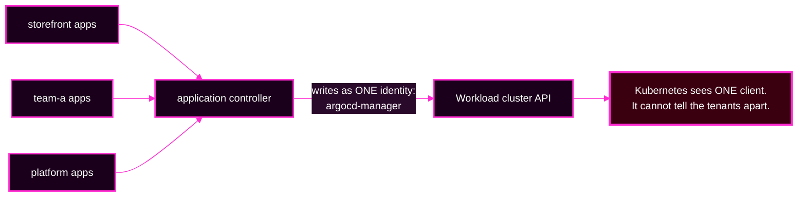

# Session 6 · Module 2 — AppProjects and Argo CD RBAC, Up Close

> **Day 2 · Session 6 · Module 2 of 3 · ~18 minutes · concept + hands-on**
> **Run every command in your VM terminal**, after `source ~/argo-lab-env.sh`.
> **← Back to:** [Day 2 map](../README.md) · [Session 6](README.md)

---

## Page TL;DR

- **What this is.** A close read of the two gates you will configure yourself: the AppProject (gate 2) and Argo CD RBAC (gate 1).
- **Why it matters.** These are the only two gates that separate one tenant from another. Kubernetes cannot tell your tenants apart at all.
- **What to remember.** *An AppProject is a positive list — empty means deny.* And: **you can unit-test a permission policy before anyone is exposed to it.**
- **The most common mistake.** Assuming the `default` project is a boundary. It is the most permissive object in a fresh install.

---

## 1. Gate 2 up close: a real AppProject, field by field

Here is the completed `storefront` AppProject that your Lab 2 exercise produced. Read it as a **fence**.

```yaml
kind: AppProject
metadata:
  name: storefront
spec:
  sourceRepos:                                             # (1) allowed Git repositories
    - http://lab-gitea:3000/course/storefront-gitops.git
  destinations:                                            # (2) allowed cluster + namespace
    - server: https://k3d-workload-server-0:6443
      namespace: storefront-dev
    - server: https://k3d-workload-server-0:6443
      namespace: storefront-staging
    - server: https://k3d-workload-server-0:6443
      namespace: storefront-prod
  clusterResourceWhitelist: []                             # (3) NO cluster-scoped kinds
  namespaceResourceWhitelist:                              # (4) only these namespaced kinds
    - { group: "", kind: ConfigMap }
    - { group: "", kind: Service }
    - { group: apps, kind: Deployment }
    - { group: batch, kind: Job }
    - { group: autoscaling, kind: HorizontalPodAutoscaler }
```

1. **`sourceRepos`** — may deploy **only** from `storefront-gitops`. Any other repository is refused.
2. **`destinations`** — may target **only** those three namespaces on that one workload cluster. Not `kube-system`, not another team's namespace, not the management cluster.
3. **`clusterResourceWhitelist: []`** — an empty list means **no cluster-scoped kinds at all**. No ClusterRoles, no CRDs, no Namespaces.
4. **`namespaceResourceWhitelist`** — even inside its own namespaces, may create **only** those five kinds. A `Secret` is not listed, so a `Secret` is refused.

> **The rule that makes it a fence: an AppProject is a *positive* list.** It permits exactly what it names and refuses everything else. **Empty means deny-all**, not "unset and therefore permissive."

### A verified detail about empty lists

When you apply `clusterResourceWhitelist: []`, Argo CD **stores it exactly as written**. Read it back and you will see the key present with an empty value:

```bash
kubectl --context k3d-mgmt -n argocd get appproject team-a -o yaml | grep -A1 clusterResourceWhitelist
```

```text
  clusterResourceWhitelist: []
```

But `argocd proj get` summarises it differently:

```text
Allowed Cluster Resources:   <none>
```

**Both describe the same thing: deny every cluster-scoped kind.** Note also that `argocd proj get` does **not** print the namespaced allow-list at all. To see that, use `argocd proj get <name> -o yaml` or open the project in the UI.

### The `default` project is the opposite, and that matters

Every Argo CD install ships a `default` AppProject, created **maximally permissive**: any repository, any destination, all cluster kinds. An Application with no `project` set lands there.

**A fresh install therefore has a project and no boundary** — a door with a lock painted on it. The first hardening step is to empty `default`'s allow-lists.

### Mini TL;DR — section 1

- An AppProject names what is **allowed**; everything unnamed is refused.
- **Empty means deny.** `[]` and `<none>` are the same statement.
- `default` ships wide open. "It has a project" is not "it has a boundary."

---

## 2. Gate 1 up close: what a policy line actually says

Gate 1 decides *who may ask*. It lives in the `argocd-rbac-cm` ConfigMap, written as CSV lines.

```csv
p, role:payments, applications, get,      payments/*, allow
p, role:payments, applications, sync,     payments/*, allow
p, role:payments, applications, action/*, payments/*, allow
g, payments-dev, role:payments
```

| Line type | Shape | Reads as |
|---|---|---|
| `p` — permission | `p, subject, resource, action, object, effect` | "the role `payments` may `get` any application matching `payments/*`" |
| `g` — grant | `g, subject, role` | "the account `payments-dev` holds the role `payments`" |

**Notice what is *not* there: no `delete` line.** The role can see and sync its own apps and nothing else. It cannot delete, and it has **no visibility** into another tenant's apps.

> **The absence of a permission *is* the permission model working.** Argo CD RBAC denies by default. You express "may sync but not delete" by writing the `sync` line and simply not writing the `delete` one.

In production, the last line would map an **SSO group** to the role, so that adding or removing an engineer is an identity-provider change with no edit to `policy.csv`. This lab has no identity provider, so a **local account** stands in for the group. The line has the same shape and the same behaviour.

The course's base policy ships **empty** — `policy.default: ""` and `policy.csv: ""` — so a fresh Argo CD grants nobody anything.

### Mini TL;DR — section 2

- `p` lines grant; `g` lines bind an account or group to a role.
- Denial is the default; you deny by **not writing** a line.
- A local account and an SSO group produce the same `g` line.

---

## 3. Gate 4 and least privilege, in three minutes

Gate 4 is the workload cluster's own RBAC, guarding the ServiceAccount Argo CD writes as. You built this in Lab 2.

- Argo CD authenticates as `argocd-manager` in the namespace `argocd-access`.
- Its permissions are **least privilege**: RoleBindings grant write access only in `storefront-dev`, `storefront-staging`, `storefront-prod`, and `platform-system`, plus a **narrower** set in `team-a`. There is **no ClusterRoleBinding** granting cluster-wide write.

Two properties auditors always ask about:

- **You can restrict *write* freely** — down to named namespaces, API groups, and kinds.
- **You cannot meaningfully restrict *read*.** Argo CD needs `get`, `list`, and `watch` at cluster scope to compute live state and health at all.

> **So "least privilege for Argo CD" means least *write* privilege.** Say that before your reviewer does.

### Mini TL;DR — section 3

- Gate 4 guards one ServiceAccount, scoped by `Role` and `RoleBinding`.
- Write can be tightly scoped; broad read is a requirement, not an oversight.
- The course cluster deliberately has no cluster-wide write binding.

---

## 4. The uncomfortable truth: every tenant syncs as the same ServiceAccount

**Every** Application's sync — `storefront`'s, `team-a`'s, anyone's — runs as the **same** `argocd-manager` ServiceAccount.



From the cluster's point of view there is exactly **one** client. **Kubernetes literally cannot tell your tenants apart.**

The consequence is the most important sentence in this session:

> **For tenancy, Argo CD is the only gate you have.** Gate 4 can stop *any* Argo CD write to a forbidden namespace or kind, but it cannot say "this particular write belongs to `team-a`." What keeps `team-a` out of `storefront`'s namespaces is the **AppProject's `destinations` list** — gate 2 — not Kubernetes.

If an auditor asks "how does the cluster know which team deployed this?", the honest answer is: **it does not. The AppProject does.**

*(Argo CD has an advanced "sync using impersonation" capability that gives each destination its own ServiceAccount, which would change this. It is a direction to investigate, not a step in this course.)*

### Mini TL;DR — section 4

- One ServiceAccount does every tenant's writes.
- Gate 4 limits *what Argo CD can do*, never *which tenant asked*.
- Tenant isolation is gate 2's job, and only gate 2's.

---

## ✅ Key Takeaways — configuring the gates

- **An AppProject is a positive list.** Empty means deny; `default` means allow everything.
- **Argo CD RBAC denies by default.** You express a restriction by omitting a line.
- **Least privilege for Argo CD is least *write* privilege**; broad read is required.
- **Kubernetes cannot distinguish tenants.** The AppProject is the tenancy boundary.

---

## 5. Hands-on: unit-test a permission policy offline

You do **not** have to deploy a policy to find out what it does. `argocd admin settings rbac can` answers "may this subject take this action on this object?" against a policy **file**, touching no cluster at all.

**▶ Predict first.** Against the `payments` policy from section 2, answer Yes or No:

1. May `payments-dev` **sync** `payments/payments-web`?
2. May `payments-dev` **delete** `payments/payments-web`?
3. May `payments-dev` **sync** `storefront/storefront-prod`?
4. May `payments-dev` **get** `payments/payments-web`?

**▶ Now run it.** This creates nothing and touches no cluster:

```bash
cd /tmp
cat > s6-policy.csv <<'EOF'
p, role:payments, applications, get,      payments/*, allow
p, role:payments, applications, sync,     payments/*, allow
p, role:payments, applications, action/*, payments/*, allow
g, payments-dev, role:payments
EOF
argocd admin settings rbac can payments-dev sync   applications 'payments/payments-web'      --policy-file s6-policy.csv
argocd admin settings rbac can payments-dev delete applications 'payments/payments-web'      --policy-file s6-policy.csv
argocd admin settings rbac can payments-dev sync   applications 'storefront/storefront-prod' --policy-file s6-policy.csv
argocd admin settings rbac can payments-dev get    applications 'payments/payments-web'      --policy-file s6-policy.csv
```

**Expected output**, verified against this course's `argocd` v3.5.2 client:

```text
Yes
No
No
Yes
```

**🔍 What each answer teaches:**

- **1 and 4 → `Yes`.** The role explicitly allows `sync` and `get` on `payments/*`, and `payments-dev` holds the role.
- **2 → `No`.** There is no `delete` line, and Argo CD RBAC denies by default.
- **3 → `No`.** `storefront/storefront-prod` does not match `payments/*`. Gate 1 stopped a cross-tenant request before any Application or cluster was involved.
- **Every answer came from a text file.** No cluster, no risk, no user exposed. That is where a permission change belongs: tested in CI, before it ships.

**Clean up:**

```bash
rm -f /tmp/s6-policy.csv
```

### Two flags, and a genuine trap

**The command requires exactly one source flag.** With neither, it fails:

```text
{"level":"fatal","msg":"please provide exactly one of --policy-file or --namespace"}
```

| Flag | Reads | Use it when |
|---|---|---|
| `--policy-file <path>` | a CSV file on disk; no cluster contact | testing a policy **before** shipping it |
| `--namespace argocd` | the live `argocd-rbac-cm` | checking what is in force **now** |

> **The trap: the argument order is not the same as the file's.**
> In a `policy.csv` **line**, the order is `p, subject, resource, action, object`.
> In the **command**, it is `can <subject> <action> <resource> <object>` — resource and action **swap places**.
>
> Get it backwards and you will see `error in RBAC request: 'sync' is not a valid resource name`, or a confident `No` to a question you did not actually ask.

### Mini TL;DR — the practice

- A permission model can be unit-tested as a file, with no cluster.
- The four answers show allow, deny-by-absence, and cross-tenant refusal.
- `--policy-file` is the CI check; `--namespace argocd` is the production check; never both.

---

## 6. Quick check

**S6-QC2 — Why should only administrators create ApplicationSets?** A team asks for permission to create ApplicationSets "to save filing tickets." Why is that a materially larger grant than letting them create Applications?

<details>
<summary>Show the answer</summary>

**Because an ApplicationSet is a factory that writes Applications, and `spec.template.spec.project` sits inside the template that the creator controls.**

Creating one **Application** is bounded: it names one project, and gate 1 governs which projects that person may use.

Creating an **ApplicationSet** hands them the pen that writes Applications. If the template's `project` can be edited — or worse, templated from generator data — they can have the controller stamp out Applications inside a **more privileged project**. That is a privilege-escalation path.

Argo CD's own documentation says only administrators should create, update, or delete ApplicationSets. This course's mitigation is the one you already know: keep `project` hard-coded, and keep ApplicationSet creation with the platform team.
</details>

---

## Final page TL;DR

- **What this is.** The two gates you configure yourself, read field by field.
- **Why it matters.** They are the entire tenancy boundary. Kubernetes contributes none of it.
- **What to remember.** *Empty means deny.* And: test the policy as a file before any user meets it.
- **The most common mistake.** Trusting `default`, or trusting Kubernetes RBAC to separate tenants.

**→ Next:** [03 — Reading a denial in the wild](03-reading-denials.md)
