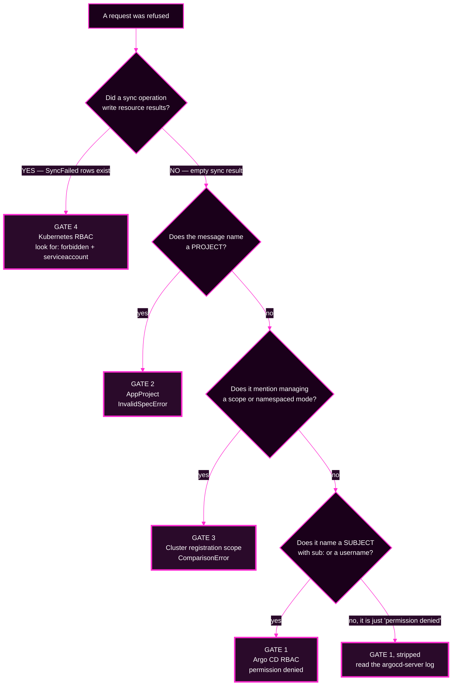

# Session 6 · Module 3 — Reading a Denial in the Wild

> **Day 2 · Session 6 · Module 3 of 3 · ~12 minutes · concept + hands-on**
> **Run every command in your VM terminal**, after `source ~/argo-lab-env.sh`.
> **← Back to:** [Day 2 map](../README.md) · [Session 6](README.md)

---

## Page TL;DR

- **What this is.** The practical skill: given one red Application and one error message, name the gate in under a minute and prove it.
- **Why it matters.** The capstone contains an authorization fault and does **not** tell you which gate it is.
- **What to remember.** Four questions in order: *did anything get applied? whose vocabulary is this? who owns that file? can I prove it read-only?*
- **The most common mistake.** Deciding which gate it is from what you expected, then reading the message looking for confirmation.

---

## 1. The decision tree

Run this top to bottom. Each branch is answerable from evidence you can gather without changing anything.



### The mechanical settler

When two gates could plausibly be responsible, this one command decides it. It reads the Application's recorded sync result:

```bash
kubectl --context k3d-mgmt -n argocd get application <name> \
  -o jsonpath='{.status.operationState.syncResult.resources}' ; echo
```

| Output | Meaning | Gate |
|---|---|---|
| nothing at all | Argo CD refused before touching the cluster | 1, 2, or 3 |
| a list containing `"status":"SyncFailed"` | Argo CD tried, and the cluster rejected it | 4 |

> **This is more reliable than "did the sync start?"** A gate-2 refusal can still record an operation if somebody presses Sync — it ends instantly with `Phase: Error` and `Duration: 0s`. But it never produces **resource result rows**. Gate 4 always does.

### Mini TL;DR — section 1

- Start with **"did anything get applied?"**, settled by the sync result rows.
- Then route on the message's **vocabulary**: project, mode, or subject.
- Never route on what you expected to happen.

---

## 2. Two failures that look identical, told apart in one step

Here is a common and genuinely confusing **asymmetry**. A project **permits** the `NetworkPolicy` kind, while the workload cluster's least-privilege ServiceAccount was **never granted** permission to create NetworkPolicies there.

Two engineers hit two different walls on the same afternoon, and both see a red badge.

### Case A — a gate 2 refusal

An engineer points a `team-a` app at `storefront-prod`, which is not in the project's `destinations`. Argo CD refuses **before any sync runs** and records a condition:

```text
CONDITION         MESSAGE
InvalidSpecError  application destination server 'https://k3d-workload-server-0:6443' and
                  namespace 'storefront-prod' do not match any of the allowed destinations
                  in project 'team-a'
```

Condition type `InvalidSpecError`. Searchable phrase: **"do not match any of the allowed destinations in project"**. No operation started. Sync result rows: **none**. The fix lives in the **AppProject**.

### Case B — a gate 4 refusal

A *permitted* app tries to sync a NetworkPolicy. The project allows the kind, so Argo CD **starts the sync**. The cluster's API server refuses the write, and the rejection appears **inside the sync result**:

```text
networkpolicies.networking.k8s.io is forbidden: User
"system:serviceaccount:argocd-access:argocd-manager" cannot create resource
"networkpolicies" in API group "networking.k8s.io" in the namespace "team-a"
```

A sync **ran** and **failed**. Sync result rows: **one, with `SyncFailed`**. The fix lives on the **workload cluster**, as a `Role` and `RoleBinding` — not in Argo CD at all.

### Side by side

| | Case A | Case B |
|---|---|---|
| What you see first | red badge | red badge |
| Condition or phase | `InvalidSpecError` condition | `Phase: Failed` |
| Sync result rows | none | one, `SyncFailed` |
| Vocabulary | `project`, a destination value | `forbidden`, `system:serviceaccount:` |
| Anything applied? | no | attempted, rejected |
| Fix lives in | the AppProject YAML | a `Role` on the workload cluster |
| You page | the platform team | the workload cluster admins |

**Same red badge. Opposite systems, opposite owners, opposite fixes.** One question separated them.

> Read for the **signature**, never a character-for-character match. Exact wording shifts between Argo CD versions; the vocabulary does not.

### Mini TL;DR — section 2

- Identical-looking failures can belong to entirely different systems.
- Sync result rows is the mechanical difference.
- Vocabulary names the owner, and the owner is who you page.

---

## ✅ Key Takeaways — reading denials

- **"Permission denied" is not a diagnosis. "Which permission system denied it" is.**
- **The sync result settles gate 4 versus gates 1–3** more reliably than any badge.
- **The message's vocabulary names the owning team.**
- **Every gate can be interrogated read-only**, before or after the failure.

---

## 3. How much a denial tells you depends on what you may see

This catches people out, so it is worth stating explicitly.

Argo CD gives you **two different forms** of the same gate-1 denial:

| Situation | What you get |
|---|---|
| You may `get` the object | the **full** rule: `permission denied: applications, delete, team-a/team-a-guestbook, sub: team-a-dev, iat: ...` |
| You may **not** `get` the object | just two words: `permission denied` |

**This is deliberate.** Describing the denial in detail would confirm that an object you are not allowed to see exists. So the answer is stripped.

**The full detail is always in the `argocd-server` log**, tagged `security=2` for a security information and event management system to pick up:

```bash
kubectl --context k3d-mgmt -n argocd logs deploy/argocd-server | grep "permission denied"
```

> **A design consequence worth noticing.** The terse form is the *hardest* denial for a developer to self-diagnose, and it is the one they are most likely to hit. A guardrail nobody can interpret is not prevention — it is a support ticket. You will rank the denials on exactly this in Lab 5.

### Mini TL;DR — section 3

- Detailed denial = you can see the object. Terse denial = you cannot.
- The full record always exists in the `argocd-server` log.
- The most secure message is often the least helpful one.

---

## 4. Deletion is an authorization question too

One more idea before the lab, because it is where governance and operations meet.

Deleting an Application is governed by gate 1, like any other verb. But **what a delete destroys** is decided somewhere else entirely: by **how the delete is requested**.

| How the delete is requested | Finalizer present? | What happens to the workloads |
|---|---|---|
| `kubectl delete application <name>` | yes | **deleted** — the finalizer runs the cascade |
| `kubectl delete application <name>` | no | **survive**, orphaned |
| `argocd app delete <name>`, or the UI's Foreground/Background | no | **deleted anyway** — the server adds the finalizer as it deletes |

> **Say the rule out loud: the deletion danger does not live in the object, it lives in the delete *path*.** An Application showing no finalizer is not safe. It is one `argocd app delete` away from taking its workloads with it.

The boundary that actually holds is gate 1: **do not grant `delete` to a role that only needs `sync`.** You will prove this in Lab 5.

### Mini TL;DR — section 4

- Gate 1 governs *whether* you may delete.
- The delete **path** governs *what* gets destroyed.
- "No finalizer" is not a safety property.

---

## 5. Not required today

Three governance topics are real, useful, and **not needed for Lab 5 or the capstone**:

- **SSO and group-to-role mapping** — how identity from an identity provider meets permission in Argo CD.
- **Secret management patterns** — why a base64 `Secret` in Git is a leaked secret, and the two safe patterns.
- **Project roles, scoped tokens, and sync windows** — narrow credentials for automation, and change freezes as configuration.

They are in [the optional reference module](90-reference-sso-secrets-and-governance.md), written to be read after the capstone.

---

## Final page TL;DR

- **What this is.** The one-minute routine for naming a gate from a message.
- **Why it matters.** The capstone hands you an authorization fault with no label on it.
- **What to remember.** *Did anything get applied?* then *whose vocabulary is this?*
- **The most common mistake.** Confirming your guess instead of reading the evidence.

---

## Transition — to Lab 5

You have four gates, four signatures, and a decision tree. **[Lab 5](../lab-05/README.md)** makes it physical.

You will fence in a brand-new tenant, prove the fence lets the right thing through, then genuinely try to walk through it — once from the Argo CD side and once from the Kubernetes side. You will compare the two denials on who denied it, where it was logged, which file fixes it, and which team you page. Then you will watch a delete get refused and work out where the real danger lives.

Bring the one question: **did anything on the cluster actually get touched?**

**→ Next:** [Lab 5 — Enforce Platform Guardrails](../lab-05/README.md)
