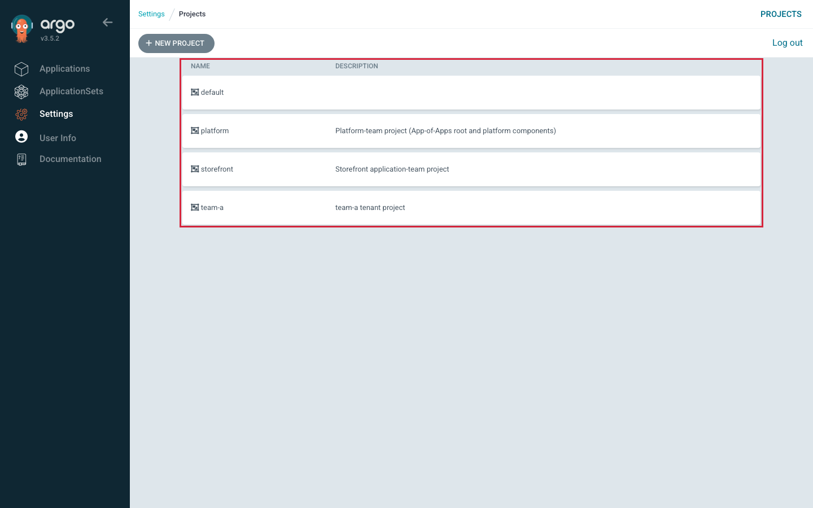

# Session 6 · Module 3 — SSO, Secrets, and Governance

> **Day 2 · Session 6 · Module 3 of 3 · ~12 minutes · concept + hands-on**
> **Goal:** understand group→role mapping, safe secret patterns, scoped tokens and sync windows — and why guardrails make the audit trail true.

---

## 1. SSO: identity from the IdP, permission from Argo CD

```text
   IDENTITY (who you are)                 PERMISSION (what you may do)
   lives in the IdP                        lives in Argo CD's policy.csv
   ┌─────────────────────────┐  OIDC       ┌──────────────────────────────────────┐
   │ Identity Provider        │  login      │ argocd-rbac-cm (policy.csv)           │
   │  groups:                 │ ─────────►  │  g, storefront-devs, role:storefront │◄ group→role
   │   • storefront-devs  ────┼─ "you are   │  p, role:storefront, applications,   │
   │   • platform-admins      │  in group   │       sync, storefront/*, allow      │◄ role→permission
   └─────────────────────────┘  storefront  └──────────────────────────────────────┘
                                 -devs"          IN THIS LAB (no IdP): a LOCAL ACCOUNT
                                                 stands in for a group — g, <account>, <role>
```

**Identity and permission are two different files owned by two different systems.** The IdP owns *who you are and which groups you are in*; Argo CD's `policy.csv` owns *what a group may do.* When someone leaves the `storefront` team, an IdP admin removes them from `storefront-devs` and their Argo CD access is gone **with no change to `policy.csv`** — Argo CD never knew them as a person, only as a group member. That is the governance win of SSO: **you stop managing people in Argo CD.** It is also why routine admin logins can be removed — you become admin by being in the admin *group*, only when needed.

Because this lab has **no identity provider** (Dex is disabled), the local account `team-a-dev` plays the part: a `g, <account>, <role>` line is the *same shape* as a real group mapping. Everything you learn transfers.

- **OIDC (OpenID Connect)** is the protocol Argo CD uses to receive "this person is authenticated, here are their groups" from an **IdP (identity provider)** such as Okta or Entra ID.
- A **local account** is defined inside Argo CD (`argocd-cm`) with a password Argo CD stores — used when there is no IdP.

---

## 2. Secret management: commit the pointer, never the payload

```text
   ✗ plaintext Secret in Git       ✓ Pattern A: destination-cluster mgmt   ✓ Pattern B: render-time
   base64 = encoding, NOT           SealedSecret/ExternalSecret in Git;      injection (plugin/operator
   encryption; anyone with repo     an in-cluster controller decrypts →      pulls from a secret store)
   read decodes it in one command   real Secret on the destination cluster
```

**base64 is encoding, not encryption** — anyone with repo read decodes it in one command, so a plaintext `Secret` in Git is a leaked secret. Worse, it is leaked **retroactively and permanently**: Git keeps history, so rotating the password on Wednesday does not un-commit Tuesday's value.

The rule (from Session 3, now at governance depth): **commit the pointer, never the payload.** What lives in Git is a *reference*; the *value* is assembled elsewhere:
- **Pattern A — destination-cluster secret management** (Argo CD's recommended direction): the encrypted/referenced object goes in Git, and an in-cluster controller turns it into a real `Secret` **on the destination cluster** (Sealed Secrets, External Secrets Operator, Secrets Store CSI Driver, Vault operators). The plaintext never passes through Argo CD.
- **Pattern B — render-time injection**: a plugin injects the value while manifests are prepared. Works, but Argo CD stores **rendered manifests in Redis in plaintext**, so an injected value can be cached in plaintext — a real reason the docs prefer Pattern A.

We name tool *categories* and stop. The rule you carry: **the pointer is safe to commit; the payload never is.**

---

## 3. Governance controls that ride on the fences

| Control | What it is | The governance question it answers |
|---|---|---|
| **API account + scoped token** | A **project role** (inside one AppProject's `spec.roles`) issued a **JWT project token** — e.g. a role granted only `sync` on that project's apps, whose signed token CI uses (enforced at **fence 1**). | *"What can this credential do?"* A typo in that pipeline could not touch `storefront-prod` — its fence-1 permissions never reach it. Scope tokens; don't put admin tokens in pipelines. |
| **Deployment window (sync window)** | An AppProject entry that **allows** or **denies** syncing during a time range (schedule, duration, scope). A deny window is a change freeze as configuration; its escape hatch `manualSync: true` lets a named person sync by hand — itself a recorded sync. | *"Who may bypass the freeze, and does the bypass show up afterward?"* — never merely "is there a freeze?" |

- A **project role** grants narrow, project-local permissions without touching global `policy.csv`. A **JWT (JSON Web Token)** is a signed, self-contained credential string.

**The through-line: guardrails are what make the audit trail true.** "Every deployment is a commit, so we have a complete audit trail" is only true if nobody can deploy *without* going through Argo CD. If engineers keep direct `kubectl` write access to the workload clusters, the Git history records what people *usually* did. The fences are the precondition that makes GitOps' central claim factual.

---

## 4. Hands-on: read the fences in the UI

**▶ Do this now — see the four tenancy boundaries.** In Argo CD, open **Settings → Projects**. You should see `default`, `storefront`, `platform`, and `team-a`.



*Figure SS-S6-01 — Four projects = four tenancy boundaries. `default` sits right next to the real fences — the trap, since it is the maximally permissive one.*

**🔍 Notice:** clicking `storefront` or `team-a` shows the `sourceRepos`, `destinations`, and whitelists you just read as YAML — the UI is a view onto the same object.

<!-- CAPTURE-SPEC: SS-S6-01/02/03 — Projects list; Applications list as team-a-dev (fence 1 as absence); a deny sync window on team-a. Argo CD v3.5.2. -->

*(If you log in as the local account `team-a-dev` instead of `admin`, you see only `team-a`'s Applications — fence 1 visible as *absence* (SS-S6-02). A deny **sync window** on a project (SS-S6-03) is a change freeze you can review in a pull request.)*

---

## 5. Quick Checks

**S6-QC2 — Why should only administrators create ApplicationSets?** A team asks to create ApplicationSets "to save tickets." Why is that a materially bigger grant?

<details>
<summary>Show answer</summary>

**Because an ApplicationSet is a factory that writes Applications, and `spec.template.spec.project` is inside the template the creator controls.** They could write a template whose `project` is a **more privileged project**, and the controller stamps out Applications there — a **privilege-escalation path**. Creating one **Application** is bounded (it names one project, fence 1 governs which). Creating an **ApplicationSet** hands them *the pen that writes Applications*, and a templated `project` makes the bound itself editable. Argo CD's docs: only admins should create/update/delete ApplicationSets. Course mitigation: keep `project` **hard-coded**, keep ApplicationSet creation with the platform team.
</details>

**S6-QC3 — Secret pattern + group mapping.** A new `payments` team needs (a) a DB password consumed with **no plaintext in Git**, and (b) five engineers who can **sync but not delete** their apps, via Okta groups. Sketch it.

<details>
<summary>Show answer</summary>

**(a)** Commit the *pointer* (a SealedSecret's ciphertext or an ExternalSecret naming the store/key); an in-cluster controller assembles the real Secret on the destination cluster (Pattern A). Never commit a base64 `Secret`. **(b)**
```csv
p, role:payments, applications, sync, payments/*, allow
g, payments-devs, role:payments
```
The `p` line grants `sync` (add `get`); the **absent** `delete` line is how you say "sync but not delete." The `g` line maps the **Okta group** to the role, so adding/removing an engineer is an Okta change with **no `policy.csv` edit.**
</details>

---

## 6. Common misconceptions

- **"AppProject restrictions are Kubernetes RBAC."** No — an AppProject is Argo CD's own admission layer (fence 2), enforced *before* contacting the cluster (`InvalidSpecError`, nothing applied). Kubernetes RBAC (fence 3) refuses a write *during* a sync (`forbidden … serviceaccount`).
- **"The `default` project is safe to use."** It is the **most permissive** object in a fresh install. "It has a project" ≠ "it has a boundary." Empty its allow-lists.
- **"An empty `clusterResourceWhitelist` allows everything."** The opposite — **empty means deny.** An AppProject is a *positive* list; `[]` names nothing, so it permits nothing. `['*']` is the open gate.
- **"A sealed Secret in Git is the same as a plaintext Secret in Git."** Opposites — a SealedSecret is ciphertext only the in-cluster key can decrypt; a plaintext Secret is base64 anyone can decode.
- **"We have Kubernetes RBAC, so tenants are isolated."** Every tenant syncs as the **same** ServiceAccount; the isolating fence is the **AppProject**, not Kubernetes RBAC.

---

## 7. Key takeaways

- **Identity from the IdP, permission from Argo CD** — SSO maps a *group* to a *role*; you stop managing people inside Argo CD. The lab's `team-a-dev` local account stands in for a group.
- **Commit the pointer, never the payload** — a secret in Git is exposed retroactively and permanently; prefer destination-cluster management over render-time injection.
- **Scope tokens, don't hand out admin** — project roles with JWT tokens give automation exactly what it needs.
- **Guardrails make the audit trail true** — GitOps' "every change is a commit" only holds if nobody can deploy around Argo CD.

---

## Transition — to Lab 5

You have the three-fence model and the one diagnostic question. **[Lab 5 — Enforce Platform Guardrails](../lab-05-enforce-platform-guardrails.md)** turns it into muscle memory as a **guardrail-bypass attempt**: you will fence in the new `team-a` tenant, then *genuinely try to walk through the fence* and read the exact error each time. You will empty the `default` project and watch a scratch app stop syncing, trigger a **fence-2** and a **fence-3** denial minutes apart, answer *which team do you page?*, confirm a denial with `argocd admin settings rbac can` *before* hitting it, and protect a tenant's apps from unintended deletion. Bring the one question: *did anything on the cluster actually get touched?*

**→ Next:** [Lab 5 — Enforce Platform Guardrails](../lab-05-enforce-platform-guardrails.md)
