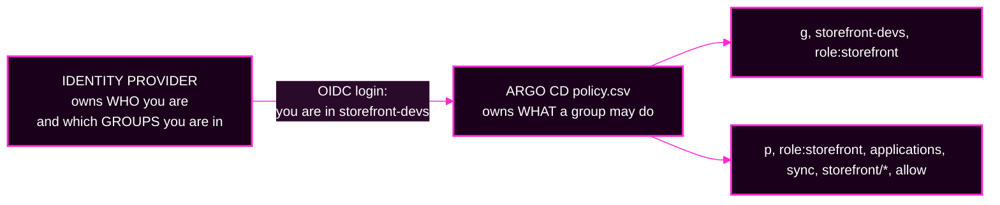

# Session 6 · Optional Reference — SSO, Secrets, and Governance Controls

> **Optional. Outside the Day 2 timebox. Nothing here is required for Lab 5 or the capstone.**
> Read it after the capstone, or when you are designing a real tenancy model.
> **← Back to:** [Day 2 map](../README.md) · [Session 6](README.md)

---

## Page TL;DR

- **What this is.** The governance topics Session 6 sets aside: single sign-on, secret handling, scoped tokens, and sync windows.
- **Why it matters.** Each one is how a real platform stops managing people and credentials by hand.
- **What to remember.** *Identity comes from the identity provider; permission comes from Argo CD.* And: **commit the pointer, never the payload.**
- **The most common mistake.** Treating a base64-encoded `Secret` in Git as protected. base64 is encoding, not encryption.

---

## 1. SSO: identity from the provider, permission from Argo CD



**Identity and permission are two different files owned by two different systems.**

The identity provider owns *who you are and which groups you belong to*. Argo CD's `policy.csv` owns *what a group may do*.

**The governance win:** when someone leaves the `storefront` team, an identity-provider administrator removes them from `storefront-devs` and their Argo CD access disappears **with no change to `policy.csv`**. Argo CD never knew them as a person, only as a group member.

It is also why routine administrator logins can be removed entirely: you become an administrator by being in the administrator *group*, only when you need to be.

**Vocabulary:**

- **OIDC (OpenID Connect)** is the protocol Argo CD uses to receive "this person is authenticated, and here are their groups" from an **identity provider** such as Okta or Entra ID.
- A **local account** is defined inside Argo CD itself, with a password Argo CD stores. It is what you use when there is no identity provider.

This lab has no identity provider, so the local account `team-a-dev` plays the part of a group. The `g, <subject>, <role>` line has exactly the same shape either way, which is why everything you learn in Lab 5 transfers.

### Mini TL;DR — section 1

- The provider owns identity; Argo CD owns permission.
- Group-to-role mapping means you stop managing people inside Argo CD.
- A local account and an SSO group produce the same policy line.

---

## 2. Secret management: commit the pointer, never the payload

**base64 is encoding, not encryption.** Anyone with read access to the repository decodes it in one command. A plaintext `Secret` committed to Git is a leaked secret.

Worse, it is leaked **retroactively and permanently**. Git keeps history, so rotating the password on Wednesday does not un-commit Tuesday's value.

**The rule: commit the pointer, never the payload.** What lives in Git is a *reference*. The *value* is assembled somewhere else.

| Pattern | How it works | Trade-off |
|---|---|---|
| **A — destination-cluster secret management** *(recommended direction)* | an encrypted or referencing object goes in Git; an in-cluster controller turns it into a real `Secret` **on the destination cluster**. Sealed Secrets, External Secrets Operator, Secrets Store CSI Driver, Vault operators | the plaintext never passes through Argo CD |
| **B — render-time injection** | a plugin injects the value while manifests are being prepared | works, but Argo CD caches **rendered manifests in Redis in plaintext**, so an injected value can sit in the cache in the clear |

That caching behaviour is a real reason the documentation prefers pattern A.

> **A sealed secret in Git is not the same as a plaintext secret in Git.** They are opposites: one is ciphertext that only an in-cluster key can decrypt; the other is base64 anybody can decode.

### Mini TL;DR — section 2

- base64 is not protection, and Git history makes a leak permanent.
- Pattern A keeps plaintext out of Argo CD entirely.
- Pattern B works but can cache plaintext in Redis.

---

## 3. Governance controls that ride on the gates

| Control | What it is | The question it answers |
|---|---|---|
| **Project role + scoped token** | a role defined **inside one AppProject's `spec.roles`**, issued a signed **JWT** that automation presents instead of a password. Enforced at **gate 1** | *"What can this credential do?"* A typo in that pipeline cannot touch `storefront-prod`, because its permissions never reach it |
| **Sync window** | an AppProject entry that **allows** or **denies** syncing during a time range. A deny window is a change freeze expressed as configuration. Its escape hatch, `manualSync: true`, lets a named person sync by hand — itself a recorded action | *"Who may bypass the freeze, and does the bypass show up afterwards?"* — never merely *"is there a freeze?"* |

**Vocabulary:** a **project role** grants narrow, project-local permissions without touching the global `policy.csv`. A **JWT (JSON Web Token)** is a signed, self-contained credential string.

### Creating a project role, if you want to try it

```bash
argocd proj role create team-a ci-sync
argocd proj role add-policy team-a ci-sync --action get  --permission allow --object '*'
argocd proj role add-policy team-a ci-sync --action sync --permission allow --object '*'
argocd proj role get team-a ci-sync
```

Two details matter.

**`--object` is the Application name *inside this project*.** The CLI adds the `team-a/` prefix itself, so `'*'` becomes `team-a/*`. Typing `'team-a/*'` produces `team-a/team-a/*`, which matches nothing.

**A role needs `get` as well as `sync`,** because the CLI fetches the Application before it syncs it.

Create the token straight into a shell variable so it is never printed:

```bash
TOKEN="$(argocd proj role create-token team-a ci-sync -t)"
```

Pass it with `--auth-token "$TOKEN"`. Clean up with `unset TOKEN` and `argocd proj role delete team-a ci-sync`.

### Sync windows, if you want to try one

```bash
argocd proj windows add storefront --kind deny --schedule "* * * * *" --duration 1h --applications "*"
```

With `manualSync` off, even an **administrator's** manual sync is refused with `cannot sync: blocked by sync window`.

Remove it when you are done — `argocd proj windows list storefront` shows the window's ID, which is `0` if it is the only one:

```bash
argocd proj windows list storefront
argocd proj windows delete storefront 0
```

> **Leave no sync window in place before the capstone.** A forgotten deny window looks exactly like a mysterious refusal, and you will waste incident time on scaffolding you created yourself.

### Mini TL;DR — section 3

- Scope tokens to a project role; never hand automation an administrator token.
- A sync window is a change freeze you can review in a pull request.
- Always ask who may bypass a freeze and whether the bypass is recorded.

---

## 4. The through-line: guardrails are what make the audit trail true

"Every deployment is a commit, so we have a complete audit trail" is only true **if nobody can deploy without going through Argo CD**.

If engineers keep direct `kubectl` write access to the workload clusters, the Git history records what people *usually* did.

**The gates are the precondition that makes GitOps' central claim factual.** Without them it is a convention, not a guarantee.

---

## ✅ Key Takeaways

- **Identity from the provider, permission from Argo CD.** SSO maps a *group* to a *role* so you stop managing people inside Argo CD.
- **Commit the pointer, never the payload.** A secret in Git is exposed retroactively and permanently.
- **Prefer destination-cluster secret management** over render-time injection, because rendered manifests are cached in plaintext.
- **Scope tokens with project roles**, and remember `--object` is already project-relative.
- **Guardrails make the audit trail true.** GitOps' claim depends on nobody being able to deploy around it.

---

## Final page TL;DR

- **What this is.** The governance material Session 6 deliberately defers.
- **Why it matters.** It is how real platforms scale tenancy past a handful of local accounts.
- **What to remember.** Identity and permission are separate systems. Pointers are safe to commit; payloads never are.
- **The most common mistake.** Leaving a sync window or a test token in place and then diagnosing it as an incident.

**→ Back to:** [Session 6](README.md) · [Day 2 map](../README.md)
