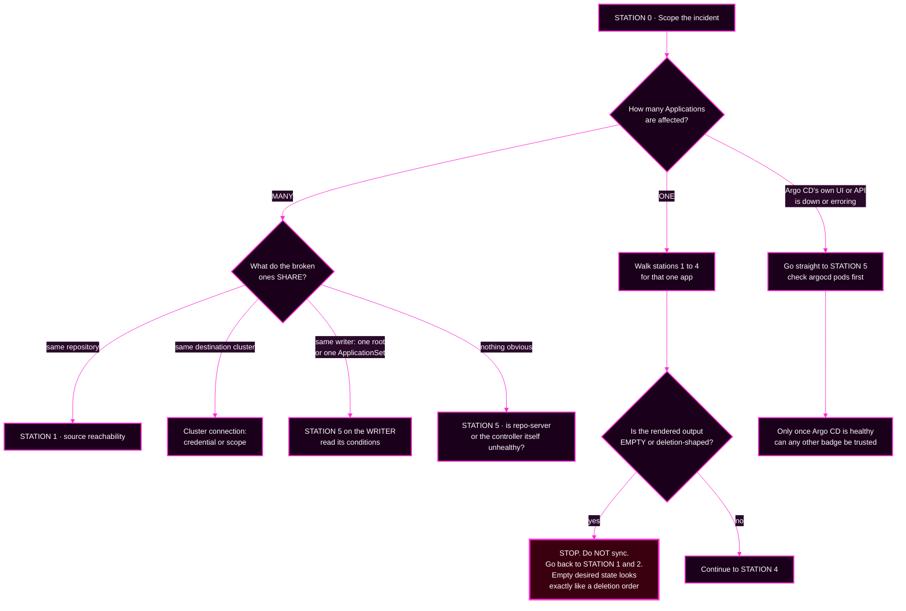

# Session 7 · Module 1 — The Investigation Stations

> **Day 2 · Session 7 · Module 1 of 3 · ~25 minutes · concept + hands-on**
> **Run every command in your VM terminal**, after `source ~/argo-lab-env.sh`.
> **← Back to:** [Day 2 map](../README.md) · [Session 7](README.md)

---

## Page TL;DR

- **What this is.** A repeatable way to investigate an Argo CD incident: seven **stations**, each answering one question and naming one component.
- **Why it matters.** Under pressure, people guess and restart things. That destroys evidence and makes healthy components look guilty.
- **What to remember.** *Evidence comes before change.* And: *source problems come before render problems.*
- **The most common mistake.** Starting at the loudest red badge instead of at the top of the chain that produced it.

---

## 1. Why this matters: 09:05, everything is `Unknown`

It is 09:05 on a Monday. Every Application in the user interface has flipped to **`Unknown`** — the status Argo CD shows when it cannot even complete a comparison.

Someone in chat types the sentence that makes most outages worse:

> *"Should I just restart everything?"*

**Stop.** That question is the trap, and it is harmful in two specific ways.

**It erases the evidence you need.** Logs roll. In-flight operations reset. The thing that would have told you what happened is gone.

**It makes a healthy component look guilty.** You touched it right before the symptom changed, so now everyone believes it was involved.

Two rules prevent all of this.

> **Evidence before change.** Gather proof of *where* the failure is before you change anything. Your first destructive action should be **the fix**, not a diagnostic guess.
>
> **Source problems come before render problems.** Check the declarative source — Git, and whether it rendered — before you suspect Argo CD's own components. Most incidents are a bad or unreachable source, not a broken controller. And you cannot trust a comparison until you trust both sides of it.

### Mini TL;DR — section 1

- A restart is an **intervention**, not a diagnosis.
- Restarting early destroys evidence and misassigns blame.
- Two rules: **evidence before change**, and **source before render**.

---

## 2. Seven stations, not a rigid pipeline

Think of the investigation as a set of **stations**. Each station answers one question and, crucially, **names exactly one component** — so finding the station finds the pod whose logs to open.

You normally visit them in order, because each one establishes trust needed by the next. But you will skip stations when the evidence lets you, and you will jump back when a station surprises you. That is not cheating; it is what the branching in section 3 is for.

```mermaid
%%{init: {'theme':'base','themeVariables':{'background':'#000000','primaryColor':'#1a001a','primaryTextColor':'#ffffff','primaryBorderColor':'#ff2bd1','lineColor':'#ff2bd1','secondaryColor':'#2a0a2a','fontSize':'14px'}}}%%
flowchart LR
    S0["0 · SCOPE<br/>how much is broken?"] --> S1["1 · SOURCE<br/>is Git right<br/>and reachable?"]
    S1 --> S2["2 · RENDER<br/>did manifests<br/>come out?"]
    S2 --> S3["3 · COMPARE<br/>what does the<br/>diff really say?"]
    S3 --> S4["4 · APPLY + HEALTH<br/>did the write land?<br/>is the workload up?"]
    S4 --> S5["5 · COMPONENT<br/>which pod is<br/>implicated?"]
    S5 --> S6["6 · REPAIR + VERIFY<br/>fix in Git,<br/>prove convergence"]
    classDef read fill:#1a001a,stroke:#ff2bd1,stroke-width:2px,color:#ffffff;
    classDef write fill:#0a2a1a,stroke:#ff2bd1,stroke-width:3px,color:#ffffff;
    class S0,S1,S2,S3,S4,S5 read;
    class S6 write;
```



**Stations 0 through 5 are pure reading. Station 6 is the first change you make.**

### The station table

| Station | The question it answers | Component it names | Where its evidence lives |
|---|---|---|---|
| **0 · Scope** | how many Applications, and what do they share? | *(none yet — this sets your path)* | the Applications list |
| **1 · Source** | is the declared source correct, and does it answer? | **Git** — it *stores* | `argocd app get`, `git ls-remote` |
| **2 · Render** | did the repo-server actually produce manifests? | **repo-server** — it *renders* | `argocd repo list --refresh hard`, `argocd app manifests` |
| **3 · Compare** | what is genuinely different, and can I trust the diff? | **application controller** — it *compares* | `argocd app diff` |
| **4 · Apply + health** | was anything written, and is the workload healthy? | **application controller** + the **target cluster API** | sync result, Pods, events |
| **5 · Component** | is the implicated component itself healthy? | whichever station 1–4 pointed at | pod status, restarts, logs, `kubectl top` |
| **6 · Repair + verify** | did the fix converge? | **Git**, then the whole loop again | a commit, then the same commands you diagnosed with |

> **The highest-value idea in this module: each station names one component.** "Manifests are stale even after a refresh" lands at station 2, so you open the **repo-server**. "The sync started and then failed with `forbidden`" lands at station 4, so you look at the **target cluster's permissions**, not at Argo CD.

### Why the usual order is what it is

**You cannot diagnose a comparison until you trust both sides of it.** Station 3 compares desired against live. That is meaningless unless you have first confirmed the desired side is the revision you think it is (station 1) and that it rendered at all (station 2).

Source and render come first. Always.

### Mini TL;DR — section 2

- Seven stations, each with one question and one component.
- Stations 0–5 read; station 6 writes.
- The order exists because a comparison is worthless until both sides are trusted.

---

## 3. The branching decision tree

The order above is the common path. Here is how the path actually changes based on what station 0 tells you.



### Read the tree as five rules

| What you see at station 0 | Where to go | Why |
|---|---|---|
| **One Application broken** | stations 1 → 4 for that app | nothing shared is implicated, so walk it normally |
| **Many Applications broken** | find what they **share**, then go there | a shared symptom means a shared dependency, never several simultaneous bugs |
| **Argo CD itself unhealthy** | station 5 first | while Argo CD is broken, **every other badge is unreliable** |
| **Rendered output is empty or deletion-shaped** | back to stations 1–2, and **do not sync** | an empty desired state is indistinguishable from "delete everything" |
| **The repository is unreachable** | station 1, and expect it to affect **every** app using that repo | confirm from outside Argo CD too, so you know it is not just the repo-server |

> **The masking question, worth asking of every hypothesis:** *if this were true, which of my other evidence becomes untrustworthy?*
>
> A broken repo-server makes every `ComparisonError` on every Application meaningless as a signal about that Application. Confirm and repair a masking fault **early**, then re-read the whole picture, because hidden symptoms will now appear.

### Mini TL;DR — section 3

- **One app** → walk the stations. **Many apps** → find the shared dependency.
- **Argo CD unhealthy** → fix that first; nothing else can be trusted until then.
- **An empty render looks like a deletion order.** Never sync your way out of it.

---

## ✅ Key Takeaways — the method

- **Evidence before change.** Your first destructive action should be the fix.
- **Source problems come before render problems.** Trust both sides before comparing them.
- **Each station names one component** — finding the station finds the pod.
- **A shared symptom means a shared dependency**, not several coincidences.
- **Ask the masking question** of every hypothesis before you act on any of them.

---

## 4. Hands-on: run the first two evidence commands

These are read-only. They change nothing.

**▶ Do this now — station 1 on a healthy Application.**

```bash
source ~/argo-lab-env.sh
argocd app get storefront-dev-workload
```

> **Use an Application that actually exists at your checkpoint.** At `CP-lab-05` and `CP-capstone` the storefront and platform Applications are present. The Day 1 app `hello-reconcile` is **removed from `CP-lab-04` onward**, so asking for it returns a confusing error rather than "not found." Check what exists with `argocd app list -o name` if you are unsure.

**🔍 Notice the fields the method reads:**

- the **Source** block — repository, target revision, path
- the **two status lines** — `Sync Status` and `Health Status`, which answer different questions
- a **`CONDITION` block**, when something is wrong, naming the cause in plain text

On a healthy Application there is no condition at all. Its absence is information.

**▶ Do this now — station 1's second half: does the source answer?**

```bash
git ls-remote http://lab-gitea:3000/course/storefront-gitops.git main
```

**Expected — a commit hash beside `refs/heads/main`:**

```text
36e39b29d3bed53094b65227078544a11c1d3c58	refs/heads/main
```

Your hash will differ. What matters is that **a healthy source answers with a hash**, and the command exits `0`.

> In Module 2 you will see what this same command prints when the source is unreachable, and why reading that difference correctly is what saves a production workload.

### Mini TL;DR — the practice

- `argocd app get` gives you source, both statuses, and any condition, in one screen.
- `git ls-remote` tests the source **from outside Argo CD**, which is how you separate "Git is down" from "Argo CD cannot reach Git."
- Use apps that exist at your checkpoint; `hello-reconcile` is gone on Day 2.

---

## 5. Quick check

**S7-QC1 — Order the evidence, and spot the skipped station.** A single Application is stuck `OutOfSync`. A teammate says: *"I already restarted the repo-server twice and it didn't help."*

What is the correct **first** move, and what did they skip?

<details>
<summary>Show the answer</summary>

The first move is **station 0**, which here is trivial — one Application, so nothing shared is implicated — followed immediately by **station 1**: `argocd app get`, then `git ls-remote`.

Your teammate jumped straight to a **station 5 action**, and not even a diagnostic one: restarting a component is an *intervention*. They violated both rules at once — **evidence before change**, and **source before render**.

Restarting the repo-server helps only if stations 1 to 4 have already implicated it. Nothing had, which is exactly why it "didn't help."

For a single-app `OutOfSync`, station 3 (`argocd app diff`) usually shows the real difference, and the fix goes in Git at station 6.
</details>

---

## 6. What "verify" means at station 6

Verification is **not** "it looks green to me."

You verify with **the same evidence you diagnosed with**. If a `ComparisonError` condition was your evidence, then verification is that condition being gone. If a stale revision was your evidence, then verification is `argocd app history` showing the new revision and the status agreeing with it.

```bash
argocd app get <app>          # condition gone? statuses agree?
argocd app history <app>      # does the newest entry match the reported revision?
```

**Closing the loop matters** because a green badge can be a stale measurement. Every status is a reading with a timestamp.

---

## 7. The capstone prerequisite map

Here is exactly which Day 2 material prepares you for which kind of capstone fault. The capstone contains **seven faults at once**, and some hide others.

| Capstone failure type | Where you learned it | The station it lands at | The skill being tested |
|---|---|---|---|
| **Source or render failure** | [Session 5 · M2](../session-05/02-safety-and-controls.md), [Lab 4 · M2](../lab-04/02-build-and-protect-the-factory.md), Session 7 · M1–M2 | 1 and 2 | read a `ComparisonError`; never sync an empty render |
| **ApplicationSet selector blast radius** | [Session 5 · M1–M2](../session-05/01-applicationsets-the-factory.md), [Lab 4 · M2](../lab-04/02-build-and-protect-the-factory.md) | 0, then 5 on the writer | preview, count, and name before applying |
| **Duplicate root/child ownership** | [Session 5 · M3](../session-05/03-app-of-apps-and-choosing.md), [Lab 4 · M3–M4](../lab-04/03-app-of-apps-and-trace-faults.md) | 0, then 5 on the writer | find *who wrote* it; spot two owners of one resource |
| **Kubernetes RBAC failure** | [Session 6 · M1–M3](../session-06/01-the-four-gates.md), [Lab 5 · M3](../lab-05/03-bypass-attempts.md) | 4 | tell an Argo CD refusal from a cluster refusal in one step |
| **Stale management credentials** | [Session 6 · M1 gate 3](../session-06/01-the-four-gates.md), Session 7 · M3 | 4 and 5 | recognise a connection symptom that names no project |
| **Workload readiness and noisy drift** | Session 7 · M1, M3 | 4 | separate sync from health; read Pods on the **workload** cluster |
| **repo-server or controller failure masking others** | Session 7 · M1, M3 | 5 | ask the masking question before acting |

**If a row above feels unfamiliar, go back and read that module before the capstone.** That is what this table is for.

---

## Final page TL;DR

- **What this is.** Seven investigation stations, plus a branching tree for when the usual order does not apply.
- **Why it matters.** It converts "everything is red and my phone is ringing" into a walk you can actually perform.
- **What to remember.** *Evidence before change. Source before render.* Each station names one component.
- **The most common mistake.** Acting on a deletion-shaped diff. That diff is usually telling you the desired side is missing, not that Git wants everything gone.

**→ Next:** [02 — One incident, walked end to end](02-worked-incident.md)
