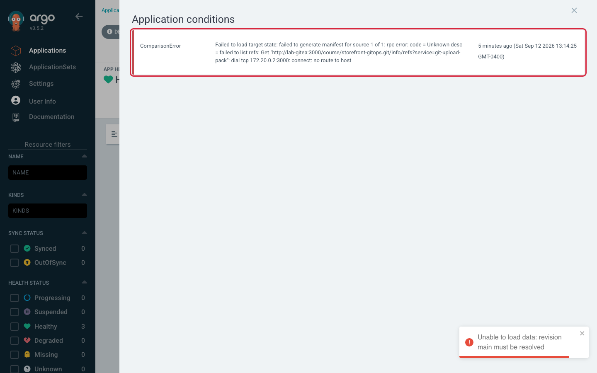
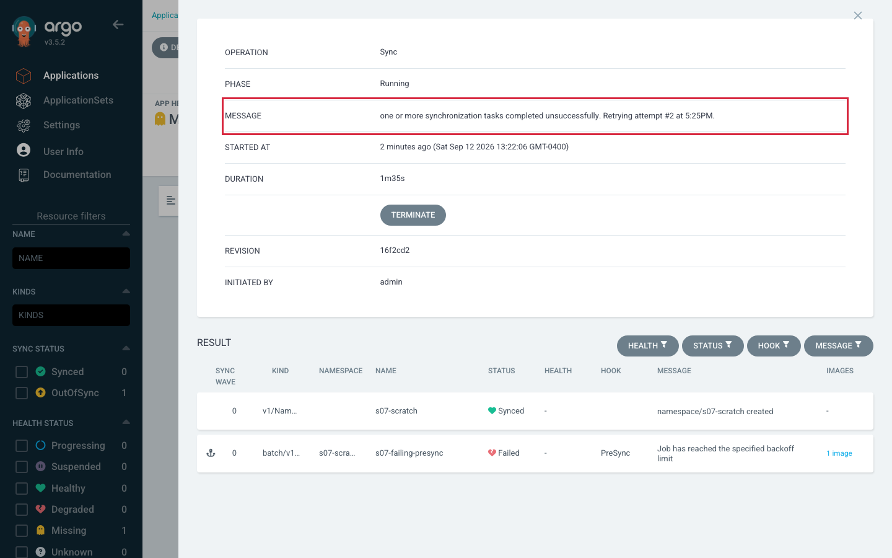

# Session 7 · Module 2 — One Incident, All Six Steps

> **Day 2 · Session 7 · Module 2 of 3 · ~25 minutes · worked walkthrough**
> **Goal:** watch the six-step method applied end-to-end to a real incident, including the single most dangerous trap in Argo CD triage — a diff that *looks* like a deletion order.

**The incident.** At 09:05, `storefront-dev-workload` (and every app that sources from the same Git server) shows red. Root cause: **the Git repository became unreachable.** (Chosen because it is *not* a Capstone fault — so this spoils nothing.) Someone wants to restart the repo-server. You do not. You walk the pipeline.

---

## Step 1 — Validate the Git source and revision

```bash
argocd app get storefront-dev-workload
```

**Real output** (the fields that matter — source, status, and the `CONDITION` block):

```text
Source:
- Repo:    http://lab-gitea:3000/course/storefront-gitops.git
  Target:  main
  Path:    charts/storefront
Sync Status:   Unknown
Health Status: Healthy

CONDITION        MESSAGE
ComparisonError  Failed to load target state: failed to generate manifest ...: failed to
                 list refs: Get "http://lab-gitea:3000/.../info/refs?service=git-upload-pack":
                 dial tcp 172.20.0.2:3000: connect: no route to host
```

**🔍 Read three things, in order:** the declared **source looks correct** (nobody edited the Application); **`Sync Status: Unknown` but `Health Status: Healthy`** (Argo CD cannot *evaluate* the app, but the workload it last deployed is still running fine — two different questions, only one broken); and the **`CONDITION` block already names the cause** (could not list refs — connection refused).

**▶ Confirm the source is unreachable from outside Argo CD too:**

```bash
git ls-remote http://lab-gitea:3000/course/storefront-gitops.git main
```

During the incident (git exits `128`):

```text
fatal: unable to access '...': Failed to connect to lab-gitea port 3000 after 3112 ms: Could not connect to server
```

**🔍** That is your first lie — but note what it tells you and what it does not: the name `lab-gitea` *still resolved* (no "could not resolve host"), so this is not DNS — **the server behind the name is not answering**. And only *from where you stand* — continue to step 2 to confirm Argo CD's repo-server sees the same thing.

---

## Step 2 — Validate repository access and manifest rendering

A bare `argocd repo list` reports a **cached** status (it can print `Successful` during a live outage). Force a re-test:

```bash
argocd repo list --refresh hard
```

```text
TYPE  REPO                                                STATUS  MESSAGE
git   http://lab-gitea:3000/course/storefront-gitops.git  Failed  Unable to connect ... dial tcp 172.20.0.2:3000: connect: no route to host
```

**▶ See how it surfaces at *render* time:**

```bash
argocd app manifests storefront-dev-workload --source git
```

```text
---
null
---
null
---
null
```

**🔍 The most easily missed evidence in the whole walkthrough:** the command **did not fail** — it exits `0` and prints empty YAML documents, one per managed resource. The repo-server could not render, so "everything" is `null`. **A quiet, empty answer is still a lie at station 2** — and it is the direct cause of the strange thing at station 3.



*Figure SS-S7-01 — the `ComparisonError` condition. Status bar reads **APP HEALTH: Healthy** and **LAST SYNC: Sync OK** — the failure surfaces as a comparison error, not a degraded workload.*

**🔍 Notice:** status is `Unknown`/`ComparisonError`, not `Degraded`, and health still says `Healthy` (the Pods are untouched); the message names the cause in plain text; and **every** app sourcing from this Git server shows the same condition at once — the signature of a **shared-dependency** failure, never one app's bug.

<!-- CAPTURE-SPEC: SS-S7-01 — ComparisonError from unreachable repo. Captured live v3.5.2. Highlight: the condition row + connection-failure message. -->

---

## Step 3 — Compare rendered state with live cluster state (the hinge, and the trap)

```bash
argocd app diff storefront-dev-workload
echo "exit code: $?"
```

```text
===== /ConfigMap storefront-dev/storefront ======
1,39d0
< apiVersion: v1
< data:
<   PODINFO_UI_MESSAGE: storefront DEV
...
===== apps/Deployment storefront-dev/storefront ======
1,203d0
< apiVersion: apps/v1
< kind: Deployment
exit code: 1
```

**🔍 Stop and read what that actually says.** *Every* line is prefixed `<` (not one `>` in 313 lines), and the headers `1,39d0` / `1,203d0` mean "lines 1..N of the live object, **deleted**, leaving nothing." Taken at face value, this diff says *Git wants the ConfigMap, Service, and Deployment all gone.*

**It does not.** The desired side is empty (the three `null` documents from step 2), so the diff is comparing a real cluster against **nothing** — and an empty desired state looks identical to a deliberate deletion. The exit code is **1** ("a real difference found"), not **2**, because from the differ's view the comparison completed fine.

> **This is why "source before platform" is a rule, not a preference.** An operator who skipped to step 3 would see a diff that appears to demand deleting the entire application — and this app has **automated sync with prune enabled**. Acting on this diff, or "just syncing to make it green," turns a source-reachability incident into a **deleted production workload.** Because you did steps 1–2 first, you know the desired side is missing and read the diff correctly: *there is nothing to compare, the problem is upstream.*

---

## Step 4 — Inspect sync results, hooks, events, and Kubernetes health

Glance at step 4 to rule out a coincidental second problem and confirm the live workload is *not* broken. **Critical detail:** the workload's Pods and events live on the **workload** cluster — name it explicitly, or you get a misleading "No resources found."

```bash
kubectl --context k3d-workload -n storefront-dev get pods
kubectl --context k3d-workload -n storefront-dev get events --sort-by=.lastTimestamp | tail -6
```

```text
NAME                          READY   STATUS      RESTARTS   AGE
storefront-75cddb6b87-wbjbg   1/1     Running     0          24h
storefront-migration-p84wv    0/1     Completed   0          5m6s
```

**🔍** Every event is `Normal`; the app Pod has run a day with zero restarts. **The workload is fine; only Argo CD's ability to evaluate it is broken.** If you had "rolled back," "restarted the app," or synced that deletion-shaped diff, you would have damaged a healthy service to fix a *source-reachability* problem. Step 4 stops that mistake.

> **A different-looking symptom, a different cause.** The screenshot below shows an operation stuck **retrying** — the app rendered and compared fine, a sync *started*, and a hook keeps failing. That is a step-4 story (sync results/hooks), not a step-2 story (rendering). Telling "never started" from "started and retrying" apart is exactly the skill step 4 builds.



*Figure SS-S7-02 — `PHASE: Running`, message "Retrying attempt #2", and a `RESULT` table showing a failed `PreSync` hook Job. The sync **started** and is **retrying** — a fundamentally different situation from a `ComparisonError`.*

**🔍 Notice:** an operation **exists** (proving rendering and comparison already succeeded); "retrying" is not "failed forever" (read the `RESULT` table for *why each attempt fails*, not the retry count); and this lives in a different panel than the SS-S7-01 condition — two surfaces because two different steps.

<!-- CAPTURE-SPEC: SS-S7-02 — Operation retrying state. Captured live v3.5.2. Highlight: the operation MESSAGE row. -->

---

## Step 5 — Inspect the responsible component and its metrics

Steps 1–4 named the suspect: the **repo-server**. *Now* — and only now — open its logs and check resource use:

```bash
kubectl --context k3d-mgmt -n argocd logs deploy/argocd-repo-server --tail=20
kubectl --context k3d-mgmt top pod -n argocd
```

The logs echo the same connection failure (`grpc.method=GenerateManifest`, `no route to host`). And `top`:

```text
NAME                              CPU(cores)   MEMORY(bytes)
argocd-application-controller-0   8m           247Mi
argocd-repo-server-dcb4fdc54-...  1m           46Mi
...
```

**🔍 An important negative result:** the repo-server is **healthy and idle** (1 millicore, 46 MiB) — not **OOMKilled** (Out-Of-Memory Killed: Kubernetes terminates a pod that exceeds its memory limit), not throttled, no restarts. That rules out "the repo-server is broken" and confirms "it is fine but cannot *reach* Git." **Restarting it — the very first thing someone wanted to do at 09:05 — would have changed nothing.** The evidence saved a pointless restart and pointed at the real fix.

---

## Step 6 — Correct the declarative source and verify reconciliation

The fix is not in Argo CD — it is restoring reachability to the Git source (DNS, network policy, or the Gitea server). Then **verify convergence with the same commands you diagnosed with:**

```bash
argocd app get storefront-dev-workload
argocd app history storefront-dev-workload
```

Once Git was reachable again:

```text
Sync Status:   Synced to main (cbeba81)
Health Status: Healthy
```

**🔍** The `CONDITION` block is gone (conditions clear once the comparison succeeds), and history's newest entry names the same revision the status reports. **Verification is not "looks green to me"** — you confirm with the same evidence you diagnosed with, closing the loop: source → render → compare → apply → healthy.

**The through-line:** six steps, six evidence commands, and the first destructive action you took was the fix. That is the entire method — and the entire Capstone.

**→ Next:** [03 — Stability, recovery, and upgrades](03-stability-recovery-upgrades.md)
