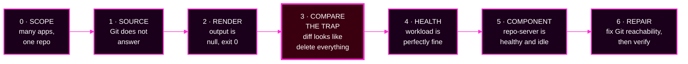

# Session 7 · Module 2 — One Incident, Walked End to End

> **Day 2 · Session 7 · Module 2 of 3 · ~30 minutes · interactive walkthrough**
> **Run every command in your VM terminal**, after `source ~/argo-lab-env.sh`.
> **← Back to:** [Day 2 map](../README.md) · [Session 7](README.md)

---

## Page TL;DR

- **What this is.** One real incident — an unreachable Git repository — walked station by station, with you predicting at each step before the evidence is shown.
- **Why it matters.** It contains the single most dangerous trap in Argo CD triage: **a diff that looks like a deletion order.**
- **What to remember.** *Source problems come before render problems.* An empty desired state and a deliberate deletion look identical.
- **The most common mistake.** Skipping to the diff, seeing every resource marked for removal, and "syncing to make it green."

> **This incident is deliberately *not* one of the capstone's faults.** Nothing here spoils anything.

---

## The incident

At 09:05, `storefront-dev-workload` shows red. So does every other Application that sources from the same Git server.

Someone wants to restart the repo-server. You do not. You walk the stations.



*Station 3 is highlighted because it is where an operator who skipped stations 1 and 2 deletes a production workload.*


**▶ Before you read on, write down your answer:** with several Applications red at once and one thing in common, which station do you go to first, and what are you looking for?

<details>
<summary>Show the answer</summary>

**Station 0 — scope** takes about ten seconds and it has already told you the most important thing: **many** Applications are broken, and they **share a Git server**.

A shared symptom means a **shared dependency**. You are not looking at several simultaneous bugs. So you go to **station 1 — source** and ask whether that shared dependency is healthy.
</details>

---

## Station 0 — Scope the incident

```bash
argocd app list
```

You see several Applications with the same status, and their `REPO` column shows the same Git server.

**🔍 The shape matters more than any single row.** One broken app is that app's problem. Five broken apps with one repository in common is the repository's problem.

---

## Station 1 — Is the source correct, and does it answer?

```bash
argocd app get storefront-dev-workload
```

**Captured output during the incident** — the fields that matter:

```text
Source:
- Repo:    http://lab-gitea:3000/course/storefront-gitops.git
  Target:  main
  Path:    charts/storefront
Sync Status:   Unknown
Health Status: Healthy

CONDITION        MESSAGE
ComparisonError  Failed to load target state: failed to generate manifest ...: failed to
                 list refs: Get "http://lab-gitea:3000/.../info/refs?service=git-upload-pack":
                 dial tcp 172.20.0.2:3000: connect: no route to host
```

**▶ Predict before reading on.** Three things in that output matter. Which three, and what does each rule in or out?

<details>
<summary>Show the answer</summary>

**1. The declared source looks correct.** Repository, target, and path are what you expect. **Nobody edited the Application.** That rules out a whole class of causes immediately.

**2. `Sync Status: Unknown` but `Health Status: Healthy`.** These answer different questions. Argo CD cannot *evaluate* the app, but the workload it last deployed is **still running fine**. Two different questions, only one of them broken.

**3. The `CONDITION` block already names the cause in plain text** — it could not list refs, because the connection failed.

The condition block is the most under-read field in Argo CD. It frequently contains the answer.
</details>

**▶ Now confirm the source is unreachable from outside Argo CD too:**

```bash
git ls-remote http://lab-gitea:3000/course/storefront-gitops.git main
```

**During the incident, git exits `128`:**

```text
fatal: unable to access '...': Failed to connect to lab-gitea port 3000 after 3112 ms:
Could not connect to server
```

**🔍 Read carefully what that does and does not tell you.** The name `lab-gitea` **still resolved** — there is no "could not resolve host" — so this is **not DNS**. The server behind the name is not answering.

And it tells you this is true **from where you are standing**. Argo CD stands somewhere else. Continue to station 2 to confirm the repo-server sees the same thing.

> **Why run this at all when Argo CD already told you?** Because it separates "Git is down" from "Argo CD cannot reach Git." Those have different fixes and different owners.

### Mini TL;DR — station 1

- The declared source was fine, so nobody broke the Application.
- `Unknown` sync with `Healthy` health means "cannot evaluate", not "workload broken".
- Confirming from outside Argo CD separates a dead server from a network path problem.

---

## Station 2 — Did anything actually render?

A bare `argocd repo list` reports a **cached** status. It can print `Successful` during a live outage. Force a re-test:

```bash
argocd repo list --refresh hard
```

**During the incident:**

```text
TYPE  REPO                                                STATUS  MESSAGE
git   http://lab-gitea:3000/course/storefront-gitops.git  Failed  Unable to connect ... no route to host
```

**▶ Predict before running the next one.** If the repo-server cannot reach Git, what do you think `argocd app manifests` prints? An error? Nothing? Something else?

```bash
argocd app manifests storefront-dev-workload --source git
```

**During the incident:**

```text
---
null
---
null
---
null
```

<details>
<summary>Why this is the most easily missed evidence in the whole walkthrough</summary>

**The command did not fail.** It exits `0` and prints empty YAML documents, one per managed resource.

The repo-server could not render, so "everything" came out as `null`. **A quiet, empty answer is still a failure** — and it is the direct cause of the very strange thing you are about to see at station 3.

If you were scripting this and only checked "did the command exit non-zero?", you would have concluded everything was fine.
</details>


*Figure SS-S7-01 — the `ComparisonError` condition in the user interface. The status bar reads **APP HEALTH: Healthy** and **LAST SYNC: Sync OK**. The failure surfaces as a comparison error, not as a degraded workload.*

**🔍 Notice:** the status is `Unknown` with a `ComparisonError`, not `Degraded`. Health still reads `Healthy`, because the Pods are untouched. And **every** Application sourcing from this Git server shows the same condition at once — the signature of a shared-dependency failure.

<!-- CAPTURE-SPEC: SS-S7-01 — ComparisonError from unreachable repo. Captured live v3.5.2. Highlight: the condition row and connection-failure message. -->

### Mini TL;DR — station 2

- Cached status lies during an outage; use `--refresh hard`.
- A failed render can produce **empty output and exit code 0**.
- Empty is not "nothing wrong". Empty is the finding.

---

## Station 3 — The hinge, and the trap

```bash
argocd app diff storefront-dev-workload
echo "exit code: $?"
```

**During the incident:**

```text
===== /ConfigMap storefront-dev/storefront ======
1,39d0
< apiVersion: v1
< data:
<   PODINFO_UI_MESSAGE: storefront DEV
...
===== apps/Deployment storefront-dev/storefront ======
1,203d0
< apiVersion: apps/v1
< kind: Deployment
exit code: 1
```

**▶ Predict before you read the explanation.** Every line is prefixed `<`. Not one `>` appears. The headers read `1,39d0` and `1,203d0`. What is this diff literally saying, and is it true?

<details>
<summary>Show the answer</summary>

**Taken at face value, this diff says Git wants the ConfigMap, the Service, and the Deployment all gone.** The `<` prefix means "present on the live side only," and `1,39d0` means "lines 1 to 39 of the live object, deleted, leaving nothing."

**It is not true.**

The desired side is **empty** — those three `null` documents from station 2. The diff is comparing a real cluster against **nothing**, and an empty desired state looks **identical** to a deliberate deletion.

The exit code is **1** ("a real difference was found"), not 2, because from the differ's point of view the comparison completed successfully. Nothing about the exit code warns you.
</details>

> **This is why "source before render" is a rule, not a preference.**
>
> An operator who skipped to station 3 sees a diff that appears to demand deleting the entire application. And this Application has **automated sync with prune enabled**.
>
> Acting on that diff — or "just syncing to make it green" — turns a source-reachability incident into a **deleted production workload**.
>
> Because you did stations 1 and 2 first, you know the desired side is missing, and you read the diff correctly: *there is nothing to compare; the problem is upstream.*

### The exit codes, since you will rely on them

| `argocd app diff` exit code | Meaning | Where it sends you |
|---|---|---|
| `0` | no difference | the app is not your problem |
| `1` | a real difference was found | forward, to station 4 |
| `2` | the comparison could not complete | **back**, to stations 1 and 2 |

**The trap above produces a `1`, not a `2`.** That is precisely why the exit code alone is not enough.

### Mini TL;DR — station 3

- An all-`<` diff with `d0` headers means the desired side is empty.
- Exit code `1` does **not** mean the comparison was trustworthy.
- Never sync a deletion-shaped diff you have not explained.

---

## Station 4 — Was anything applied, and is the workload actually fine?

Visit station 4 to rule out a coincidental second problem and to confirm the live workload is not broken.

**Critical detail: the Pods and events live on the *workload* cluster.** Name the context explicitly, or you get a misleading "No resources found."

```bash
kubectl --context k3d-workload -n storefront-dev get pods
kubectl --context k3d-workload -n storefront-dev get events --sort-by=.lastTimestamp | tail -6
```

**During the incident:**

```text
NAME                          READY   STATUS      RESTARTS   AGE
storefront-75cddb6b87-wbjbg   1/1     Running     0          24h
storefront-migration-p84wv    0/1     Completed   0          5m6s
```

**🔍** Every event is `Normal`. The application Pod has run for a day with zero restarts.

**The workload is fine. Only Argo CD's ability to evaluate it is broken.**

If you had "rolled back," "restarted the app," or synced that deletion-shaped diff, you would have damaged a healthy service in order to fix a **source-reachability** problem. Station 4 is what stops that mistake.

### A different-looking symptom, a different station


*Figure SS-S7-02 — `PHASE: Running`, the message "Retrying attempt #2", and a `RESULT` table showing a failed `PreSync` hook Job. The sync **started** and is **retrying**.*

**🔍 Notice how different this is from SS-S7-01.** An operation **exists**, which proves rendering and comparison already succeeded. This is a **station 4** story, not a station 2 story.

"Retrying" is also not "failed forever." Read the `RESULT` table for *why each attempt fails*, not the retry count.

Telling "never started" apart from "started and retrying" is exactly the skill station 4 builds.

<!-- CAPTURE-SPEC: SS-S7-02 — Operation retrying state. Captured live v3.5.2. Highlight: the operation MESSAGE row. -->

### Mini TL;DR — station 4

- Workload evidence lives on the **workload** cluster; name the context.
- A healthy Pod with zero restarts rules out "the app is broken."
- An operation that **exists** proves stations 2 and 3 already succeeded.

---

## Station 5 — Only now, look at the component

Stations 1 to 4 named the suspect: the **repo-server**. *Now* — and only now — open its logs and check its resource use.

```bash
kubectl --context k3d-mgmt -n argocd logs deploy/argocd-repo-server --tail=20
kubectl --context k3d-mgmt top pod -n argocd
```

The logs echo the same connection failure. And `top` shows:

```text
NAME                              CPU(cores)   MEMORY(bytes)
argocd-application-controller-0   8m           247Mi
argocd-repo-server-dcb4fdc54-...  1m           46Mi
```

**▶ Predict: is that a healthy repo-server or a struggling one?**

<details>
<summary>Show the answer</summary>

**Healthy, and idle.** One millicore and 46 mebibytes. Not out-of-memory killed, not throttled, no restarts.

That is an **important negative result**. It rules out "the repo-server is broken" and confirms "the repo-server is fine but cannot *reach* Git."

**Restarting it — the very first thing someone wanted to do at 09:05 — would have changed nothing.** The evidence saved a pointless restart and pointed at the real fix.
</details>

### Mini TL;DR — station 5

- You reach station 5 with a named suspect, not a hunch.
- A negative result is a result: "healthy and idle" eliminates a hypothesis.
- This is where restarting first would have wasted the outage.

---

## Station 6 — Repair, then verify with the same evidence

The fix is not in Argo CD at all. It is restoring reachability to the Git source — DNS, a network policy, or the Gitea server itself.

Then **verify with the same commands you diagnosed with**:

```bash
argocd app get storefront-dev-workload
argocd app history storefront-dev-workload
```

Once Git was reachable again:

```text
Sync Status:   Synced to main (cbeba81)
Health Status: Healthy
```

**🔍** The `CONDITION` block is **gone** — conditions clear once the comparison succeeds — and history's newest entry names the same revision the status reports.

**Verification is not "looks green to me."** You confirm with the same evidence you diagnosed with, closing the loop: source → render → compare → apply → healthy.

---

## ✅ Key Takeaways — the worked incident

- **Many apps, one shared repository: that is a shared-dependency failure**, not five bugs.
- **A failed render can exit `0` and print empty documents.** Empty is the finding.
- **An empty desired state produces a deletion-shaped diff with exit code `1`.** Never act on it.
- **`Unknown` sync with `Healthy` health means "cannot evaluate", not "workload broken."**
- **The first destructive action you took was the fix**, and the restart everyone wanted would have done nothing.

---

## Final page TL;DR

- **What this is.** Six stations walked on one real incident, with the trap in the middle.
- **Why it matters.** The trap converts a read-only problem into a deleted production workload, in one click.
- **What to remember.** *Source problems come before render problems*, because an empty render is indistinguishable from a deletion order.
- **The most common mistake.** Believing a diff before you have confirmed that both sides of it are real.

**→ Next:** [03 — Component-level diagnosis](03-component-diagnosis.md)
