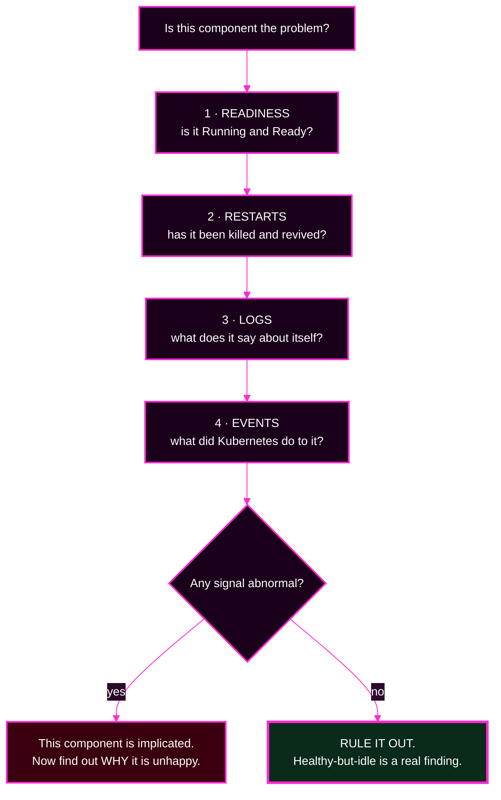

# Session 7 · Module 3 — Component-Level Diagnosis

> **Day 2 · Session 7 · Module 3 of 3 · ~20 minutes · concept + hands-on**
> **Run every command in your VM terminal**, after `source ~/argo-lab-env.sh`.
> **← Back to:** [Day 2 map](../README.md) · [Session 7](README.md)

---

## Page TL;DR

- **What this is.** Station 5 in detail: how to tell whether an Argo CD component is actually unhealthy, using signals you can read directly.
- **Why it matters.** A broken component makes every Application badge unreliable, so you must be able to rule it in or out quickly and confidently.
- **What to remember.** *A healthy-but-idle component is a real finding.* Ruling something out is progress.
- **The most common mistake.** Reaching for metrics you do not have. This lab has no Prometheus. Everything you need is readable with `kubectl`.

---

## 1. The six components and what each failure looks like

Day 1 named the components. Here is what it looks like from the outside when each one is in trouble.

| Component | Its verb | What stops when it is down | Data lost? | The symptom you will actually see |
|---|---|---|---|---|
| **server** | *talks* | the user interface, the API, the CLI, webhooks | none | "cannot connect", CLI hangs, UI will not load — **but syncs keep happening** |
| **repo-server** | *renders* | rendering new or changed manifests | none | `ComparisonError` on **many** apps at once; empty `app manifests` output |
| **application-controller** | *compares and applies* | drift detection and syncing | none | statuses stop **updating**; badges freeze at an old value |
| **applicationset-controller** | *generates* | creating or updating generated Applications | none | the ApplicationSet's conditions go stale; generated apps keep reconciling |
| **redis** | *remembers* | nothing — the cache simply rebuilds | **none** | everything works, more slowly, for a while |
| **notifications-controller** | *announces* | outbound alerts | none | silence, which is the hardest failure to notice |

**▶ Predict before reading the note below:** which component's outage causes **no stopped syncs and no data loss** — only a slowdown?

<details>
<summary>Show the answer</summary>

**Redis.** It holds *only* a cache. Losing it costs a rebuild — some CPU and some latency — but **never** data.

Argo CD's real state is Kubernetes objects: the Applications, AppProjects, ConfigMaps, and Secrets in the management cluster. That is why "back up Redis" is backing up the wrong thing.
</details>

> **The most useful row is `server`.** People assume a broken user interface means deployments have stopped. They have not. The controllers keep reconciling and syncing unattended while the UI is down. Sync and visibility are different systems.

### Mini TL;DR — section 1

- Each component fails in a recognisable, distinct way.
- **No component's failure loses data**, because state lives in Kubernetes objects.
- A dead user interface does not stop deployments.

---

## 2. The four signals you can always read

No Prometheus is installed in this lab, and you do not need one. These four signals are enough to rule a component in or out.



### Signal 1 and 2 — readiness and restarts, in one command

```bash
kubectl --context k3d-mgmt -n argocd get pods \
  -o custom-columns='NAME:.metadata.name,READY:.status.containerStatuses[*].ready,RESTARTS:.status.containerStatuses[*].restartCount,STATUS:.status.phase'
```

**Healthy output looks like this** (verified on the course environment):

```text
NAME                                                READY   RESTARTS   STATUS
argocd-application-controller-0                     true    0          Running
argocd-applicationset-controller-57db6d494c-v6cs6   true    0          Running
argocd-notifications-controller-7797558c68-x9t42    true    0          Running
argocd-redis-56d6bd8bb7-jlmxq                       true    0          Running
argocd-repo-server-dcb4fdc54-nbvpl                  true    0          Running
argocd-server-779878f878-9jfvt                      true    0          Running
```

**What to read:**

| You see | It means |
|---|---|
| `READY true`, `RESTARTS 0` | the component is up and has not been killed — **rule it out** |
| `READY false`, `Running` | the process is up but failing its readiness probe — it is **not serving** |
| a climbing `RESTARTS` count | something keeps killing it — go find out what |
| `CrashLoopBackOff` in `STATUS` | it cannot even start successfully |

### Why a restart count matters more than it looks

A pod that restarts is a pod that **lost whatever it was doing**. For the repo-server, in-flight renders died. For the application controller, in-flight operations reset.

**And the most common cause has a specific name.** If a container exceeds its memory limit, Kubernetes kills it — **OOMKilled**, short for out-of-memory killed. Find out with:

```bash
kubectl --context k3d-mgmt -n argocd get pods \
  -o jsonpath='{range .items[*]}{.metadata.name}{"\t"}{.status.containerStatuses[*].lastState.terminated.reason}{"\n"}{end}'
```

On a healthy environment the reason column is **empty** for every pod, because nothing has terminated. A pod showing `OOMKilled` there has been killed for memory at least once, and that is your lead.

### Signal 3 — logs

```bash
kubectl --context k3d-mgmt -n argocd logs deploy/argocd-repo-server --tail=30
```

Swap `argocd-repo-server` for the component you suspect. The application controller is a StatefulSet, so it is addressed differently:

```bash
kubectl --context k3d-mgmt -n argocd logs statefulset/argocd-application-controller --tail=30
```

**Add `--previous` to read the logs of a container that has since restarted** — that is where the reason for a crash usually lives:

```bash
kubectl --context k3d-mgmt -n argocd logs deploy/argocd-repo-server --previous --tail=30
```

### Signal 4 — events

```bash
kubectl --context k3d-mgmt -n argocd get events --sort-by=.lastTimestamp | tail -15
```

Events are what **Kubernetes** did, as opposed to what the component says about itself. `Killing`, `BackOff`, `Failed`, and `Unhealthy` are the ones worth finding.

> **Events expire.** Kubernetes keeps them for about an hour by default. An empty event list does not mean nothing ever happened; it may mean it happened a while ago. Logs last longer than events; a pod restart erases neither, but a pod *deletion* erases both.

### Mini TL;DR — section 2

- Four signals: **readiness, restarts, logs, events.** No metrics stack required.
- `lastState.terminated.reason` tells you if it was `OOMKilled`.
- `--previous` reads the log of the container that died.

---

## ✅ Key Takeaways — reading a component

- **Readiness and restarts answer "is it healthy?" in one command.**
- **Healthy-but-idle is a genuine finding** that eliminates a hypothesis.
- **Logs are what the component says; events are what Kubernetes did.** You often need both.
- **A restart destroys in-flight work and the evidence of what went wrong** — which is why you do not restart things to find out.

---

## 3. Component symptoms you should recognise on sight

### repo-server symptoms

| What you see | Likely cause |
|---|---|
| `ComparisonError` on **many** Applications at once | it cannot reach Git, or it is not running |
| `argocd app manifests` prints `null` documents and exits `0` | rendering failed silently |
| `OOMKilled` with a climbing restart count | rendering exceeded its memory limit |
| one repository is slow while others are fine | that repository is large, or its renders are serialised |

**Why the memory one happens.** The repo-server holds rendered output in memory. A big chart, or many concurrent renders, raises the peak. There is also a default execution timeout of about 90 seconds, which means a chart that grows slowly can one day take 95 seconds and start failing **on a day nobody changed anything**.

### application-controller symptoms

| What you see | Likely cause |
|---|---|
| statuses are stale — badges frozen at old values | the controller is not running, or is far behind |
| syncs never start, though everything renders | same |
| high CPU and rising reconcile latency | too many Applications or resources for its resources |

**The key distinction:** a controller problem makes statuses **stop changing**. A repo-server problem makes statuses **change to `Unknown`**. Frozen is not the same as wrong.

### Kubernetes API symptoms (on the workload cluster)

| What you see | Likely cause | Which gate |
|---|---|---|
| `forbidden: User "system:serviceaccount:..."` inside a sync result | the ServiceAccount lacks a permission | gate 4 |
| `Unauthorized` or `401` in the controller log, affecting one cluster | the stored credential is stale or was rotated | the cluster registration |
| `can not be managed when in namespaced mode` | the registration forbids that scope | gate 3 |
| connection timeouts to one cluster | network path or the cluster is down | neither — infrastructure |

> **`forbidden` and `Unauthorized` are different words for different problems.** `forbidden` means "we know who you are, and you may not do that" — a permissions fix. `Unauthorized` means "we do not accept your credential at all" — a credential fix. One of these is a capstone fault.

### Mini TL;DR — section 3

- Many apps in `ComparisonError` → repo-server or Git.
- Statuses frozen rather than wrong → the application controller.
- **`forbidden` is a permission problem; `Unauthorized` is a credential problem.**

---

## 4. Hands-on: a component health sweep

**▶ Do this now.** This is entirely read-only, and it is exactly what you should run at station 5 in the capstone.

```bash
source ~/argo-lab-env.sh

# 1. readiness and restarts
kubectl --context k3d-mgmt -n argocd get pods \
  -o custom-columns='NAME:.metadata.name,READY:.status.containerStatuses[*].ready,RESTARTS:.status.containerStatuses[*].restartCount,STATUS:.status.phase'

# 2. has anything been killed?
kubectl --context k3d-mgmt -n argocd get pods \
  -o jsonpath='{range .items[*]}{.metadata.name}{"\t"}{.status.containerStatuses[*].lastState.terminated.reason}{"\n"}{end}'

# 3. resource use right now
kubectl --context k3d-mgmt top pod -n argocd

# 4. what Kubernetes has done recently
kubectl --context k3d-mgmt -n argocd get events --sort-by=.lastTimestamp | tail -10
```

**Expected on a healthy course environment:** every pod `true` and `0`; the termination-reason column empty for every pod; modest CPU and memory; and events that are all `Normal`.

**🔍 Write down what "normal" looks like on your machine now**, while nothing is wrong. During an incident, knowing the baseline is half the diagnosis. The controller using a few hundred mebibytes is only alarming if you know it usually uses far less.

> **If `kubectl top` returns an error** about metrics not being available, the metrics API is not ready yet. That is not a fault. Use readiness, restarts, logs, and events instead — they are sufficient.

### Mini TL;DR — the sweep

- Four commands rule every Argo CD component in or out.
- Capture the baseline **now**, while things are healthy.
- If `top` is unavailable, the other three signals still answer the question.

---

## 5. Sync status and health status are different questions

This is Day 1 material, and it is worth restating because the capstone leans on it hard.

| Status | The question it answers | It can be wrong when |
|---|---|---|
| **Sync status** | does live state match the desired state Argo CD rendered? | rendering failed, so there is no trustworthy desired state |
| **Health status** | is the running workload actually working? | Argo CD has not been able to re-evaluate it recently |

**They fail independently, and one of them keeps reporting an old value.**

In the Module 2 incident, sync went `Unknown` while health stayed `Healthy` — and health was *correct*: the Pods really were fine. The last-known health reading remained true because nothing had touched the workload.

**The trap is the reverse case.** A workload can be `Degraded` while the badge still reads `Healthy`, because the reading is stale.

> **Every status is a measurement with a timestamp.** Before you rely on a `Successful`, `Synced`, or `Healthy`, ask *when was this measured, and by what?*

### Mini TL;DR — section 5

- Sync and health answer different questions and fail independently.
- A stale `Healthy` is the more dangerous of the two.
- Ask when a status was measured before trusting it.

---

## 6. Quick checks

**S7-QC2 — Three failures, three impacts.** State what stops and whether data is lost: **(a)** the Redis pod is deleted; **(b)** the repo-server is `OOMKilled`; **(c)** the `argocd-server` pod is down.

<details>
<summary>Show the answer</summary>

**(a)** Nothing stops and no data is lost. Redis is a disposable cache; the only cost is a rebuild.

**(b)** Rendering stops. New syncs and refreshes error with `ComparisonError` and `Unknown`. **No data is lost**, and running workloads are untouched. The fix is resources, not a restart.

**(c)** The user interface, the API, and the CLI stop. **Syncing does not stop** — the controllers keep reconciling unattended. No data is lost.

None of the three causes data loss, because Argo CD's real state is Kubernetes objects.
</details>

**S7-QC3 — Frozen or wrong?** Every Application's badge has read exactly the same value for twenty minutes, including ones you know were changed. Which component do you suspect, and which command confirms it?

<details>
<summary>Show the answer</summary>

**The application controller.** A repo-server problem makes statuses change *to `Unknown`*; a controller problem makes them **stop changing at all**.

Confirm with readiness and restarts, then its logs:

```bash
kubectl --context k3d-mgmt -n argocd get pods \
  -o custom-columns='NAME:.metadata.name,READY:.status.containerStatuses[*].ready,RESTARTS:.status.containerStatuses[*].restartCount'
kubectl --context k3d-mgmt -n argocd logs statefulset/argocd-application-controller --tail=30
```

If it is `READY true` with `0` restarts and its logs are moving, it is **not** frozen, and your premise needs rechecking.
</details>

---

## 7. Not required before the capstone

Five operational topics are genuinely part of running Argo CD in production, and **none of them is needed for the capstone**:

- high-availability architecture
- controller sharding
- backup and recovery
- upgrade planning
- operating an internal fork

They are in [the optional reference module](90-reference-platform-operations.md), written to be read after the capstone.

---

## Final page TL;DR

- **What this is.** Station 5 in practice: four readable signals, and the symptom patterns for each component.
- **Why it matters.** A broken component makes every other badge untrustworthy, so ruling one in or out is high-value.
- **What to remember.** *Healthy-but-idle is a finding.* And: `forbidden` is permission, `Unauthorized` is credential.
- **The most common mistake.** Wanting metrics you do not have, when readiness, restarts, logs, and events already answer the question.

---

## Transition — to the Capstone

You now have a method you can run under pressure, and the component knowledge to finish it.

The **[Capstone](../capstone/README.md)** applies all of it to **seven connected faults at once**: a rendering problem, a blast-radius surprise, an ownership tangle, a permission denial, a disconnected cluster, a degraded workload hidden behind noisy drift, and a component under pressure.

Your job is exactly the discipline you have just practised: **identify the failure layer with evidence before you change anything.**

Bring the stations, the branching tree, the masking question, and the two rules: **evidence comes before change**, and **source problems come before render problems**.

**→ Next:** [Capstone — Restore an Argo CD Deployment Platform](../capstone/README.md)
