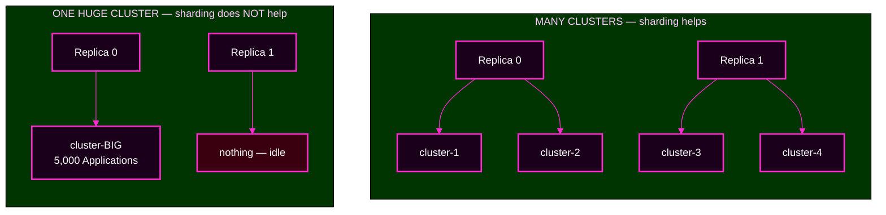

# Session 7 · Optional Reference — Platform Operations After the Capstone

> **Optional. Outside the Day 2 timebox. Nothing here is required for the capstone.**
> Read it after the capstone, or when you are responsible for running Argo CD in production.
> **← Back to:** [Day 2 map](../README.md) · [Session 7](README.md)

---

## Page TL;DR

- **What this is.** The lifecycle jobs an Argo CD operator owns: high availability, sharding, backup and recovery, upgrades, and forks.
- **Why it matters.** These decisions are made once and lived with for years.
- **What to remember.** *Argo CD's real state is Kubernetes objects; Redis is disposable.* And: **the renderer is part of your desired state.**
- **The most common mistake.** Treating an upgrade as a version bump. It can change your rendered manifests with no Git change at all.

---

## 1. What high availability actually buys you, component by component

"Turn on HA" is not one switch. Each component fails differently, so each gains something different from a second replica.

This course runs the **non-HA** install — one replica of each — precisely so you can watch a single component's outage cleanly.

| Component | What a second replica buys | What is still a single point |
|---|---|---|
| **server** | the UI and API survive one pod dying | nothing important; it is stateless |
| **repo-server** | rendering capacity and survival of one pod | the Git servers it talks to |
| **application-controller** | clusters are spread across replicas | **a single cluster is still one shard** — see section 2 |
| **applicationset-controller** | leader election keeps generation running | the repositories it reads |
| **redis** | cache survives a node failure | nothing — it holds no durable state |
| **notifications-controller** | alerts survive a pod dying | the external services it notifies |

**No component's failure loses data**, because Argo CD's real state is Kubernetes objects in the management cluster's etcd.

---

## 2. Controller sharding splits *clusters*, not Applications

When the application controller is overloaded, the instinct is "add a replica." That works **only if you have multiple clusters**, because the controller distributes **clusters** across replicas, not Applications.

**▶ Predict:** your busiest cluster holds 5,000 Applications and its controller is maxed out. You add a second replica. Does that cluster get faster?



<details>
<summary>Show the answer</summary>

**No.** A single cluster is a single shard. It cannot be split across replicas, so the extra replica sits idle.

The fix is **architectural** — more clusters, or a bigger single shard — not more replicas.
</details>

### Which dial drives which component

| If this grows | This component feels it |
|---|---|
| number of Applications | application-controller |
| resources per Application | application-controller |
| number of clusters | application-controller (and sharding helps) |
| number of repositories | repo-server |
| repository size, especially monorepos | repo-server |
| change rate | repo-server |

---

## 3. Repo-server pressure, in detail

Three drivers, each with a different lever.

**Memory and out-of-memory kills.** Rendering holds output in memory. The lever is `--parallelismlimit`, which caps concurrent renders.

**The one-render-per-repository constraint.** If rendering has to *write* files into the clone — as `helm dependency build` does — only one generation per repository may run at a time. A monorepo can therefore feel serialised even while CPU sits idle.

**The execution timeout.** The default is about 90 seconds, configurable with `ARGOCD_EXEC_TIMEOUT`. A chart that grows slowly can one day render in 95 seconds and start failing **on a day nobody changed anything**. That is a genuinely confusing incident if you do not know the timeout exists.

---

## 4. Alert design: alert on failure to converge

If you do add an observability stack, the obvious alert is wrong.

**"An Application is `OutOfSync`" fires constantly and gets muted.** `OutOfSync` is a normal, transient state every time anyone commits anything.

**The alert that carries information is compound:** an Application has been `OutOfSync` **and** has automated sync enabled **and** has not converged for N minutes.

> **Alert on failure to converge, not on `OutOfSync`.** That "N minutes" *is* your service-level objective, written as a threshold.

---

## 5. Health checks and ignore rules

Two mechanisms shape what Argo CD *tells* you, and they pull in opposite directions.

A **custom health check**, written in Lua, teaches Argo CD to judge a custom resource it does not recognise. This is a **good** use: it makes a badge mean more than it did.

**`ignoreDifferences`** tells Argo CD to stop reporting a field as drift. Sometimes necessary — an autoscaler legitimately owns `/spec/replicas` — but the same mechanism, aimed carelessly, hides a real change forever.

```yaml
# SAFE — field-scoped, with a clear owner (the HPA owns replica count):
ignoreDifferences:
  - group: apps
    kind: Deployment
    jsonPointers: [/spec/replicas]

# DANGEROUS — ignores the ENTIRE spec. A changed image or a removed
# securityContext becomes invisible. Nothing owns "the whole spec."
ignoreDifferences:
  - group: apps
    kind: Deployment
    jsonPointers: [/spec]
```

> **The discipline in one sentence: every ignore rule should name a *field*, not a resource, and must have a written *owner*.** If nothing owns the field, you have not reduced risk — you have built a place for drift to hide.

**The test is "name the owner."** For `/spec/replicas` the owner is real: the HorizontalPodAutoscaler. For the container image, the honest answer is *nothing owns it except your Git source* — so ignoring the image is a blind spot, not silenced noise.

---

## 6. Backup, and recovering a lost management cluster

Argo CD is **largely stateless**. Applications, AppProjects, the `argocd-cm` and `argocd-rbac-cm` ConfigMaps, and the repository and cluster **Secrets** live as Kubernetes objects in the management cluster's etcd. Redis is a disposable cache.

**Whatever is genuinely in Git does not need *restoring* — it needs *re-applying*.**

What *does* need backing up is the part that never made it into Git: credentials in the Secrets, and anything configured through the user interface.

### ▶ Hands-on: export Argo CD's own state

This is read-only and writes one file in your home directory.

```bash
source ~/argo-lab-env.sh
argocd admin export -n argocd > backup.yaml
grep -E '^kind:' backup.yaml | sort | uniq -c
```

**Expected shape** — verified on this course environment at `CP-lab-05`; your counts will vary with lab state:

```text
   8 kind: Application
   1 kind: ApplicationSet
   4 kind: AppProject
   4 kind: ConfigMap
   5 kind: Secret
```

**🔍 Notice what that list *is*.** The **ConfigMaps** are Argo CD's configuration. The **Applications, AppProjects, and ApplicationSets** are your declared desired state, which *should* also live in Git. The **Secrets** are the credentials — usually the parts that are **not** in Git, and the entire reason the export exists.

Read it back with `argocd admin import - < backup.yaml`. Clean up with `rm -f backup.yaml`.

> **The size of your export file is a receipt for everything you forgot to declare in Git.** A large export from a mature GitOps setup is a warning sign, not a comfort.

### Recovery when the whole management cluster is lost

Git lives *outside* both clusters, so your desired state survived. Recovery is a **rebuild**, not an archaeology project.

1. Stand up a fresh management cluster and install the **same** Argo CD version, the same declarative way.
2. Re-apply what is in Git — often one root App-of-Apps. Argo CD tracks resources by annotation, so it **re-adopts** the already-running workloads rather than redeploying them.
3. Import the parts that were never in Git from your export, chiefly the repository and cluster **Secrets**.
4. Let Redis rebuild itself. You do nothing.
5. Verify with the method: `argocd app get` across the fleet until everything reads `Synced` and `Healthy`.

> **The reframe: if Argo CD is truly declarative, losing the management cluster is a rebuild, not a disaster.** The only irreplaceable pieces are the credentials — which is why the export exists and must be protected as sensitive material.

---

## 7. Upgrades: the renderer is part of your desired state

The most dangerous misconception is that an upgrade is only a version bump.

**Argo CD renders your charts, so its bundled Helm version is part of your desired state.** Change the renderer and *the same chart with the same values can produce different YAML*, with nobody touching Git.

**A real case:** Argo CD 3.5 moved to Helm 4 as its only renderer, which changed `null` coalescing behaviour. Upgrading 3.4 to 3.5 alone can therefore change rendered manifests.

### The upgrade timeline

1. **Read the release notes end to end.** Not the headline.
2. **Compatibility test — this is the real work.** *Render your real charts with the new version's Helm and diff the output.* A non-empty diff is a change you are about to ship. Also check the tested-Kubernetes compatibility matrix, and bump the `argocd` CLI to match the server's minor version.
3. **Canary.** Upgrade one non-critical Argo CD instance first.
4. **Write your rollback criteria in advance**, while you are calm.

**Two disciplines:** match Argo CD to your Kubernetes version, and **change one variable at a time** — never upgrade Argo CD and Kubernetes on the same day.

> **Rehearse the render, not just the rollback.**

**S7-QC4 — An upgrade changed the manifests and nobody touched Git.** You upgrade 3.4 to 3.5 and Applications go `OutOfSync` with no commits. What happened, and which test would have caught it?

<details>
<summary>Show the answer</summary>

**Argo CD 3.5 bundles Helm 4, which changed `null` coalescing.** The same chart and values render different YAML under the new renderer, because the renderer is part of your desired state.

The test: **render your real charts with the new Helm version and diff the output before upgrading.** Plus check the tested-Kubernetes matrix, match the CLI version, and change one variable at a time.
</details>

---

## 8. Operating an internal fork

A **fork** moves you from *consuming* upstream's work to *producing* it — permanently.

Before forking, price the jobs you now own forever:

- tracking upstream changes
- **CVE response** — you merge, rebuild, test, and release the patch yourself
- building images, and their provenance
- regression testing against your own patches
- setting a release cadence
- minimising divergence so merges stay possible

> **Forking is not wrong — it is priced.** Often the cheaper answer is to contribute the change upstream instead.

---

## ✅ Key Takeaways

- **Sharding splits clusters, not Applications.** One huge cluster cannot be split.
- **Argo CD's real state is Kubernetes objects; Redis is disposable.** Back up the export, keep desired state in Git.
- **Losing the management cluster is a rebuild from Git plus an export.**
- **An ignore rule must name a field and have a written owner**, or it is a blind spot.
- **Alert on failure to converge, not on `OutOfSync`.**
- **An upgrade can change your manifests with no Git change** — rehearse the render.

---

## Final page TL;DR

- **What this is.** The operator's lifecycle jobs, deferred out of the required Day 2 path.
- **Why it matters.** These are long-lived decisions that are expensive to revisit.
- **What to remember.** The renderer is part of your desired state, and your export file is a receipt for what you failed to declare in Git.
- **The most common mistake.** Backing up Redis, which holds nothing that matters.

**→ Back to:** [Session 7](README.md) · [Day 2 map](../README.md)
