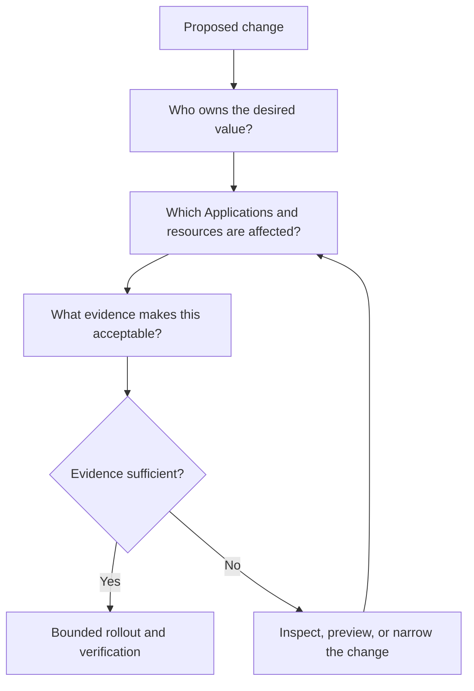
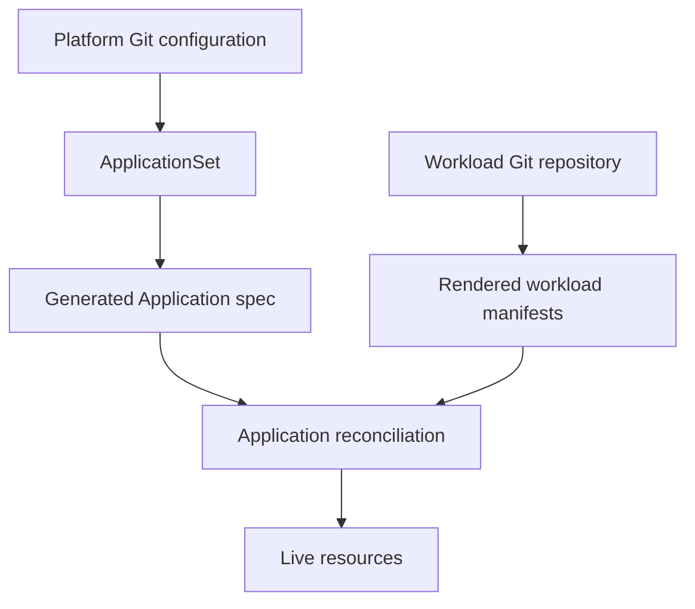
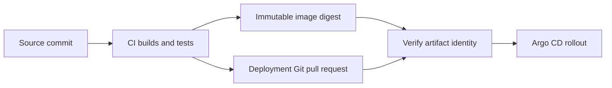
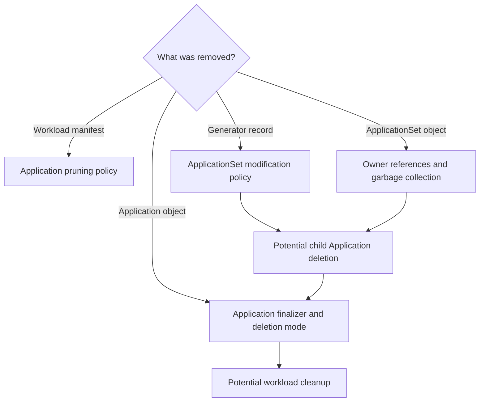
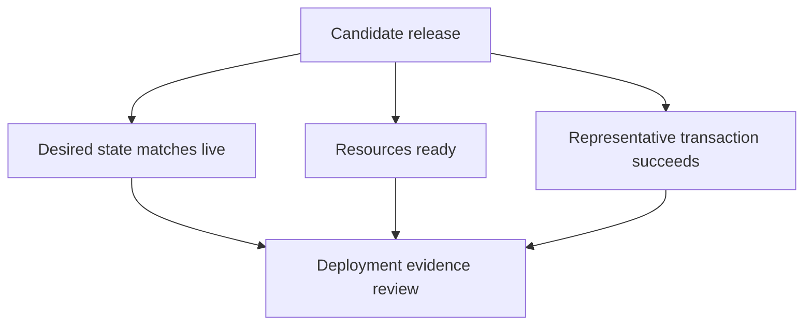
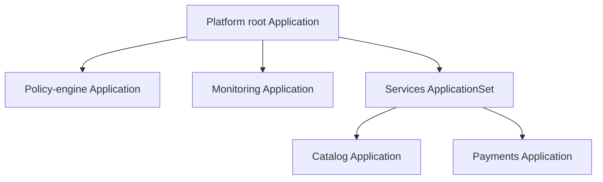
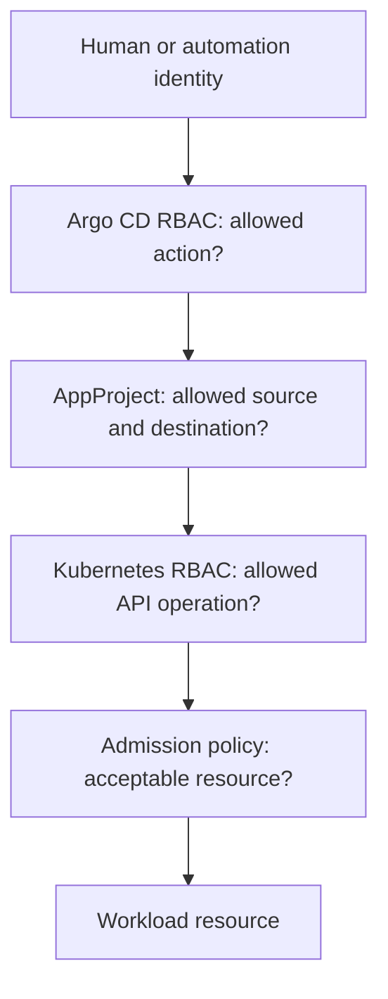

# Argo CD Best Practices: The Operator’s Field Guide

> **The goal:** make deployments understandable, changes bounded, and recovery predictable.
>
> By the end, you should be able to review an Argo CD design and explain **who owns it, what can change, what proves it works, and how to recover it**.

This guide follows the topics in [Intermediate Argo CD Operations](https://github.com/varoonsahgal/argo-new/blob/main/argo-cd-student-guide.md): Applications, management and workload clusters, Helm, synchronization, promotion, ApplicationSets, App-of-Apps, governance, and production operations. It extends those topics with practical design reviews and incident decisions.

**How to use it:** read the examples as an operator, then pause at the seven exercises. Most exercises are short design or diagnosis tasks; two use read-only inspection or local rendering. There is no need to repeat the course’s drift, registration, or checkpoint labs.

**Environment:** commands use Bash on the course Ubuntu VM. `k3d-mgmt` represents the management cluster and `k3d-workload` represents the workload cluster. Run commands only when the named example exists at your current checkpoint. Production names and permissions will differ.

**Examples:** complete manifests are labelled as such. Other YAML blocks are excerpts showing where a setting belongs. Example policies illustrate a decision; they are not universal defaults. This is a companion guide, not a script to apply from top to bottom.

**Version note:** technical references were checked on 15 September 2026. The course materials target Argo CD 3.5.2. The linked `stable` documentation can advance; verify version-sensitive behavior against your installed release before adopting it.

All diagrams are embedded Mermaid. GitHub renders them from this Markdown file; no image downloads are required.

---

## Start here: the incident that makes the practices matter

It is 09:07. A teammate says:

> “I changed one line. Twenty Applications changed. Production is green, but checkout is failing. I turned off auto-sync in the UI, but it switched back on. Can we delete the parent and start again?”

There are at least four separate questions hiding in that message:

| Statement | The question an operator should ask |
|---|---|
| One line changed twenty Applications | Which generator or shared template multiplied the change? |
| Production is green | Green on which measure: sync, resource health, or a user transaction? |
| Auto-sync switched back on | What owns the Application’s specification? |
| Delete the parent | What deletion relationships and finalizers connect it to the children? |

**The central habit: before changing a resource, trace its owner and its consequences.**



## A map of the practices

| Area | Practices | Course connection |
|---|---|---|
| Ownership | 1–3: desired state, boundaries, reproducible releases | Sessions 1–2 and 4 |
| Deployment behavior | 4–7: sync, deletion, ordering, evidence | Session 4; Labs 1 and 3 |
| Scale and composition | 8–10: factories, parents, rendering | Session 5; Lab 4 |
| Security | 11–12: authority and credentials | Sessions 3 and 6; Labs 2 and 5 |
| Operating the platform | 13–18: diagnosis, noise, alerts, capacity, recovery, upgrades | Session 7 and capstone |

---

## 1. Make ownership visible before enabling automation

**Practice:** keep production Application definitions and platform settings under reviewed declarative management. Know the source that will restore a setting after someone changes it live.

An Application’s `spec.source` tells Argo CD where to find its **workload manifests**. It does not, by itself, tell you who manages the **Application object**.

That object might be created manually, maintained by an ApplicationSet, or applied by a parent Application. These are different ownership arrangements.



**Example:** changing auto-sync in the UI edits the live Application. It does not commit to Git. A managing ApplicationSet or parent can restore its desired setting. For a generated Application, the normal lasting change belongs in the ApplicationSet template or its controlled inputs.

Give each Application an operational owner, source-of-truth location, and escalation route. Labels and annotations can make these visible, but an agreed ownership record matters more than a particular naming convention.

**Read-only inspection:**

```bash
kubectl --context k3d-mgmt -n argocd get application storefront-dev \
  -o jsonpath='{.metadata.ownerReferences}{"\n"}'

argocd app get storefront-dev
```

An ApplicationSet owner reference is useful evidence. Its absence does not prove the Application is unmanaged: App-of-Apps resource tracking is not equivalent to a Kubernetes owner reference.

**Insight:** “It is stored in Git” is incomplete. Ask **which Git file owns this exact field**. [References: declarative practice](https://argo-cd.readthedocs.io/en/stable/user-guide/best_practices/), [generated Application changes](https://argo-cd.readthedocs.io/en/stable/operator-manual/applicationset/Controlling-Resource-Modification/).

### Exercise 1 — The setting that keeps coming back · 4 minutes

A generated Application has auto-sync enabled. An engineer disables it in the UI. A few minutes later it is enabled again.

Write a three-line incident response:

1. Your ownership hypothesis.
2. The evidence you would inspect before making another edit.
3. The place you would make a durable change, and how you would verify it.

**Success criterion:** your explanation distinguishes changing the live child from changing the definition that maintains it.

---

## 2. Give each resource one clear deployment owner

**Practice:** choose Application boundaries around lifecycle, ownership, and failure impact.

“One microservice per Application” can be useful, but it is not a law. A service’s Deployment, Service, and related configuration often belong together. A cluster-wide operator maintained by a platform team usually has a different lifecycle.

| Usually group together | Usually consider separating |
|---|---|
| Resources released and recovered together | Components with different owners or approval paths |
| One service and its service-specific configuration | Shared operators and CustomResourceDefinitions (CRDs) |
| Resources whose sync order must be managed together | Production and development workloads |

Avoid having two Applications manage the same Kubernetes object. If a Horizontal Pod Autoscaler (HPA) controls replicas, also decide which fields it owns rather than letting Git and the HPA compete.

**Example:** a `storefront` chart should not casually own a shared ingress controller’s CRDs. Uninstalling one shop must not remove infrastructure used by other shops.

**Insight:** the useful boundary is **“what should change and recover together?”**, not “how many YAML files fit in a folder?”

---

## 3. Promote the artifact you tested

**Practice:** make the release identity reproducible. Separate the code build from the deployment decision.

Continuous integration (CI) builds and tests an image, then proposes the desired deployment revision in Git. Argo CD reconciles the approved desired state. CI does not need broad workload-cluster credentials for this pattern.



**Example:** development tests an image identified by a digest. Staging and production promote that same digest. They do not rebuild the same source independently and assume the result is identical.

A production deployment should identify its configuration revision, chart version or Git commit, image digest, and environment values. A protected deployment branch is a valid desired-state workflow; it moves through review. An unprotected moving reference or a mutable image tag undermines reproducibility.

For incident recovery, a Git revert creates a new auditable desired state. Confirm that the previous image still exists and the application remains compatible with the current database schema.

**Insight:** Git can restore a manifest. It cannot automatically reverse a database migration. [Reference: pinned dependencies and repository separation](https://argo-cd.readthedocs.io/en/stable/user-guide/best_practices/).

---

## 4. Treat auto-sync, self-heal, and prune as separate decisions

**Practice:** select automation according to the environment’s review process, field ownership, and deletion tolerance.

| Control | Question it answers |
|---|---|
| Automated sync | Should eligible desired-state changes sync without a manual sync request? |
| Self-heal | Should eligible live drift be corrected automatically? |
| Automated pruning | Should tracked resources removed from desired state be deleted automatically? |
| Allow empty | May an automated pruned sync accept an empty desired resource set? |

**Example Application excerpt for a reviewed, disposable development workload:**

```yaml
spec:
  syncPolicy:
    automated:
      enabled: true
      selfHeal: true
      prune: true
      allowEmpty: false
```

This is not a recommendation to paste the same policy into every production Application. Production can use auto-sync with strong Git review, artifact checks, and appropriate sync windows. Manual sync is useful when a separate execution decision is required; it is not a substitute for review.

Self-heal deserves an emergency procedure: pause or change the controlling policy before a necessary live intervention, record the intervention, reconcile Git with the intended outcome, and restore normal operation.

A sync window controls when synchronization is permitted; it does not replace authorization or validate a change. [References: automation semantics](https://argo-cd.readthedocs.io/en/stable/user-guide/auto_sync/), [sync windows](https://argo-cd.readthedocs.io/en/stable/user-guide/sync_windows/).

**Insight:** the important production question is **“where is approval enforced?”**, not “did somebody click Sync?”

---

## 5. Review deletion as a separate design

**Practice:** draw the deletion relationships before relying on any one safety setting.

There are different operations:

1. Pruning a resource removed from an Application’s desired manifests.
2. Deleting an Application and potentially cascading to its workloads.
3. Removing a generated Application when generator output changes.
4. Deleting the ApplicationSet or parent that manages children.

A setting for one path does not necessarily block the others.



A **finalizer** is a cleanup instruction attached to an object. It can keep deletion pending while a controller performs cleanup. Removing it without understanding the cleanup can leave resources behind.

| Mechanism | What it addresses | What it does not establish |
|---|---|---|
| `Prune=confirm` on a resource | Confirmation before pruning that resource | Protection against every deletion path |
| `Delete=confirm` on a resource | Confirmation during Application deletion cleanup | Protection from direct Kubernetes deletion |
| ApplicationSet `applicationsSync: create-update` | Prevents controller deletions caused by changed generated output | Protection from deleting the ApplicationSet itself |
| `preserveResourcesOnDeletion: true` | Changes generated Application finalizer behavior to preserve workloads | A backup, or prevention of later manual cleanup |

Controller-wide ApplicationSet policy can override per-set policy. Verify effective settings and any existing child finalizers; do not infer protection from one YAML line. [References: resource sync options](https://argo-cd.readthedocs.io/en/stable/user-guide/sync-options/), [Application deletion](https://argo-cd.readthedocs.io/en/stable/user-guide/app_deletion/), [ApplicationSet policies](https://argo-cd.readthedocs.io/en/stable/operator-manual/applicationset/Controlling-Resource-Modification/), [generated-resource deletion](https://argo-cd.readthedocs.io/en/stable/operator-manual/applicationset/Application-Deletion/).

**Example:** a production namespace needs an explicit deletion review because deleting it can affect resources beyond the chart being changed. PersistentVolumeClaims additionally need a storage and backup policy.

### Exercise 2 — Find the missing protection · 5 minutes

A proposal says: “Our ApplicationSet uses `create-update`, so deleting the ApplicationSet cannot remove production.”

Draw the path from ApplicationSet to Application to workload. Mark the places where you need more evidence. Include child owner references, finalizers, and deletion mode.

**Success criterion:** name the deletion operation actually covered by `create-update` and the separate operation in the proposal. Do this as a tabletop review; do not test by deleting the course factory.

---

## 6. Use ordering for dependencies, and health for readiness

**Practice:** add waves where one resource really must precede another. Avoid decorating every manifest with a number.

Argo CD orders synchronization by phase, wave, resource kind, and name. Waves sequence work within an Application’s sync. Lower wave numbers run earlier; unsuccessful or unhealthy earlier work can block progression. [Reference: sync phases and waves](https://argo-cd.readthedocs.io/en/stable/user-guide/sync-waves/).

**Example dependency:** a configuration-validation Job must succeed before a Deployment uses a new configuration.

```yaml
# Excerpt from the validation Job's metadata.
metadata:
  annotations:
    argocd.argoproj.io/hook: PreSync
    argocd.argoproj.io/hook-delete-policy: BeforeHookCreation,HookSucceeded
```

Make Jobs repeatable. Use bounded runtime, clear failure messages, and operations that remain safe if retried. If a hook performs a migration, design the migration itself for compatibility and partial failure.

A `PreSync` Job cannot depend on a namespace that will only be created later during `Sync`. Check the prerequisites of your ordering mechanism too.

Do not confuse resource ordering with traffic management: waves do not implement a canary or prove business success. Also, selective resource sync skips hooks; do not use it casually where hooks enforce deployment checks.

**Insight:** “B was submitted after A” is weaker than “A was ready before B needed it.”

---

## 7. Require three kinds of deployment evidence

**Practice:** verify desired-state agreement, resource health, and user-visible behavior separately.

| Evidence | Example question | What it does not prove |
|---|---|---|
| Sync | Does live state match the rendered desired state? | That the desired configuration is correct |
| Resource health | Are the resources meeting their health criteria? | That a customer can finish checkout |
| Service behavior | Does a representative transaction succeed? | That every resource matches Git |



**Example:** `storefront` is Synced and its Deployment is Healthy, but the payment endpoint is configured incorrectly. Kubernetes can report ready replicas while customer requests fail. Custom health checks should reflect the resource’s real contract; they should not be written merely to turn a tile green. [Reference: resource health](https://argo-cd.readthedocs.io/en/stable/operator-manual/health/).

For a release, record the deployed revision, resource health, and one meaningful smoke test. For checkout, a successful homepage request is weaker evidence than a test order through the payment sandbox.

### Exercise 3 — Green, but wrong · 4 minutes

Evidence: Synced, Healthy, all replicas ready, homepage returns HTTP 200, checkout returns HTTP 500 after a configuration change.

Choose your next two observations and explain what each could rule out. Then write the condition you would require before declaring recovery.

**Success criterion:** your recovery condition includes a customer-relevant test, not just Argo CD status.

---

## 8. Preview ApplicationSets as a change to a fleet

**Practice:** review generated names, repositories, revisions, projects, and destinations—not just the template diff.

An ApplicationSet maintains Application definitions. Each generated Application then follows the normal reconciliation path. A small template change can affect many children without creating a new deployment mechanism.

**Complete illustrative manifest:** two services, each with its own GitHub repository. The URLs are placeholders; this is a reading example, not a course deployment manifest.

```yaml
apiVersion: argoproj.io/v1alpha1
kind: ApplicationSet
metadata:
  name: team-services
  namespace: argocd
spec:
  goTemplate: true
  goTemplateOptions: ["missingkey=error"]
  generators:
    - list:
        elements:
          - name: catalog
            repoURL: https://github.com/example-org/catalog-gitops.git
          - name: payments
            repoURL: https://github.com/example-org/payments-gitops.git
  template:
    metadata:
      name: '{{ .name }}-dev'
    spec:
      project: team-services
      source:
        repoURL: '{{ .repoURL }}'
        targetRevision: main
        path: deploy/dev
      destination:
        server: https://k3d-workload-server-0:6443
        namespace: '{{ .name }}-dev'
```

Prerequisites for using this design: real repositories containing `deploy/dev`, repository access, a registered destination, existing namespaces or a deliberate namespace-creation policy, and an AppProject permitting the sources and destinations. The example omits automated sync.

**Yes: each Application can have its own repo.** The ApplicationSet’s own configuration may live in a third platform repository. A Git generator’s input repository is also conceptually different from each child Application’s workload source. [Reference: List generator templating](https://argo-cd.readthedocs.io/en/stable/operator-manual/applicationset/Generators-List/).

For a matrix with independent lists, 3 environments × 4 clusters produces 12 combinations. Expanding a selector to 8 clusters doubles the potential fleet to 24. Preview also needs unique names and valid inputs; multiplication alone is not validation.

**Use explicit cluster labels.** The YAML generator key is `clusters`, plural. Labels are mutable configuration, not a security boundary; AppProjects and Kubernetes permissions still matter.

### Exercise 4 — Review the output, not the file size · 6 minutes

From your existing course `platform-config` clone, with the Argo CD CLI connected:

```bash
argocd appset generate examples/appset-list.yaml -o yaml
```

This renders a preview without creating the Applications. Record the two names, source paths, and destination namespaces. Then review this proposed change on paper: “add production and broaden the cluster selector.”

What evidence would you require beyond a successful preview? Consider access, values-file existence, workload rendering, duplicate ownership, and rollout policy.

**Success criterion:** distinguish “valid generated Application definitions” from “workloads proved deployable.” [Reference: preview command](https://argo-cd.readthedocs.io/en/release-3.5/user-guide/commands/argocd_appset_generate/).

---

## 9. Keep App-of-Apps hierarchies understandable

**Practice:** use a parent to manage a deliberate collection of child Applications. Keep the hierarchy shallow and its administration restricted.

| Requirement | Useful starting point |
|---|---|
| A few independent deployments | Ordinary Applications |
| Repeated Application structure with differing values | ApplicationSet |
| Bootstrap a known set of platform Applications | App-of-Apps |
| Bootstrap a generated service fleet | A parent managing an ApplicationSet, with explicit ownership |

These choices do not dictate repository count or microservice architecture.



A parent reconciling child Application objects does not automatically prove their workloads are ready. If cross-child sequencing matters, configure and test health propagation and ordering deliberately. Avoid circular bootstraps, such as a controller depending on a component it must first install to access its own source. [Reference: cluster bootstrapping](https://argo-cd.readthedocs.io/en/stable/operator-manual/cluster-bootstrapping/).

**Example:** separate a foundational secret-access dependency from an application fleet that needs those secrets. Test how the foundation is restored when the management cluster is empty.

**Insight:** a hierarchy is useful when it answers “who manages this?” It becomes harmful when it hides “what will deleting this remove?”

---

## 10. Make Helm rendering reproducible and inspect the final manifests

**Practice:** review what Argo CD will apply, especially when several layers supply values.

Argo CD uses Helm to render manifests; it manages the resulting Kubernetes resources rather than a traditional Helm release lifecycle. Values precedence is:

`parameters` → `valuesObject` → inline `values` → `valueFiles` → chart defaults.

Higher-precedence settings win. When multiple values files set a key, later files take precedence. [Reference: Helm integration](https://argo-cd.readthedocs.io/en/stable/user-guide/helm/).

**Example:** `envs/prod/values.yaml` says `replicaCount: 4`, but an Application Helm parameter says `replicaCount: "1"`. Reviewing only the production values file misses the effective setting.

Prefer a small, documented override hierarchy. Avoid unexplained emergency parameters that survive indefinitely. Keep generated manifests deterministic; template randomness can produce recurring differences even without a meaningful configuration change.

### Exercise 5 — Find the winning value · 5 minutes

On paper, predict the effective replica count:

| Source | Value |
|---|---|
| Chart default | 1 |
| First values file | 2 |
| Last values file | 4 |
| Application Helm parameter | 3 |

Then, from the course `storefront-gitops` clone, inspect a local render:

```bash
helm template storefront-dev charts/storefront \
  --namespace storefront-dev \
  -f envs/dev/values.yaml > /tmp/storefront-rendered.yaml

less /tmp/storefront-rendered.yaml
```

Find a Deployment’s replicas, image, and Pod-template configuration references. Local rendering is a useful check; Argo CD may use a different Helm version, API capabilities, or additional overrides. Verify against the actual Application when resolving a production discrepancy.

**Success criterion:** explain where the effective value came from and why reading one source file was insufficient.

---

## 11. Design three layers of authorization

**Practice:** separate who may request an action, what an Application may target, and what the cluster credential may do.



RBAC means role-based access control. Argo CD RBAC governs actions through Argo CD. AppProjects constrain repository, destination, and resource-kind choices. Kubernetes RBAC governs the workload credential’s API access. Admission policies can add content rules, such as approved registries or restricted Pod privileges.

**AppProject excerpt:**

```yaml
spec:
  sourceRepos:
    - https://github.com/example-org/storefront-gitops.git
  destinations:
    - server: https://k3d-workload-server-0:6443
      namespace: storefront-prod
  clusterResourceWhitelist: []
  namespaceResourceWhitelist:
    - group: apps
      kind: Deployment
    - group: ""
      kind: Service
    - group: ""
      kind: ConfigMap
```

This illustrative allowlist must be expanded deliberately if the application needs other kinds. Prevent application teams from modifying the AppProject or redirecting their Application to a more privileged project. Restrict deployment into Argo CD’s own namespace: controlling its configuration can confer platform authority. [References: AppProjects](https://argo-cd.readthedocs.io/en/stable/user-guide/projects/), [Argo CD RBAC](https://argo-cd.readthedocs.io/en/stable/operator-manual/rbac/).

Use single sign-on groups for routine access and keep emergency administrator access auditable. Test both allowed and denied actions with representative identities.

**Insight:** a destination allowlist is ineffective if the same person can freely rewrite the allowlist.

---

## 12. Treat repository and cluster credentials as different trust relationships

**Practice:** scope, rotate, and recover each credential according to what it authorizes.

| Credential or trust material | Purpose | Operational question |
|---|---|---|
| Repository credential | Read a private source | Does it cover more repositories than necessary? |
| Workload-cluster credential | Authenticate API requests to Kubernetes | Which namespaces and verbs can this identity use? |
| Certificate authority certificate | Verify the server’s TLS identity | What happens when trust material rotates? |
| Argo CD API token | Allow automation to call Argo CD | Does it have a narrow role and a revocation plan? |

For production, validate server certificates rather than carrying classroom TLS shortcuts forward. Do not copy workload tokens into student handouts, terminal captures, or incident tickets. Kubernetes Secret values encoded as base64 are not encrypted merely because they look unreadable. [Reference: security model](https://argo-cd.readthedocs.io/en/stable/operator-manual/security/).

Prefer a documented secret-management integration over plaintext Git secrets. Understand where decrypted secrets exist: rendering-time secret injection can expose sensitive content to parts of the Argo CD rendering and caching path. Destination-cluster secret operators have different trust and recovery requirements. [Reference: secret management](https://argo-cd.readthedocs.io/en/stable/operator-manual/secret-management/).

**Example:** a repository credential template covers an entire organization URL prefix. Adding a new repository may require no extra secret, but the access boundary has become broader. Review that as a permission choice.

**Insight:** a dedicated management cluster centralizes deployment authority. Its separation is valuable, but compromise there can still affect many workload clusters.

---

## 13. Troubleshoot the first broken link

**Practice:** localize the failure before changing configuration or restarting components.

| Evidence | Start here | A useful next observation |
|---|---|---|
| Expected Application missing | ApplicationSet generation or parent sync | Generator output, parent conditions, template errors |
| Source unavailable | Repository connection | URL, credentials, revision, DNS and TLS errors |
| Manifest generation failed | Rendering | Values paths, chart dependencies, renderer error |
| Sync denied | Authorization | Distinguish project denial from Kubernetes `Forbidden` |
| Destination unreachable | Cluster connectivity | API address, network path, authentication and trust |
| Synced but Degraded | Workload health | Events, probes, scheduling, application logs |
| Many unrelated apps delayed | Platform capacity or shared dependency | Queue time, repo-server pressure, API latency |

**A small read-only evidence set:**

```bash
source ~/argo-lab-env.sh

argocd app get storefront-dev --refresh
argocd app diff storefront-dev

kubectl --context k3d-mgmt -n argocd get application storefront-dev \
  -o jsonpath='{.status.conditions}{"\n"}'

kubectl --context k3d-workload -n storefront-dev get pods
kubectl --context k3d-workload -n storefront-dev get events \
  --sort-by=.metadata.creationTimestamp
```

`argocd app diff` can return a nonzero exit status when differences exist; that is not necessarily a connection failure. Refresh asks for an updated comparison; it does not perform a sync.

**Example:** if a values-file path is wrong, restarting a Deployment cannot repair the missing desired manifests. Start with the rendering error.

**Insight:** good troubleshooting reduces the number of plausible explanations with every observation.

---

## 14. Suppress noise only after identifying its owner

**Practice:** keep diff exclusions narrow and explain why each exists.

**Example:** an HPA owns a Deployment’s replica count. An Application can ignore that specific difference:

```yaml
spec:
  ignoreDifferences:
    - group: apps
      kind: Deployment
      name: storefront
      namespace: storefront-dev
      jsonPointers:
        - /spec/replicas
```

Ignoring a field during comparison is not the same as preserving it during a sync. Evaluate `RespectIgnoreDifferences=true` when you need that behavior, including its existing-resource limitations. Do not broaden an ignore rule to the entire Deployment specification to hide an unexplained mismatch. [References: diff customization](https://argo-cd.readthedocs.io/en/stable/user-guide/diffing/), [sync behavior](https://argo-cd.readthedocs.io/en/stable/user-guide/sync-options/).

For every ignore rule, record the field owner, the reason, the scope, and a review condition. Treat force/replace options, skipped validation, and skipped dry runs similarly: each needs a specific diagnosis, not a blanket troubleshooting shortcut.

**Insight:** a quieter dashboard is valuable only if meaningful drift remains visible.

---

## 15. Alert on consequences and stalled progress

**Practice:** monitor whether deployments converge within an acceptable time and whether users are affected.

An immediately OutOfSync Application after a commit may be normal. An Application that stays OutOfSync beyond its expected deployment duration deserves investigation. A manual-sync Application waiting for approval needs different alerting from an automated one.

| Signal | Useful interpretation |
|---|---|
| Sustained resource degradation | Workload readiness or health needs attention |
| Repeated failed syncs | A change cannot converge; retries alone may not fix it |
| Fleet-wide rendering delays | Shared repository or repo-server bottleneck |
| Cluster connection failures | Remote deployments and observation may be impaired |
| Growing reconciliation duration | Capacity or dependency performance is deteriorating |
| Failed user transaction | Customer outcome is broken regardless of sync color |

Use Argo CD metrics with application/service monitoring and deployment revision context. Set thresholds from measured normal behavior and service objectives rather than copying another team’s alert durations. [Reference: metrics](https://argo-cd.readthedocs.io/en/stable/operator-manual/metrics/).

**Example alert text:** “Storefront production failed to converge for 12 minutes after revision X; checkout failures increased.” The duration is illustrative. The alert points to a consequence and the relevant change.

---

## 16. Size the platform for work, not just Application count

**Practice:** measure the expensive part before increasing concurrency or replicas.

Two installations with 500 Applications can behave very differently. One may manage small manifests; another may render large charts, scan a monorepo, and watch many clusters with high resource churn.

| Pressure | Investigate before tuning |
|---|---|
| Repo-server memory or CPU | Chart/render complexity, concurrent requests, large repositories |
| Disk pressure | Repository checkouts and temporary render space |
| Slow reconciliation | Resource counts, Kubernetes API latency, work queues |
| One busy cluster | Distribution of controller work, not only total replicas |
| Commit bursts | Fan-out, monorepo invalidation, webhook behavior |

High availability (HA) reduces some component failures; it does not make DNS, Git, identity providers, networks, or workload APIs available. Controller sharding and renderer concurrency should follow measured demand. Increasing parallelism can amplify pressure on a shared dependency. [Reference: high availability and scaling](https://argo-cd.readthedocs.io/en/stable/operator-manual/high_availability/).

**Insight:** “add more workers” is wrong when all workers are waiting on the same overloaded API.

---

## 17. Prove you can restore the management plane

**Practice:** restore into an isolated environment and verify the deployment path, not just the backup file.

Git does not necessarily contain repository credentials, workload credentials, private keys, identity-provider configuration, or externally managed secrets. Argo CD export/import supports backing up its configuration; protect exports as sensitive and pair them with a complete recovery inventory. [Reference: disaster recovery](https://argo-cd.readthedocs.io/en/stable/operator-manual/disaster_recovery/).

| Recoverable asset | Example recovery source |
|---|---|
| Argo CD installation and settings | Reviewed install configuration and pinned artifacts |
| Applications, projects, and factories | Git plus validated configuration backup |
| Credentials and trust | Secret system and documented recovery access |
| Workload images and charts | Retained registries and repositories |
| Stateful application data | Separate database/storage backup and restore process |
| External dependencies | DNS, identity, certificate, and network recovery procedures |

Existing workloads can continue running when Argo CD is unavailable; deployment automation and observation are impaired. That does not mean the workload is immune to failures in shared dependencies.

Set a recovery time objective (how quickly service must return) and a recovery point objective (how much configuration or data loss is tolerable). Rehearse recovery without accidentally reconnecting an unvalidated restored controller to production.

### Exercise 6 — The management cluster is gone · 7 minutes

You have all Git repositories, but no access to the old management cluster. Workloads are still serving traffic.

Write the first five recovery actions in order. Identify one missing credential, one external dependency, and one reason to delay enabling automatic synchronization.

**Success criterion:** the plan restores trust and access before broad reconciliation, and includes a bounded verification deployment.

---

## 18. Upgrade through evidence; keep automation accountable

**Practice:** treat an Argo CD upgrade as a deployment-platform change with explicit acceptance and rollback criteria.

Pin the Argo CD version, installation chart, and relevant renderer versions. Read each applicable upgrade note across the version path, including CRD, permissions, health, diff, and configuration changes. Test representative Applications and failure cases before rolling forward. [Reference: upgrade guidance](https://argo-cd.readthedocs.io/en/stable/operator-manual/upgrading/overview/).

A useful upgrade test set includes one Helm workload, one generated fleet, one App-of-Apps hierarchy, one restricted project, and one credential rotation or connection check. Verify both an allowed action and a forbidden action.

For an internal fork, name the owner of upstream security tracking, image provenance, regression tests, and rebase decisions. A small patch can create a long-lived operational obligation.

**Beyond the course: AI-assisted operations.** If an agent uses an Argo CD API or MCP integration, start with scoped read-only evidence gathering. Have it explain the revision, failure layer, and intended change. Route lasting fixes through the owning Git configuration and require a human decision for broad or destructive changes. This is an operating recommendation, not a claim that every integration implements these controls.

Treat repository text and logs as untrusted input to the agent. An instruction found in an error message is not authorization to change the platform.

**Insight:** automation should shorten the path from evidence to a reviewed decision; it should not hide the decision.

---

## Exercise 7 — The production change review · 10 minutes

A pull request makes these changes:

- Expands an ApplicationSet selector from development clusters to all clusters.
- Changes the shared image reference to a mutable tag.
- Enables automated pruning.
- Adds an ignore rule for an entire Deployment specification.
- Includes “all Applications are green” as the only validation evidence.

Prepare a short review with three columns:

| Change | Concrete failure it could cause | Evidence or revision required |
|---|---|---|
| Fill in each proposed change | Avoid generic “this is risky” comments | Make the next action testable |

Then choose the smallest useful first rollout. State its scope, success evidence, stop condition, and recovery action.

**Success criterion:** your review connects each objection to a mechanism. It distinguishes generating Applications, syncing workloads, deleting resources, and proving customer success.

---

## The review card: ten questions before production

1. **Ownership:** which source owns the Application and each shared resource?
2. **Identity:** can we identify and retrieve the exact image, chart, and configuration revision?
3. **Scope:** have we inspected generated names, sources, and destinations?
4. **Authority:** can this identity target only the intended repositories and workloads?
5. **Automation:** are sync, self-heal, pruning, and approval placement deliberate?
6. **Deletion:** what happens if a manifest, child, parent, or generator record disappears?
7. **Dependencies:** do ordering and health checks represent real prerequisites?
8. **Evidence:** what proves sync, resource health, and user-visible success?
9. **Recovery:** what is the stop condition and how will desired state, credentials, and data recover?
10. **Observability:** who learns about failed convergence, and what evidence will they receive?

A good answer can be brief. An unknown answer should produce an inspection, a bounded test, or a smaller change.

> **The operating standard:** someone who did not make the change should still be able to explain its owner, its reach, its evidence, and its recovery path.
